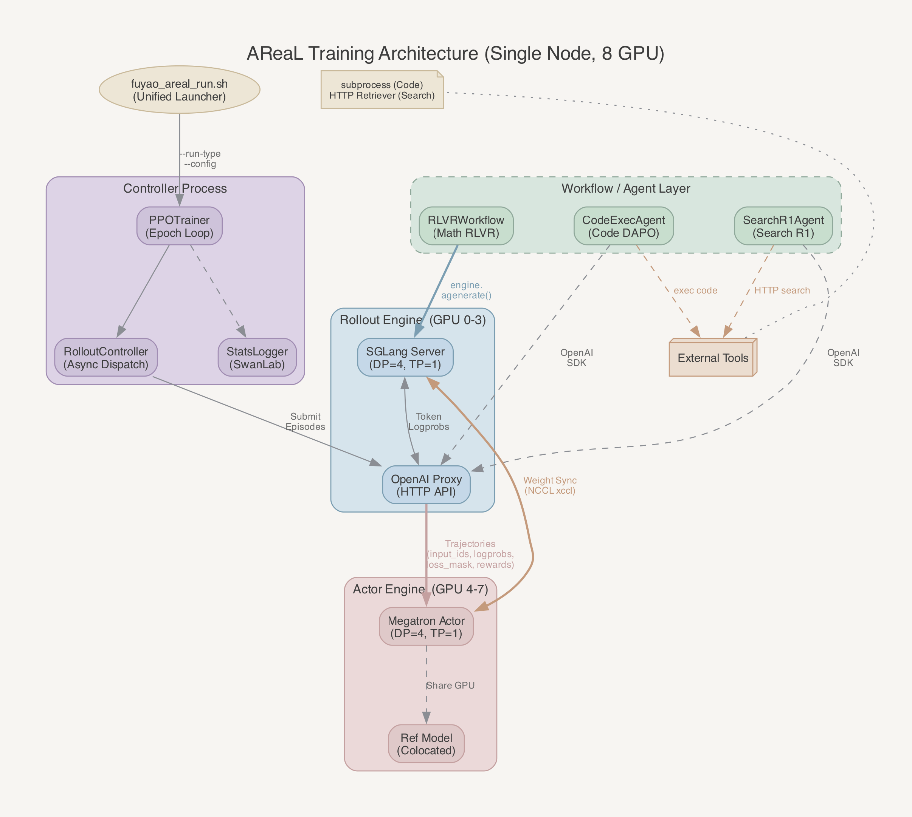
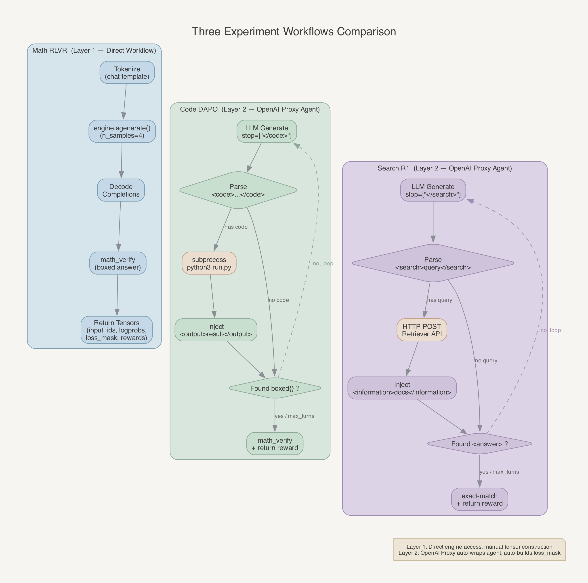
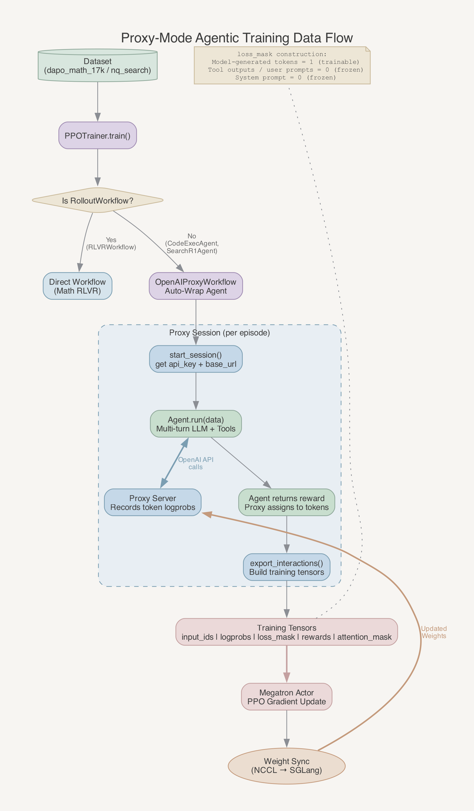

# Fuyao 三类实验跑通指南
> 版本：v1.0 | 作者：zengbw | 日期：2026-04-02

---

## 1. 需求内容
### 1.1 需求目标
基于 AReaL 框架和 fuyao 集群环境，跑通三类 RL 训练实验：单轮数学推理（Math RLVR）、多轮代码执行数学推理（Code DAPO Agentic）、多轮搜索增强问答（Search R1 Agentic），验证框架的端到端训练能力。
### 1.2 验证目标
使用 Qwen3-4B 模型，在 dapo_math_17k / NQ search 数据集上完成完整训练循环：rollout 生成 → reward 计算 → PPO/GRPO 梯度更新 → 权重同步，确认 reward 曲线上升且无训练异常。
### 1.3 参考方案
- AReaL（InclusionAI 开源 RL 训练框架）：[GitHub](https://github.com/inclusionai/AReaL)
- Search-R1（搜索增强推理）：[GitHub](https://github.com/PeterGriffinJin/Search-R1)
- DAPO（Decoupled Clip and Dynamic sAmpling Policy Optimization）：[arXiv](https://arxiv.org/abs/2503.14476)

---

## 2. 需求分析
### 2.1 技术背景
AReaL 是分布式 RL 训练框架，核心思路是将 LLM 对齐训练拆分为两个角色：Rollout（推理引擎，负责生成 trajectory）和 Actor（训练引擎，负责梯度更新）。两者通过 RPC 通信，推理用 SGLang 加速，训练用 Megatron/FSDP2 分布式并行。

三类实验代表了 RL 训练的三个层次：
- **Math RLVR**（Layer 1）：最简单的单轮生成 + 二值 reward，验证基础训练流水线
- **Code DAPO**（Layer 2）：多轮工具调用（代码执行），验证 Proxy 模式下的 agentic 训练
- **Search R1**（Layer 2）：多轮工具调用（检索服务），验证外部服务集成的 agentic 训练

三者共享同一套训练基础设施（Megatron Actor + SGLang Rollout），差异仅在 Workflow/Agent 层。
### 2.2 技术挑战
| 挑战 | 说明 |
|---|---|
| Proxy 模式 token 追踪 | Code DAPO 和 Search R1 使用 OpenAI Proxy 模式，框架需要在 HTTP 层自动追踪每个 token 的 logprob 并构建 loss_mask，将非模型生成的 token（工具输出、用户提示）排除在训练之外 |
| 多轮 reward 归因 | agentic 场景中一个 episode 包含多轮 LLM 调用，reward 只在最终回答时产生，需要合理地将 reward 归因到各轮（通过 turn_discount 或 individual export） |
| 外部服务依赖 | Search R1 依赖检索服务（RETRIEVAL_ENDPOINT），Code DAPO 需要代码执行环境，这些服务的可用性和延迟直接影响训练 |
| math_verify 线程安全 | reward 计算使用 math_verify 库，该库在多线程环境下可能因 signal 机制报错，需要 fallback 处理 |
| stop token 处理 | SGLang 的 stop_strings 会吞掉停止标记本身（如 `</code>`、`</search>`），Agent 需要手动恢复这些标记以保持消息格式完整 |
### 2.3 约束条件
- 部署环境：fuyao 集群，单节点 8×GPU（NVIDIA）
- 基础框架：AReaL（基于 commit 9d829a7）
- 训练后端：Megatron-Core（TP1/PP1），SGLang 推理
- 实验跟踪：SwanLab（通过 SWANLAB_API_KEY 配置）
- 提交入口：`fuyao_examples/fuyao_areal_run.sh`

---

## 3. 方案设计
### 3.1 整体架构
三类实验共享同一套训练架构，差异仅在 Workflow 层：



三类实验的 Workflow 差异：



### 3.2 数据流
以 Proxy 模式（Code DAPO / Search R1）为例（Math RLVR 更简单，直接走 RLVRWorkflow）：



### 3.3 关键设计决策
| 决策 | 选择 | 理由 |
|---|---|---|
| Agentic 集成方式 | OpenAI Proxy 模式（Layer 2） | Agent 代码无需依赖 AReaL 内部 API，只用标准 OpenAI SDK；框架自动处理 token tracking 和 loss_mask 构建 |
| 训练后端 | Megatron TP1/PP1 | 单节点 8 卡场景下 TP1 即可放下 4B 模型，DP=4 提高吞吐 |
| 推理后端 | SGLang DP=4 | 与 Actor DP 对齐，支持 stop_strings 和 chat template |
| Ref 模型策略 | Colocation（与 Actor 共享 GPU） | 4B 模型显存足够，无需额外节点 |
| Reward 归因 | export_style=individual + turn_discount=1.0 | 每轮作为独立样本训练，避免长序列 OOM，简化 credit assignment |
| Code 执行方式 | 本地 subprocess | 简单可靠，无需部署远程沙盒；可通过 EXECD_ENDPOINT 切换远程模式 |

---

## 4. 需求实现
### 4.1 核心代码模块
三类实验的实现全部在 `fuyao_examples/` 目录下，采用旁路落地策略——不修改上游 `areal/` 代码，通过配置扩展和外部 Agent 实现。

**继承/复用的上游模块：**
| 模块 | 路径 | 上游基类 | 说明 |
|---|---|---|---|
| 训练器 | `areal/trainer/rl_trainer.py` | PPOTrainer | 三类实验共用，无修改 |
| RLVR Workflow | `areal/workflow/rlvr.py` | RolloutWorkflow | Math RLVR 直接使用 |
| OpenAI Proxy | `areal/experimental/openai/proxy/` | — | Code DAPO 和 Search R1 的 token 追踪基础设施 |
| GSM8K Reward | `areal/reward/gsm8k.py` | — | Math RLVR 的 reward 基础 |
| Megatron Engine | `areal/engine/megatron_engine.py` | TrainEngine | 训练后端 |
| SGLang Engine | `areal/engine/sglang_engine.py` | InferenceEngine | 推理后端 |

**全新模块：**
| 模块 | 路径 | 职责 |
|---|---|---|
| AgenticConfig | `fuyao_examples/configs.py` | 扩展 GRPOConfig，增加 agentic 场景参数（max_turns, sandbox_type 等） |
| CodeExecAgent | `fuyao_examples/code_dapo/code_exec_agent.py` | Code DAPO 的 Agent 实现：LLM 生成 → 代码提取 → subprocess 执行 → reward |
| SearchR1Agent | `fuyao_examples/search_r1/search_r1_agent.py` | Search R1 的 Agent 实现：LLM 生成 → 搜索查询 → HTTP 检索 → reward |
| Search R1 Reward | `fuyao_examples/search_r1/reward.py` | exact-match reward：`<answer>` 标签提取 + 归一化比较 |
| Math Reward Wrapper | `fuyao_examples/reward.py` | math_verify 的线程安全 fallback 包装 |
| DAPO Math Dataset | `fuyao_examples/dataset/dapo_math.py` | dapo_math_17k 的 Parquet 数据加载和 train/valid 自动切分 |
| Tracking Patch | `fuyao_examples/tracking_patch.py` | monkey-patch StatsLogger，将指标映射到 DeepInsight 命名空间 |
| 统一启动脚本 | `fuyao_examples/fuyao_areal_run.sh` | 环境配置 + 沙盒部署 + 训练入口路由 |
| 训练入口（×3） | `fuyao_examples/{math,code_dapo,search_r1}/train_*.py` | 各场景的数据加载 + config 解析 + PPOTrainer 启动 |

**代码量统计：** 新增 14 个文件，约 1100 行。其中核心 Agent 逻辑约 450 行（CodeExecAgent 225 行 + SearchR1Agent 250 行），训练入口约 200 行，配置/数据/reward 约 300 行，启动脚本约 220 行。
### 4.2 代码就绪性验证
以下表格逐组件确认当前代码仓中三类实验的就绪状态（2026-04-02 验证）。

**代码组件：**
| 组件 | Math RLVR | Code DAPO | Search R1 |
|---|---|---|---|
| 入口脚本 | `fuyao_examples/math/train_math_rlvr.py` | `fuyao_examples/code_dapo/train_code_dapo.py` | `fuyao_examples/search_r1/train_search_r1.py` |
| YAML 配置 | `qwen3_4b_rlvr.yaml` | `code_dapo_qwen3_4b.yaml` | `search_r1_qwen3_4b.yaml` |
| Workflow/Agent | `areal/workflow/rlvr.py` (RLVRWorkflow) | `code_exec_agent.py` (CodeExecAgent) | `search_r1_agent.py` (SearchR1Agent) |
| Reward 函数 | `fuyao_examples/reward.py` (math_reward_fn) | `fuyao_examples/reward.py` (math_verify_with_fallback) | `fuyao_examples/search_r1/reward.py` (search_r1_reward) |
| 数据加载 | `fuyao_examples/dataset/dapo_math.py` | `train_code_dapo.py` 内联 | `train_search_r1.py` 内联 |
| Config 类 | GRPOConfig (上游) | AgenticConfig (`configs.py`) | AgenticConfig (`configs.py`) |
| 启动脚本 | `fuyao_areal_run.sh` (math_rlvr) | `fuyao_areal_run.sh` (code_dapo) | `fuyao_areal_run.sh` (search_r1) |
| Proxy 基础设施 | 不需要 | `areal/experimental/openai/proxy/` | 同左 |
| 沙盒部署 | 不需要 | 不需要（local subprocess） | `deploy_sandboxes.py` |

**运行时依赖（非代码）：**
| 依赖 | 场景 | 说明 |
|---|---|---|
| 模型文件 | 三类都需要 | `/publicdata/huggingface.co/Qwen/Qwen3-4B` 需在 fuyao 集群上可访问 |
| 训练数据 | Math RLVR + Code DAPO | `/workspace/.../data/dapo_math_17k_processed` |
| 训练数据 | Search R1 | `/workspace/.../code/Search-R1/data/nq_search/` + `/workspace/.../data/HotpotQA` |
| 检索服务 | Search R1 | `RETRIEVAL_ENDPOINT` 需预先部署或通过 fuyao SDK 自动部署 |
| GPU | 三类都需要 | 单节点 8 卡 |

结论：代码层面全部就绪，跑通前提是 fuyao 集群上有对应的模型、数据和 GPU 资源。
### 4.3 关键设计细节
#### 4.3.1 Proxy 模式自动包装
Code DAPO 和 Search R1 的 Agent 类不继承 `RolloutWorkflow`，而是实现 `async def run(data, **extra_kwargs) -> float` 方法。AReaL 在运行时检测到这种签名后，自动用 `OpenAIProxyWorkflow` 包装：

```python
# PPOTrainer 内部的自动检测逻辑
workflow_cls = import_from_string(workflow_path)
if hasattr(workflow_cls, 'run') and not issubclass(workflow_cls, RolloutWorkflow):
    # 自动包装为 OpenAIProxyWorkflow
    actual_workflow = OpenAIProxyWorkflow(agent_cls=workflow_cls, ...)
```

Agent 通过 `extra_kwargs` 接收 `base_url`、`api_key`、`http_client`，用标准 `openai.AsyncOpenAI` 与 SGLang Proxy 通信。
#### 4.3.2 stop token 恢复
SGLang 的 `stop_strings` 参数会将停止标记从生成结果中移除。两个 Agent 都需要手动恢复：

```python
# CodeExecAgent: 恢复 </code>
def _restore_code_stop_tag(text):
    if not text.rstrip().endswith("</code>"):
        return f"{text.rstrip()}</code>{trailing}"

# SearchR1Agent: 恢复 </search>
def _restore_search_stop_tag(text):
    if "<search>" in text and "</search>" not in text:
        return text + "</search>"
```

#### 4.3.3 math_verify 线程安全 fallback
`fuyao_examples/reward.py` 中的 `math_verify_with_fallback` 处理多线程环境下 math_verify 的 signal 限制：

```python
def math_verify_with_fallback(response, ground_truth):
    try:
        return _verify_without_timeout(response, ground_truth)  # parsing_timeout=None
    except Exception:
        return 0.0
```

核心是传 `parsing_timeout=None` 禁用 signal-based timeout，避免 "signal only works in main thread" 错误。

---

## 5. 实验配置
### 5.1 基础配置（三类实验共享）
| 参数 | 值 | 说明 |
|---|---|---|
| 模型 | `/publicdata/huggingface.co/Qwen/Qwen3-4B` | Qwen3-4B（Math RLVR 和 Code DAPO 用 Instruct，Search R1 用 Base） |
| 训练后端 | `megatron:d4t1p1` | Megatron，DP=4, TP=1, PP=1 |
| 推理后端 | `sglang:d4p1t1` | SGLang，DP=4 |
| 节点数 | 1 | 单节点 8 卡 |
| GPU/节点 | 8 | Actor 4 卡 + SGLang 4 卡（通过 scheduling_spec 分配） |
| dtype | bfloat16 | 训练和推理统一 |
| seed | 42 | 可复现 |
| total_train_epochs | 10 | 训练 10 个 epoch |
| optimizer | Adam (lr=1e-6, β1=0.9, β2=0.999) | 统一优化器 |
| gradient_clipping | 1.0 | 梯度裁剪 |
| eps_clip | 0.2 | PPO clip range |
| reward_scaling | 10.0 | reward 缩放因子 |
| reward_bias | -0.5 | reward 偏移 |
| kl_ctl | 0.0 | 无 KL 惩罚（纯 GRPO） |
| weight_update_mode | xccl | NCCL 直接同步权重到推理引擎 |
| context_length | 16384 | SGLang 上下文长度 |
| Ref 模型 | colocation with Actor | 共享 GPU，无需额外资源 |
| 实验跟踪 | SwanLab (online) | 通过 SWANLAB_API_KEY |
### 5.2 各实验超参差异
| 参数 | Math RLVR | Code DAPO | Search R1 |
|---|---|---|---|
| Config 类 | GRPOConfig | AgenticConfig | AgenticConfig |
| Workflow | `areal.workflow.rlvr.RLVRWorkflow` | `fuyao_examples.code_dapo.code_exec_agent.CodeExecAgent` | `fuyao_examples.search_r1.search_r1_agent.SearchR1Agent` |
| Reward | `fuyao_examples.reward.math_reward_fn` | `math_verify_with_fallback` (内部调用) | `search_r1_reward` (exact-match) |
| n_samples | 4 | 1 | 1 |
| max_new_tokens | 8192 | 4096 | 4096 |
| temperature | 0.99 | 0.99 | 0.99 |
| top_p | 0.99 | 0.99 | 0.99 |
| top_k | 100 | 100 | 100 |
| batch_size | 16 | 128 | 128 |
| max_concurrent_rollouts | 64 | 128 | 128 |
| lr_scheduler | cosine (warmup 1%) | constant | cosine (warmup 1%) |
| reward_norm | group (group_size=4) | batch | batch |
| adv_norm | batch | batch | batch |
| max_turns | — | 10 | 10 |
| max_tool_uses | — | 1 | 2 |
| stop_strings | — | `["</code>"]` | `["</search>"]` |
| export_style | — | individual | individual |
| turn_discount | — | 1.0 | 1.0 |
| enable_thinking | false | false | false |
| mem_fraction_static | 0.7 | 0.8 | 0.8 |
| 外部服务 | 无 | 无（local subprocess） | RETRIEVAL_ENDPOINT |
### 5.3 集群资源配置
| 角色 | GPU 数 | 用途 | 关键参数 |
|---|---|---|---|
| Actor (Megatron) | 4 | PPO 训练，梯度同步 | DP=4, max_tokens_per_mb=16384 |
| Ref Model | 0 (colocated) | KL 参考 logprob | 与 Actor 共享 GPU |
| SGLang Rollout | 4 | LLM 推理生成 | DP=4, context_length=16384 |
### 5.4 数据集
| 实验 | 数据集 | 路径 | 格式 | 字段 |
|---|---|---|---|---|
| Math RLVR | dapo_math_17k | `/workspace/.../data/dapo_math_17k_processed` | Parquet | prompt, solution |
| Code DAPO | dapo_math_17k | 同上 | Parquet | prompt, solution |
| Search R1 (train) | NQ search | `/workspace/.../code/Search-R1/data/nq_search/` | Parquet/JSON | question, golden_answers |
| Search R1 (valid) | HotpotQA | `/workspace/.../data/HotpotQA` | Parquet/JSON | problem, answer |

**数据处理差异：**
- Math RLVR / Code DAPO：`dapo_math.py` 加载 Parquet，提取 `\boxed{}` 作为 ground truth，构建 `{"messages": [...], "answer": "..."}` 格式
- Search R1：`train_search_r1.py` 直接加载，归一化为 `{"question": "...", "golden_answers": [...]}`

---

## 6. 实验结果
### 6.1 完整对比表
**[待补充]** 需要实际运行三类实验后填入 reward 曲线终值和关键指标。

| 实验 | Final Reward (avg) | Reward @Step10 | Reward @Step50 | 训练总时长 | 备注 |
|---|---|---|---|---|---|
| Math RLVR | [待补充] | [待补充] | [待补充] | [待补充] | baseline |
| Code DAPO | [待补充] | [待补充] | [待补充] | [待补充] | |
| Search R1 | [待补充] | [待补充] | [待补充] | [待补充] | 需检索服务 |
### 6.2 训练曲线
**[待补充]** 训练完成后从 SwanLab 导出 `ppo_actor/task_reward/avg` 曲线数据，生成对比图。
### 6.3 框架功能验证小结
**[待补充]** 训练完成后逐项确认：
- Rollout 生成是否正常（检查 `dump_to_file` 输出）
- Reward 计算是否正确（抽样检查 reward 日志）
- 梯度更新是否收敛（检查 `pg_loss` 和 `grad_norm`）
- 权重同步是否成功（检查 `update_weights` 时间）
- 多轮工具调用是否正常（检查 `tool_use_count` / `tool_use_attempts`）

---

## 7. 实验结论
### 7.1 框架功能验证结论
**[待补充]** 训练完成后填入：

| 验证项 | 结果 | 说明 |
|---|---|---|
| Math RLVR 端到端训练 | [待验证] | RLVRWorkflow + math_verify reward |
| Code DAPO Proxy 模式 | [待验证] | CodeExecAgent + local subprocess |
| Search R1 Proxy 模式 | [待验证] | SearchR1Agent + 检索服务 |
| 多轮 token 追踪 | [待验证] | loss_mask 正确排除工具输出 |
| Megatron 权重同步 | [待验证] | xccl 模式 Actor→SGLang |
| SwanLab 指标上报 | [待验证] | DeepInsight 指标映射 |
### 7.2 效果结论
**[待补充]** 训练完成后从数据中提炼结论。

---

## 8. 复现指南
### 8.1 环境准备
```bash
# 1. 确认 fuyao 环境已就绪（镜像中应包含 AReaL 依赖）
# 镜像 Dockerfile: areal_fuyao.dockerfile

# 2. 确认 PYTHONPATH
export PYTHONPATH="/code/AReaL_xpeng:${PYTHONPATH:-}"

# 3. 确认 GPU 可用
python -c "import torch; print(f'GPUs: {torch.cuda.device_count()}')"

# 4. 确认关键依赖
python -c "import sglang; print('SGLang OK')"
python -c "import megatron.core; print('Megatron OK')"
python -c "import math_verify; print('math_verify OK')"

# 5. 设置 SwanLab（推荐）
export SWANLAB_API_KEY="your_api_key_here"
```
### 8.2 场景 1：Math RLVR
**概述：** 单轮数学推理 RL，最简单的实验，无外部依赖，建议首先跑通。

**入口脚本：** `fuyao_examples/math/train_math_rlvr.py`
**配置文件：** `fuyao_examples/math/qwen3_4b_rlvr.yaml`

**启动命令：**
```bash
bash fuyao_examples/fuyao_areal_run.sh \
    --run-type math_rlvr \
    --config fuyao_examples/math/qwen3_4b_rlvr.yaml
```

**工作流程：**
1. 加载 dapo_math_17k 数据集（自动 95%/5% 切分 train/valid）
2. 每条数据构建 `{"role": "user", "content": "问题...\nPlease reason step by step, and put your final answer within \\boxed{}."}` 格式
3. RLVRWorkflow 调用 SGLang 生成 4 个采样（n_samples=4），每个最长 8192 token
4. math_verify 验证 `\boxed{}` 中的答案是否正确，返回 0.0 或 1.0
5. GRPO 算法计算 group-relative advantage（同一 prompt 的 4 个采样互相比较）
6. Megatron 执行 PPO 梯度更新

**需要检查的路径/数据：**
- 模型路径：`/publicdata/huggingface.co/Qwen/Qwen3-4B` 是否存在
- 数据路径：`/workspace/zhangjh37@xiaopeng.com/data/dapo_math_17k_processed` 是否存在
- 输出目录：`/dataset_rc_llmrl/areal_zjh_output/` 是否有写权限
### 8.3 场景 2：Code DAPO Agentic RL
**概述：** 多轮代码执行 RL，模型生成 Python 代码 → 本地 subprocess 执行 → 注入结果 → 继续推理。

**入口脚本：** `fuyao_examples/code_dapo/train_code_dapo.py`
**配置文件：** `fuyao_examples/code_dapo/code_dapo_qwen3_4b.yaml`

**启动命令：**
```bash
# 默认 local subprocess 模式（无需额外服务）
bash fuyao_examples/fuyao_areal_run.sh \
    --run-type code_dapo \
    --config fuyao_examples/code_dapo/code_dapo_qwen3_4b.yaml
```

**可选：使用远程 execd 沙盒**
```bash
EXECD_ENDPOINT=http://10.1.x.x:39524 \
bash fuyao_examples/fuyao_areal_run.sh \
    --run-type code_dapo \
    --config fuyao_examples/code_dapo/code_dapo_qwen3_4b.yaml
```

**工作流程：**
1. 加载 dapo_math_17k 数据集（同 Math RLVR）
2. 构建 system prompt + 问题 + 代码工具使用说明（`PYTHON_CODE_TOOL_INSTRUCTION`）
3. CodeExecAgent 循环（最多 10 轮，最多 1 次工具调用）：
   - LLM 生成直到 `</code>` 停止
   - 提取 `<code>...</code>` 中的 Python 代码
   - 通过 `subprocess.run(["python3", code_file], timeout=5)` 本地执行
   - 将 `<output>结果</output>` 注入对话
   - 若发现 `\boxed{answer}` 则停止
4. math_verify_with_fallback 计算 reward
5. export_style=individual：每轮 LLM 调用作为独立训练样本

**注意事项：**
- `code_timeout=5`（秒），代码执行超时返回 `[ERROR] Code execution timed out`
- `max_tool_uses=1`，只允许 1 次代码执行，达到上限后提示模型直接输出答案
- 执行输出截断到 1024 字符
### 8.4 场景 3：Search R1 Agentic RL
**概述：** 多轮搜索增强 RL，模型发出搜索查询 → HTTP 调用检索服务 → 注入搜索结果 → 继续推理。需要预先部署检索服务。

**入口脚本：** `fuyao_examples/search_r1/train_search_r1.py`
**配置文件：** `fuyao_examples/search_r1/search_r1_qwen3_4b.yaml`

**前置条件：** 需要一个 HTTP 检索服务，API 格式：
```json
POST /retrieve
Request:  {"queries": ["query text"], "topk": 3, "return_scores": true}
Response: {"result": [{"document": {"contents": "Title\nBody text..."}}]}
```

**启动命令：**
```bash
# 方式 A: 自动部署检索服务（通过 fuyao SDK）
bash fuyao_examples/fuyao_areal_run.sh \
    --run-type search_r1 \
    --config fuyao_examples/search_r1/search_r1_qwen3_4b.yaml

# 方式 B: 使用已有检索服务
RETRIEVAL_ENDPOINT=http://10.1.x.x:8001/retrieve \
bash fuyao_examples/fuyao_areal_run.sh \
    --run-type search_r1 \
    --config fuyao_examples/search_r1/search_r1_qwen3_4b.yaml \
    --skip-deploy
```

**工作流程：**
1. 加载 NQ search 数据集（question + golden_answers）
2. 构建 prompt：`<think>` 推理格式 + `<search>` 搜索工具说明 + `<answer>` 答案格式
3. SearchR1Agent 循环（最多 10 轮，最多 2 次搜索）：
   - LLM 生成直到 `</search>` 停止
   - 提取 `<search>query</search>` 中的查询文本
   - 通过 `aiohttp.post(search_url, json=payload)` 调用检索服务
   - 将 `<information>搜索结果</information>` 注入对话
   - 若发现 `<answer>...</answer>` 则停止
4. 从 `<answer>` 标签提取答案，归一化后与 golden_answers 做 exact-match
5. 返回 reward（1.0 匹配，0.0 不匹配）

**注意事项：**
- Search R1 使用 Qwen3-4B Base（非 Instruct），因为需要学习使用搜索工具的能力
- `max_tool_uses=2`，最多两次搜索
- 检索服务超时 5 秒，失败返回 `[SearchTool Error: ...]`
- 达到工具使用上限后追加提示："Reached the maximum number of tool use. Please output final answer directly."
### 8.5 关键监控指标
| 指标 | SwanLab 路径 | 健康范围 | 异常信号 |
|---|---|---|---|
| Task Reward | `ppo_actor/task_reward/avg` (或 `deepinsight_algorithm/reward`) | 逐步上升 | 持续为 0 或突然跌落 |
| Policy Loss | `ppo_actor/update/actor_loss/avg` | 负值且绝对值逐步减小 | 突然跳到正值或 NaN |
| Grad Norm | `ppo_actor/update/grad_norm` | < 10.0 | 持续 > 100 或 NaN |
| Clip Ratio | `ppo_actor/update/clip_ratio/avg` | 0.1 ~ 0.4 | > 0.8 说明 off-policy 过大 |
| Entropy | `ppo_actor/update/entropy/avg` | 缓慢下降 | 骤降说明 mode collapse |
| Step Time | `timeperf/step/total` | 稳定 | 突然变大可能是 OOM/NCCL 问题 |
| Tool Use Count (Agentic) | `tool_use_count` / `tool_use_attempts` | > 0 | 持续为 0 说明模型没学会调用工具 |
| Tool Success Rate (Agentic) | `tool_use_success` / `successful_tool_uses` | > 0.5 | 持续为 0 说明工具调用失败 |
### 8.6 常见问题排查
| 问题 | 可能原因 | 解决方案 |
|---|---|---|
| `signal only works in main thread` | math_verify 在非主线程使用 signal | 已通过 `fuyao_examples/reward.py` 的 fallback 机制处理，确认入口调用了 `math_verify_with_fallback` |
| Reward 持续为 0 | 1) 模型未生成 `\boxed{}` 或 `<answer>` 格式 2) stop token 导致截断 | 检查 `dump_to_file` 输出的 trajectory 内容；确认 system prompt 中包含格式指令 |
| RETRIEVAL_ENDPOINT 未设置 | 环境变量缺失 | 设置 `RETRIEVAL_ENDPOINT` 或通过 fuyao SDK 自动部署 |
| SGLang OOM | context_length 过大或 mem_fraction_static 过高 | 降低 `sglang.context_length` 或 `sglang.mem_fraction_static`（当前 0.7~0.8） |
| NCCL timeout | 网络配置问题 | 检查 `NCCL_IB_HCA`、`NCCL_IB_TIMEOUT` 设置，脚本已预配置 |
| 代码执行 timeout | 模型生成的代码含死循环 | `code_timeout=5` 已处理，超时返回错误信息 |
### 8.7 推荐跑通顺序
1. **先跑 Math RLVR**：无外部依赖，验证基础训练流水线（模型加载、SGLang 推理、Megatron 训练、权重同步）
2. **再跑 Code DAPO**：在 Math RLVR 基础上增加 Proxy 模式和多轮工具调用，无需外部服务
3. **最后跑 Search R1**：在 Code DAPO 基础上增加外部检索服务依赖，验证完整的 agentic 训练链路

---

## 附录
### A. 文件索引
```text
fuyao_examples/
├── fuyao_areal_run.sh              # 统一启动脚本（环境配置+沙盒部署+训练路由）
├── configs.py                      # AgenticConfig（扩展 GRPOConfig）
├── reward.py                       # math_verify 线程安全 fallback
├── tracking_patch.py               # DeepInsight 指标映射
├── deploy_sandboxes.py             # fuyao SDK 沙盒部署
├── dataset/
│   └── dapo_math.py                # dapo_math_17k 数据加载器
├── math/
│   ├── qwen3_4b_rlvr.yaml          # 场景1 配置
│   └── train_math_rlvr.py          # 场景1 入口
├── code_dapo/
│   ├── code_dapo_qwen3_4b.yaml     # 场景2 配置
│   ├── code_exec_agent.py          # 场景2 Agent（代码执行循环）
│   ├── code_exec_workflow.py       # 场景2 Workflow 备用实现
│   └── train_code_dapo.py          # 场景2 入口
└── search_r1/
    ├── search_r1_qwen3_4b.yaml     # 场景3 配置
    ├── search_r1_agent.py          # 场景3 Agent（搜索检索循环）
    ├── search_r1_workflow.py       # 场景3 Workflow 备用实现
    ├── reward.py                   # exact-match reward
    └── train_search_r1.py          # 场景3 入口
```
### B. 环境变量速查
| 变量 | 用途 | 必需场景 |
|---|---|---|
| `SWANLAB_API_KEY` | SwanLab 实验追踪 | 推荐所有场景 |
| `RETRIEVAL_ENDPOINT` | 检索服务 HTTP 地址 | Search R1 必需 |
| `EXECD_ENDPOINT` | 远程代码执行服务地址 | Code DAPO 可选（默认 local） |
| `AUTH_USER` | fuyao SDK 用户身份 | 自动部署沙盒时 |
| `BIFROST_JOB_NAME` | fuyao 任务名（用于 experiment_name） | fuyao 环境自动设置 |
| `CUDA_DEVICE_MAX_CONNECTIONS` | CUDA 通信优化 | 脚本自动设置为 1 |
### C. DeepInsight 指标映射
| AReaL 原始指标 | DeepInsight 指标 |
|---|---|
| `ppo_actor/task_reward/avg` | `deepinsight_algorithm/reward` |
| `ppo_actor/update/actor_loss/avg` | `deepinsight_algorithm/policy_loss` |
| `ppo_actor/update/entropy/avg` | `deepinsight_algorithm/entropy` |
| `ppo_actor/kl_rewards/avg` | `deepinsight_algorithm/kl_loss` |
| `ppo_actor/update/clip_ratio/avg` | `deepinsight_algorithm/clip_ratio` |
| `ppo_actor/seq_len/avg` | `deepinsight_algorithm/response_length` |
| `ppo_actor/update/grad_norm` | `deepinsight_algorithm/grad_norm` |
| `timeperf/recompute_logp` | `deepinsight_infra/ref_logp_time` |
| `timeperf/train_step` | `deepinsight_infra/backward_step_time` |
| `timeperf/rollout` | `deepinsight_infra/rollout_step_time` |
| `timeperf/update_weights` | `deepinsight_infra/sync_weight_time` |
