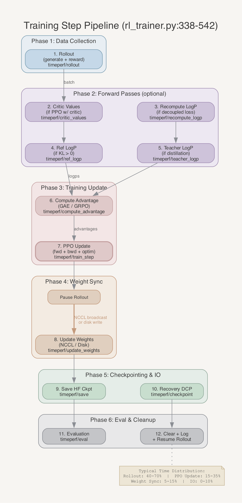
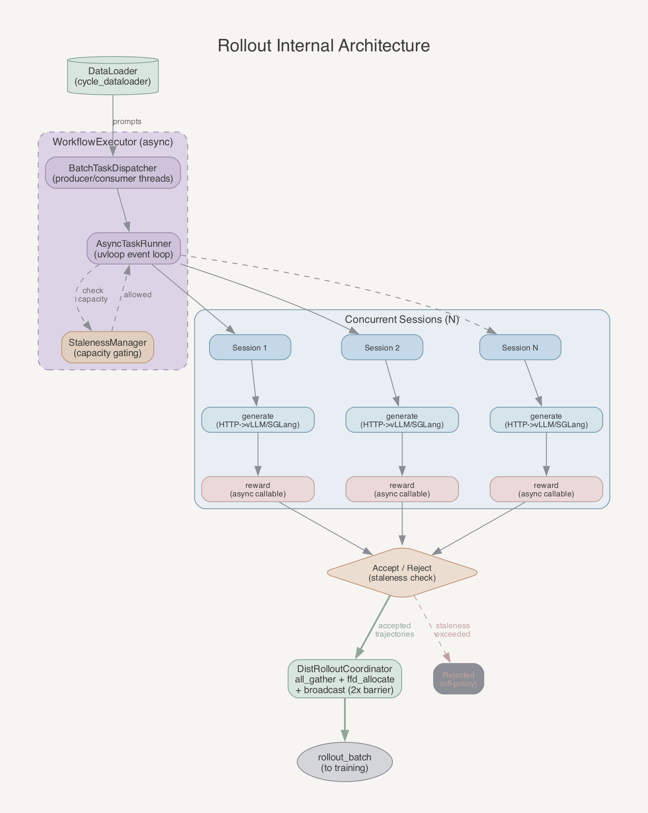
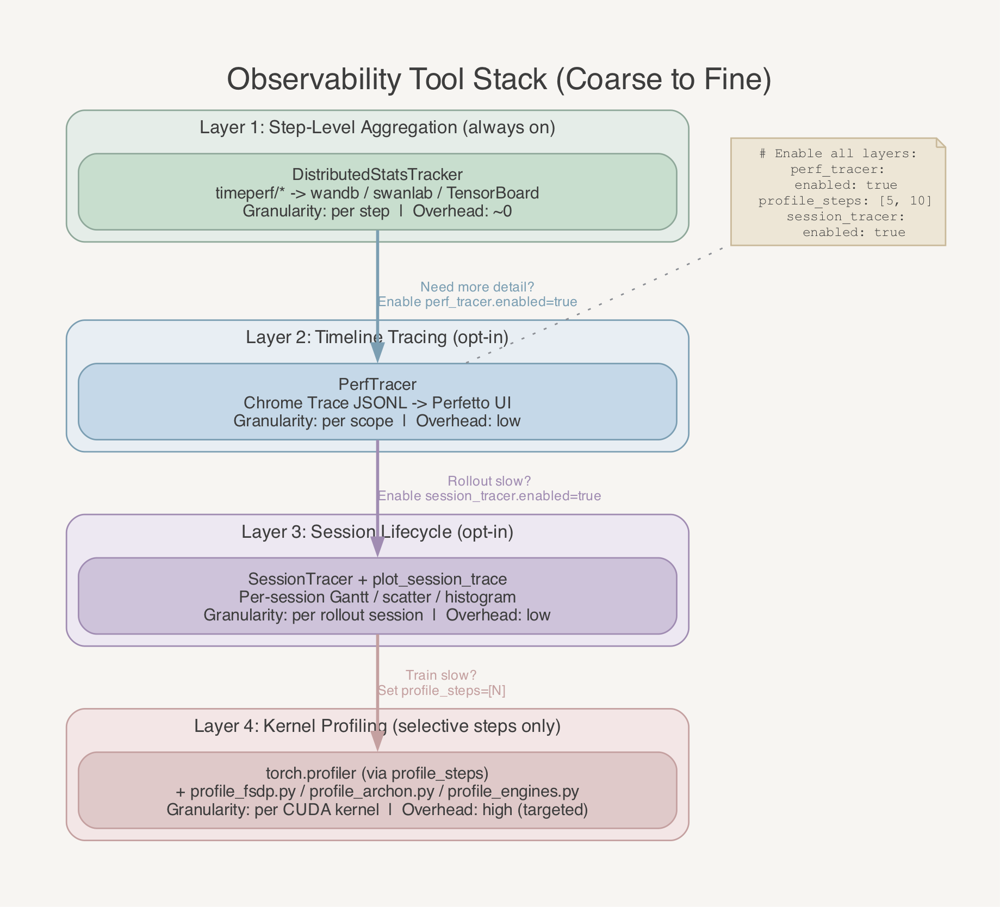
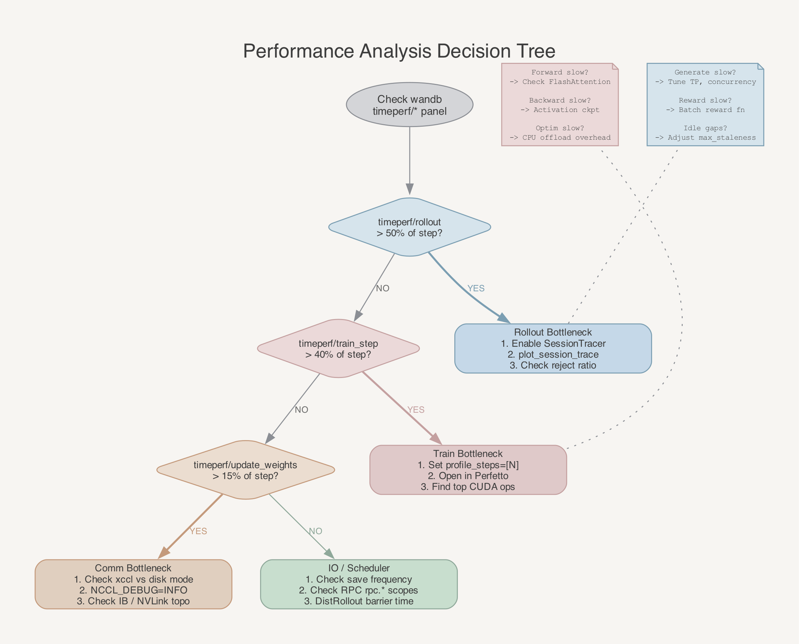

# AReaL 性能观测与分析指南
> 版本：v1.0 | 作者：zengbw | 日期：2026-04-02

---

## 1. 概述
### 1.1 目标
为 AReaL 分布式 RL 训练框架提供一套完整的性能观测方案，帮助 infra 工程师：
- 定位训练流水线中的时间瓶颈（rollout / train / weight sync / IO）
- 量化各阶段耗时占比，发现优化空间
- 监控 GPU 显存与通信开销，指导资源配置
- 建立性能基线，对比不同配置下的吞吐差异
### 1.2 适用场景
- 新模型/新数据集上线前的性能摸底
- 超参调整（batch size、TP/SP、n_mbs）后的性能回归验证
- 多节点扩展时的通信瓶颈排查
- Rollout 延迟异常时的根因分析
### 1.3 核心工具链
| 工具 | 用途 | 数据源 |
|---|---|---|
| `DistributedStatsTracker` | 每 step 各阶段 wall-clock 耗时 | wandb / swanlab / TensorBoard |
| `PerfTracer` | Chrome Trace 格式的细粒度 timeline | JSONL 文件 → Perfetto |
| `SessionTracer` | 每条 rollout session 的生命周期分析 | JSONL 文件 → Plotly |
| `profile_fsdp.py` / `profile_archon.py` | 单引擎 forward/backward kernel 级分析 | PyTorch Profiler JSON |
| `profile_engines.py` | Archon vs FSDP 引擎对比 | 对比报告 |
| `plot_session_trace.py` | Rollout session 可视化 | Gantt 图 + 直方图 |

---

## 2. 训练流水线阶段模型
### 2.1 单步训练阶段分解
一个完整的训练 step 包含以下串行阶段，每个阶段都被 `stats_tracker.record_timing()` 和 `perf_tracer.trace_scope()` 双重打点：



**关键观测点**：
- 阶段 1（rollout）通常是耗时最长的，包含 LLM 推理 + reward 计算
- 阶段 7（train_step）是 GPU 计算密集阶段，含 forward + backward + optimizer step
- 阶段 8（update_weights）是 NCCL 通信密集阶段，涉及 actor→inference 的权重同步
- 阶段 9-10（save/checkpoint）在非触发 step 耗时接近 0

### 2.2 Rollout 内部流水线
Rollout 阶段内部由 `WorkflowExecutor` 驱动，使用异步并发模型：



**关键指标**：
- `max_concurrent_rollouts`：并发 session 上限
- `max_staleness`：off-policy 容忍度，过高导致样本浪费，过低导致等待
- session 被 reject 的比例：反映 rollout 与 train 速度匹配度

### 2.3 阶段耗时速查表
| 阶段 | `stats_tracker` key | `perf_tracer` scope | Category | 典型耗时占比 |
|---|---|---|---|---|
| Rollout（含 generate+reward） | `timeperf/rollout` | `train.rollout` | COMPUTE | 40-70% |
| Critic values | `timeperf/critic_values` | `train.compute_values` | COMPUTE | 0-5% |
| Prox logp recompute | `timeperf/recompute_logp` | `train.recompute_logp` | COMPUTE | 0-5% |
| Ref logp | `timeperf/ref_logp` | `train.ref_logp` | COMPUTE | 0-5% |
| Teacher logp | `timeperf/teacher_logp` | `train.teacher_logp` | COMPUTE | 0-5% |
| Advantage computation | `timeperf/compute_advantage` | `train.compute_advantage` | COMPUTE | <1% |
| PPO update (fwd+bwd+step) | `timeperf/train_step` | `train.ppo_update` | COMPUTE | 15-35% |
| Weight sync | `timeperf/update_weights` | `train.update_weights` | COMM | 5-15% |
| HF save | `timeperf/save` | `train.save` | IO | 0-10% |
| Recovery checkpoint | `timeperf/checkpoint_for_recover` | `train.checkpoint` | IO | 0-5% |
| Evaluation | `timeperf/eval` | `train.eval` | COMPUTE | 0-20% |
| Clear batches | `timeperf/clear_batches` | `train.clear_batches` | INSTR | <1% |

---

## 3. 观测工具详解
框架提供 4 层递进的性能观测能力，从粗到细，按需开启：



**Layer 1：Step 级聚合指标（`DistributedStatsTracker`，始终开启）**
训练主循环 12 个阶段全部用 `record_timing()` 打点，key 前缀 `timeperf/`，自动输出到 wandb / swanlab / TensorBoard。零配置开箱即用。在 wandb 建一个 Stacked Area panel 放入 `timeperf/rollout`、`timeperf/train_step`、`timeperf/update_weights` 等，一眼看出哪个阶段占比最高。还能看到 `ppo_actor/seq_len/avg`、`ppo_actor/n_seqs` 等 batch 统计。
适合场景：快速摸底、超参对比、日常监控。

**Layer 2：Chrome Trace Timeline（`PerfTracer`，需配置 `perf_tracer.enabled: true`）**
在 Layer 1 的 12 个阶段基础上，额外覆盖引擎内部子操作（`fsdp_engine.forward`、`fsdp_engine.backward`、`fsdp_engine.step`、`rpc.*`），输出 Chrome Trace 兼容 JSONL。拖入 Perfetto 可查看各阶段的精确时间轴和嵌套关系。在指定 step 还可通过 `profile_steps` 激活 `torch.profiler`，采集 CUDA kernel 级热点并合并到同一 timeline。
适合场景：定位 train_step 内部哪个子阶段慢、发现 GPU-CPU 同步卡点。

**Layer 3：Rollout Session 生命周期（`SessionTracer`，需配置 `perf_tracer.session_tracer.enabled: true`）**
为每条 rollout session 单独记录 generate / reward / toolcall 各阶段耗时和 accept/reject 状态。配合内置 `plot_session_trace.py` 工具，输出 Gantt 图（每 session 阶段分布）+ latency scatter（趋势）+ duration 直方图。
适合场景：rollout 耗时高时，区分是 LLM 推理慢、reward 计算慢、还是调度 idle 多；分析 reject 率。

**Layer 4：Kernel 级 Profiling（独立 CLI 工具，按需运行）**
三个独立工具不需要跑完整训练：`profile_fsdp.py`（FSDP 引擎 fwd/bwd kernel 分析）、`profile_archon.py`（Archon 引擎同上）、`profile_engines.py`（两引擎并排对比），输出 `total_cuda_time_ms`、`peak_memory_mb`、`top_ops`。
适合场景：引擎选型、新模型上线前评估计算效率和显存峰值。

**推荐使用路径**：
1. 日常看 wandb `timeperf/*` 面板（Layer 1），确认各阶段占比是否合理
2. 发现异常 → 开启 PerfTracer（Layer 2），用 Perfetto 看 timeline 定位子阶段
3. Rollout 慢 → 开启 SessionTracer（Layer 3），用 `plot_session_trace` 分析 generate vs reward vs idle
4. Train 慢 → 设 `profile_steps=[N]`（Layer 2+4），在稳态 step 采 CUDA kernel trace，找 top 耗时 op
5. 选引擎 → 用 `profile_engines`（Layer 4）做隔离对比

以下是各工具的详细配置与使用说明。

### 3.1 DistributedStatsTracker（步级聚合指标）
**源码**：`areal/utils/stats_tracker.py`
**原理**：每个 `record_timing(key)` 上下文管理器记录 `time.perf_counter()` 差值，存储在 `timeperf/{key}` 下。`export()` 时跨 rank 做 `dist.all_reduce`，支持 AVG / MIN / MAX / SUM 模式。
**输出**：每个 training step 导出一个 `dict[str, float]`，通过 `StatsLogger` 同时写入 wandb / swanlab / TensorBoard。
**使用方式**：
```yaml
# 在实验 config 中配置 stats_logger
stats_logger:
  wandb:
    mode: online
    project: areal-perf
    entity: your-team
  tensorboard:
    path: /data/tb_logs/experiment_name
```
**查看方式**：
- wandb dashboard：筛选 `timeperf/*` 前缀的指标
- TensorBoard：`tensorboard --logdir /data/tb_logs/experiment_name`
**自定义打点**：
```python
from areal.utils.stats_tracker import record_timing, stat

# 计时
with record_timing("my_custom_phase"):
    do_something()

# 标量
stat(my_metric=tensor_value)
```

### 3.2 PerfTracer（Chrome Trace 细粒度 Timeline）
**源码**：`areal/utils/perf_tracer.py`
**原理**：
- 基于 `time.perf_counter_ns()` 记录 Begin/End 事件对
- 输出 Chrome Trace 兼容的 JSONL 文件
- 可选在特定 step 激活 `torch.profiler`，捕获 CUDA kernel 级 trace 并合并到同一 timeline
**配置**：
```yaml
perf_tracer:
  enabled: true              # 主开关（默认 false）
  save_interval: 1           # 每 N 步刷盘
  profile_steps: [5, 10, 20] # 在这些 step 激活 torch.profiler
  session_tracer:
    enabled: true             # 启用 per-session 追踪
    flush_threshold: 256      # 累计 256 条记录后刷盘
```
**输出路径**：`{fileroot}/logs/{user}/{experiment}/{trial}/perf_tracer/traces-r{rank}.jsonl`
**查看方式**：
1. 打开 [Perfetto UI](https://ui.perfetto.dev)
2. 将 `traces-r0.jsonl` 拖入浏览器
3. 使用 timeline 视图查看各阶段耗时分布
**Trace 类别（用于过滤）**：
| Category | 含义 | 示例 scope |
|---|---|---|
| `compute` | CPU/GPU 计算 | `train.ppo_update`, `fsdp_engine.forward` |
| `comm` | 分布式通信 | `train.update_weights`, `fsdp_engine.update_weights_from_distributed` |
| `io` | 磁盘 IO | `train.save`, `fsdp_engine.update_weights_from_disk` |
| `sync` | 同步屏障 | barrier 等待 |
| `scheduler` | 任务调度 | `workflow_executor.rollout_batch`, `rollout_controller.prepare_batch` |
| `instr` | 框架开销 | `train.clear_batches`, `train.log_stats` |
| `misc` | 其他 | `pause_generation`, `continue_generation` |

### 3.3 SessionTracer（Rollout Session 生命周期分析）
**源码**：`areal/utils/perf_tracer.py`（`SessionTracer` 类，L920-1123）
**原理**：为每个 rollout session 记录生命周期事件：submit → generate → reward → toolcall → finalized（accepted/rejected/failed）。
**输出路径**：`{fileroot}/logs/{user}/{experiment}/{trial}/session_tracer/sessions-r{rank}.jsonl`
**记录字段**：
| 字段 | 含义 |
|---|---|
| `submit_ts` | session 提交时间戳 |
| `finalized_ts` | session 完成时间戳 |
| `total_s` | 总耗时 |
| `generate_s` | LLM 推理耗时 |
| `reward_s` | reward 计算耗时 |
| `toolcall_s` | 工具调用耗时（multi-turn workflow） |
| `status` | accepted / rejected / failed / dropped |
**可视化**：
```bash
python -m areal.tools.plot_session_trace \
  --input /path/to/sessions-r0.jsonl \
  --output /path/to/session_analysis.html
```
输出包含：
- Gantt 图：每个 session 的 generate/reward/toolcall 各阶段时间分布，含 idle gap 检测
- Latency scatter：session 总耗时随时间的变化趋势
- Duration 直方图：各阶段耗时的分布统计

### 3.4 独立 Profiling 工具
**FSDP 引擎 profiling**：
```bash
python -m areal.tools.profile_fsdp \
  --model /path/to/model \
  --warmup-iters 3 \
  --profile-iters 5 \
  --mode both \
  --seq-lens 128,256,512 \
  --output /path/to/fsdp_trace.json
```
**Archon 引擎 profiling**：
```bash
python -m areal.tools.profile_archon \
  --model /path/to/model \
  --warmup-iters 3 \
  --profile-iters 5 \
  --output /path/to/archon_trace.json
```
**引擎对比**：
```bash
python -m areal.tools.profile_engines \
  --model /path/to/model \
  --mode both \
  --seq-lens 128,256,512,128
```
输出包含：`total_cuda_time_ms`、`peak_memory_mb`、`top_ops` 列表。

---

## 4. 性能分析方法论
### 4.1 第一步：建立 Step 级全景（5 分钟定位）
**目标**：找到训练 step 中耗时最长的阶段。
**方法**：从 wandb / TensorBoard 中查看 `timeperf/*` 指标的趋势图。
**关键看板配置**（wandb）：
```
Panel 1: "Step Time Breakdown" (Stacked Area)
  - timeperf/rollout
  - timeperf/train_step
  - timeperf/update_weights
  - timeperf/save
  - timeperf/checkpoint_for_recover
  - timeperf/eval

Panel 2: "Rollout Efficiency" (Line)
  - timeperf/rollout (total rollout time)
  - rollout/rejected_ratio (if available)

Panel 3: "GPU Memory" (Line)
  - device/mem_allocated
  - device/mem_reserved
```
**决策树**：



### 4.2 Rollout 瓶颈分析
当 `timeperf/rollout` 主导 step 耗时时：
**4.2.1 Session 级分析**
启用 SessionTracer，运行 `plot_session_trace.py` 分析：
- **Generate 占比 >> Reward**：瓶颈在 LLM 推理
  - 检查 vLLM/SGLang TP 并行度是否充分利用 GPU
  - 检查 `max_concurrent_rollouts` 是否过低导致推理 GPU 空闲
  - 查看 SGLang metrics（`enable_metrics: true`）中的 request 队列深度
- **Reward 占比高**：瓶颈在 reward 计算
  - 检查 reward function 是否有外部 API 调用或 CPU 密集操作
  - 考虑 reward 批处理优化
- **Idle gap 频繁出现**：调度效率低
  - 检查 `StalenessManager` 的 reject 率
  - 调整 `max_staleness` 平衡 on-policy 纯度与吞吐
**4.2.2 并发度调优**
```
有效并发 = min(max_concurrent_rollouts,
               (max_staleness + current_version + 1) * batch_size - accepted_samples)
```
- `max_concurrent_rollouts` 过低 → 推理 GPU 利用率不足
- `max_concurrent_rollouts` 过高 → 内存压力大，reject 增多
- `max_staleness` = 0 → 完全 on-policy，每次 weight update 后之前的 rollout 全部作废
**4.2.3 推理引擎调优**
| 参数 | 位置 | 建议 |
|---|---|---|
| `tensor_parallel_size` | SGLang/vLLM config | 与 GPU 数量匹配，大模型需更高 TP |
| `enable_nccl_nvls` | `cli_args.py:1432` | A100/H100 上可尝试开启 |
| `decode_log_interval` | `cli_args.py:1483` | 设为 1 观察推理吞吐 |
| `show_time_cost` | `cli_args.py:1479` | 开启查看单请求耗时 |
| `enable_metrics` | `cli_args.py:1480` | 开启 Prometheus 指标导出 |

### 4.3 Train 瓶颈分析
当 `timeperf/train_step` 主导时：
**4.3.1 Kernel 级 Profiling**
在特定 step 启用 `torch.profiler`：
```yaml
perf_tracer:
  enabled: true
  profile_steps: [10, 20, 30]
```
在 Perfetto 中查看 `train.ppo_update` 内部的 `fsdp_engine.forward`、`fsdp_engine.backward`、`fsdp_engine.step` 三个子 scope：
- **Forward 占比高**：检查 attention 实现、sequence length padding 效率
- **Backward 占比高**：检查梯度累积策略、activation checkpointing 配置
- **Step（optimizer）占比高**：检查 CPU offload 是否引入 H2D 瓶颈
**4.3.2 独立引擎 Profiling**
使用 `profile_fsdp.py` 或 `profile_archon.py` 做隔离分析：
```bash
python -m areal.tools.profile_fsdp \
  --model /path/to/model \
  --seq-lens 256,512,1024,256 \
  --profile-iters 5 \
  --output fsdp_trace.json
```
在 Perfetto 中查看 top CUDA ops 和 peak memory，关注：
- matmul / attention kernel 是否用了最优实现（FlashAttention）
- 是否存在不必要的 GPU-CPU 同步（`.item()`, `.tolist()`）
- 序列长度 padding 浪费率
**4.3.3 Micro-batch 调优**
PPO update 内部将 batch 切分为 `ppo_n_minibatches` 个 micro-batch：
- `n_mbs` 过大 → 单个 micro-batch 太小，GPU 利用率低
- `n_mbs` 过小 → 单个 micro-batch 太大，显存不足
- 找到显存刚好用满的最小 `n_mbs` 值
**4.3.4 引擎对比**
```bash
python -m areal.tools.profile_engines \
  --model /path/to/model \
  --seq-lens 256,512,1024,256
```
对比 Archon vs FSDP 的 `total_cuda_time_ms` 和 `peak_memory_mb`，选择更高效的引擎。

### 4.4 通信瓶颈分析
当 `timeperf/update_weights` 占比显著时：
**4.4.1 Weight Sync 模式**
AReaL 支持两种 weight sync：
- **xccl（NCCL broadcast）**：actor 通过 NCCL 直接广播权重到 inference GPU，延迟低但需要 GPU 互联
- **disk（NFS/共享存储）**：actor 写磁盘，inference 读磁盘，延迟取决于 IO 带宽
在 Perfetto 中查看：
- `fsdp_engine.update_weights_from_distributed` (xccl) — 包含分块 broadcast 的 NCCL 耗时
- `fsdp_engine.update_weights_from_disk` (disk) — 包含写入 + 加载耗时
**4.4.2 排查方法**
- FSDP 引擎会在 `dist.broadcast()` 前后打印 `"Broadcasting model weights took X.XX seconds"`（`fsdp_engine.py:338-350`）
- 对于 disk 模式，`remote_inf_engine.py:1294-1325` 记录 `save_timestamp` → `load_timestamp` 的延迟
**4.4.3 优化方向**
| 场景 | 建议 |
|---|---|
| xccl 延迟高 | 检查 NCCL 拓扑（`NCCL_TOPO_FILE`），确认 NVLink/NVSwitch 可用 |
| 跨节点 broadcast 慢 | 检查 IB 带宽，考虑将 actor 和 rollout 分配到同节点 |
| disk 模式延迟高 | 检查共享存储 IOPS，考虑切换到 xccl 模式 |
| 权重更新阻塞 rollout | rollout 在 weight sync 期间被 pause，检查 sync 耗时是否合理 |

### 4.5 IO 与调度分析
**4.5.1 Checkpoint IO**
- `timeperf/save`：HF 格式保存，通常较慢
- `timeperf/checkpoint_for_recover`：DCP 格式保存，支持 async staging
- 框架使用 `saver.maybe_wait_for_staging()` 确保上一次 async save 完成后才开始 PPO update
- 如果 save 阻塞了 train，考虑增大 save 频率间隔
**4.5.2 RPC 开销**
每个 engine method 调用经过 RPC 层（Flask HTTP）时，都被 `perf_tracer.trace_scope(f"rpc.{method_name}")` 包裹。在 Perfetto 中查看 `rpc.*` scope 来量化序列化/反序列化开销。
**4.5.3 DistRolloutCoordinator 开销**
Rollout 结果需要跨 DP group 做 `all_gather` + `ffd_allocate`（首次适配递减负载均衡）+ `broadcast`（两次 barrier）。在大 DP 并行度下，这部分通信开销可能显著。

---

## 5. 性能指标体系
### 5.1 核心指标定义
框架目前未内置 tokens/sec 和 MFU 计算。以下是完整指标体系，分为"已有"和"待实现"两类：
**已有指标**（直接从 `stats_tracker` 导出）：
| 指标 | stats key | 说明 |
|---|---|---|
| 各阶段 wall-clock 耗时 | `timeperf/rollout`, `timeperf/train_step`, ... | 12 个阶段全覆盖 |
| 序列长度（avg/min/max） | `ppo_actor/seq_len/avg` 等 | 含 prompt_len 拆分 |
| 有效 token 数 | `ppo_actor/n_valid_tokens` | loss_mask 为 true 的 token |
| 序列数 | `ppo_actor/n_seqs` | 当前 step 处理的序列总数 |
| 显存状态 | `DeviceRuntimeInfo.log()` | mem_allocated / reserved / used |
**待实现指标**（TODO，见第 7 章详细实现方案）：
| 指标 | 公式 | 说明 |
|---|---|---|
| Train tokens/sec | `total_tokens / timeperf/train_step` | 训练阶段每秒处理 token 数 |
| Rollout tokens/sec | `total_gen_tokens / timeperf/rollout` | 推理阶段每秒生成 token 数 |
| Step tokens/sec | `total_tokens / step_total_time` | 端到端每秒 token 数 |
| MFU | `actual_flops / peak_flops` | 模型 FLOPS 利用率 |
| Train compute ratio | `timeperf/train_step / step_total_time` | GPU 用于有效训练的时间占比 |
| Rollout efficiency | `1 - rejected_ratio` | 生成的 rollout 被有效使用的比例 |
| Weight sync overhead | `timeperf/update_weights / step_total_time` | 权重同步占比 |
| IO overhead | `(timeperf/save + timeperf/checkpoint) / step_total_time` | IO 占比 |
| GPU memory utilization | `mem_allocated / mem_total` | 显存使用率 |
### 5.2 监控告警阈值（建议）
| 指标 | 健康范围 | 异常信号 |
|---|---|---|
| `timeperf/rollout` 变化 | step 间波动 < 20% | 突增 > 50% 说明推理卡顿或 reject 率上升 |
| `timeperf/train_step` | 稳定（波动 < 5%） | 突增可能是显存 swap 或 GC |
| `timeperf/update_weights` | 稳定 | 突增说明通信异常 |
| `mem_allocated` | < 90% of total | > 95% 时 OOM 风险 |
| reject 率 | < 20% | > 50% 说明 rollout/train 速度严重失配 |
| step 间隔 | 稳定 | 周期性尖刺通常是 save/eval 触发 |

---

## 6. 实操指南
### 6.1 快速性能摸底（推荐首次使用）
**Step 1**：启用全量观测
```yaml
# 在实验 YAML 中追加
perf_tracer:
  enabled: true
  save_interval: 1
  profile_steps: [5, 10]  # 仅在这几步采集 kernel trace
  session_tracer:
    enabled: true
    flush_threshold: 128

stats_logger:
  wandb:
    mode: online
    project: areal-perf-baseline
```
**Step 2**：运行 20-30 步训练
```bash
python3 examples/math/gsm8k_rl.py \
  --config examples/math/gsm8k_grpo.yaml \
  scheduler.type=local \
  total_train_steps=30 \
  perf_tracer.enabled=true \
  "perf_tracer.profile_steps=[5,10,20]" \
  perf_tracer.session_tracer.enabled=true
```
**Step 3**：分析结果
```bash
# 1. 查看 wandb dashboard 中的 timeperf/* stacked area chart
# 2. 下载 traces-r0.jsonl，拖入 Perfetto 查看 timeline
# 3. 分析 session trace
python -m areal.tools.plot_session_trace \
  --input /path/to/sessions-r0.jsonl \
  --output session_analysis.html
```

### 6.2 Kernel 级深度分析
适用于定位到 `train_step` 瓶颈后，需要进一步分析哪个 CUDA kernel 慢：
```yaml
perf_tracer:
  enabled: true
  profile_steps: [15]  # 只在稳定期的一个 step 采集
```
打开 Perfetto 后：
1. 搜索 `train.ppo_update` scope，展开查看内部 kernel
2. 按 CUDA time 排序，找到 top-5 耗时 kernel
3. 检查是否有 `aten::to`（设备转换）、`aten::copy_`（数据拷贝）等非计算 kernel 占比过高

### 6.3 引擎选型对比
在决定使用 FSDP 还是 Archon 引擎前：
```bash
# 在单 GPU 上运行对比
python -m areal.tools.profile_engines \
  --model /path/to/model \
  --batch-size 2 \
  --seq-lens 256,512,1024,256 \
  --warmup-iters 3 \
  --profile-iters 10 \
  --output engine_comparison/
```
关注输出中的：
- `total_cuda_time_ms`：越低越好
- `peak_memory_mb`：越低意味着可以用更大 batch_size
- `top_ops`：确认关键 kernel 是否一致

### 6.4 Rollout 调度调优
**场景**：rollout 耗时占比过高，但推理 GPU 利用率低。
**方法**：
1. 查看 `StalenessManager` 的 capacity 公式：
   ```
   capacity = min(max_concurrent_rollouts,
                  (max_staleness + version + 1) * batch_size - accepted)
   ```
2. 从 session trace 中统计 reject 率和 idle gap 比例
3. 调整参数：
   ```yaml
   # 提高并发
   rollout.max_concurrent_rollouts: 64  # 默认可能较低
   # 放松 staleness
   rollout.max_head_offpolicyness: 2    # 允许 2 版本 off-policy
   ```
4. 重新运行，对比 `timeperf/rollout` 变化

### 6.5 显存分析
框架通过 `DeviceRuntimeInfo`（`areal/api/io_struct.py:336`）在关键节点记录显存状态：
```python
# 代码中已有的打点位置
self.actor.get_device_stats().log("ppo update")       # PPO 更新后
self.critic.get_device_stats().log("critic values")    # Critic 前向后
self.ref.get_device_stats().log("ref logp")            # Ref 前向后
```
记录字段：`mem_allocated`、`mem_reserved`、`mem_used`（= total - free）。
**注意**：当前框架不记录 SM occupancy 或 GPU 利用率百分比。如需此类信息，需结合 `nvidia-smi dmon` 或 DCGM exporter。

---

## 7. 吞吐与 MFU 实现方案（TODO）
### 7.1 已有能力总结
| 能力 | 覆盖度 | 说明 |
|---|---|---|
| Step 级各阶段耗时 | 完整 | 12 个阶段全部双重打点 |
| Chrome Trace timeline | 完整 | 支持 Perfetto 可视化，可合并 torch.profiler |
| Session 生命周期 | 完整 | generate/reward/toolcall 分阶段追踪 |
| 引擎级 profiling | 完整 | FSDP/Archon 独立 profiling 工具 |
| 显存追踪 | 基础 | 仅 allocated/reserved/used，缺乏时序图 |
| 外部报表 | 完整 | wandb + swanlab + TensorBoard 三路同时输出 |

### 7.2 TODO-1：Train Tokens/sec（训练吞吐）
**目标**：每 step 自动计算并上报训练侧 tokens/sec。
**现有数据基础**：
- `ppo_actor/seq_len/avg`（每序列平均 token 数）已在 `areal/trainer/ppo/actor.py:251,295` 通过 `attn_mask.sum(-1)` 计算并写入 `stats_tracker`
- `ppo_actor/n_seqs`（序列数）已记录
- `ppo_actor/n_valid_tokens`（生成 token 数，即 `loss_mask.sum()`）已记录为 denominator
- `timeperf/train_step`（PPO update 耗时）已记录
**实现方案**：
- **步骤 1**：在 `areal/trainer/ppo/actor.py` 的 `_ppo_update()` 方法中（约 L271），新增一个 `stats_tracker.scalar()` 调用，记录 `total_tokens = seqlens.sum().item()`：
  ```python
  # actor.py:_ppo_update(), 在 infer_token_denominator 之后
  seqlens = attn_mask.sum(-1)  # 已有
  stats_tracker.scalar(total_tokens=seqlens.sum().item())       # 新增
  stats_tracker.scalar(total_gen_tokens=loss_mask.sum().item()) # 新增
  ```
- **步骤 2**：在 `areal/trainer/rl_trainer.py` 的 `_export_and_commit_stats()` 方法中（约 L889），从 `stats` dict 中取出 token 数和耗时，计算 tokens/sec 并注入：
  ```python
  def _export_and_commit_stats(self, epoch, epoch_step, global_step):
      stats = self.actor.export_stats()
      stats.update(self.rollout.export_stats())
      # --- 新增：计算吞吐指标 ---
      total_tokens = stats.get("ppo_actor/total_tokens", 0)
      total_gen_tokens = stats.get("ppo_actor/total_gen_tokens", 0)
      train_time = stats.get("timeperf/train_step", 0)
      rollout_time = stats.get("timeperf/rollout", 0)
      step_time = sum(v for k, v in stats.items() if k.startswith("timeperf/"))
      if train_time > 0:
          stats["throughput/train_tokens_per_sec"] = total_tokens / train_time
      if rollout_time > 0:
          stats["throughput/rollout_tokens_per_sec"] = total_gen_tokens / rollout_time
      if step_time > 0:
          stats["throughput/step_tokens_per_sec"] = total_tokens / step_time
      # --- 结束 ---
      self.stats_logger.commit(epoch, epoch_step, global_step, stats)
  ```
**上报路径**：自动进入 wandb / swanlab / TensorBoard，key 前缀为 `throughput/`。
**涉及文件**：
| 文件 | 修改点 |
|---|---|
| `areal/trainer/ppo/actor.py` | `_ppo_update()` ~L271，新增 `scalar(total_tokens=...)` |
| `areal/trainer/rl_trainer.py` | `_export_and_commit_stats()` ~L889，新增吞吐计算 |

### 7.3 TODO-2：MFU（Model FLOPs Utilization）
**目标**：每 step 自动计算并上报 MFU，评估 GPU 计算效率。
**MFU 定义**：
```
MFU = actual_flops_per_sec / gpu_peak_flops_per_sec

actual_flops_per_sec = model_flops_per_token * tokens_per_step / train_step_time
model_flops_per_token ≈ 6 * num_params  (Kaplan 近似：forward 2P + backward 4P)
```
**现有数据基础**：
- `total_tokens`：由 TODO-1 新增
- `timeperf/train_step`：已有
- 模型参数量：
  - FSDPEngine：`self.model` 可通过 `sum(p.numel() for p in model.parameters())` 获取，当前未缓存（`areal/engine/fsdp_engine.py:867`）
  - MegatronEngine：已在 init 时计算并 log，但未存为属性（`areal/engine/megatron_engine.py:316-320`）
- GPU 峰值 FLOPS：需从硬件型号推断（A100=312 TFLOPS bf16, H100=989 TFLOPS bf16, H800=~756 TFLOPS bf16）
**实现方案**：
- **步骤 1**：在引擎 init 时缓存参数量
  ```python
  # fsdp_engine.py, initialize() 末尾 (~L870)
  self.total_params = sum(p.numel() for p in self.model.parameters())
  logger.info(f"Model parameter count: {self.total_params / 1e9:.2f}B")

  # megatron_engine.py, ~L320 已有计算，追加：
  self.total_params = total_params
  ```
- **步骤 2**：在 `cli_args.py` 的 `PerfTracerConfig`（或新建 `ThroughputConfig`）中添加 GPU 峰值 FLOPS 配置
  ```python
  @dataclass
  class ThroughputConfig:
      gpu_peak_tflops_bf16: float = 312.0  # A100 默认值，用户可覆盖
  ```
- **步骤 3**：在 `_export_and_commit_stats()` 中计算 MFU
  ```python
  # rl_trainer.py: _export_and_commit_stats()
  total_params = self.actor.get_total_params()  # 新增 API
  gpu_peak_flops = self.config.throughput.gpu_peak_tflops_bf16 * 1e12
  n_gpus = dist.get_world_size(self.actor.data_parallel_group)
  if train_time > 0 and total_params > 0:
      model_flops_per_token = 6 * total_params
      actual_flops = model_flops_per_token * total_tokens / train_time
      peak_flops = gpu_peak_flops * n_gpus
      stats["throughput/mfu"] = actual_flops / peak_flops
  ```
**注意事项**：
- `6 * num_params` 是 dense Transformer 的近似值，MoE 模型需用 `6 * active_params`
- `n_gpus` 应取参与训练的 GPU 数（DP * TP * PP），不含推理 GPU
- BF16/FP16 的峰值 FLOPS 不同，需与实际训练精度匹配
**涉及文件**：
| 文件 | 修改点 |
|---|---|
| `areal/engine/fsdp_engine.py` | `initialize()` 末尾，缓存 `self.total_params` |
| `areal/engine/megatron_engine.py` | ~L320，缓存 `self.total_params` |
| `areal/api/cli_args.py` | 新增 `ThroughputConfig` dataclass |
| `areal/trainer/rl_trainer.py` | `_export_and_commit_stats()` 新增 MFU 计算 |

### 7.4 TODO-3：Rollout 吞吐细化指标
**目标**：区分 prefill tokens/sec 和 decode tokens/sec。
**现有数据基础**：
- `ModelResponse.latency`：单请求总耗时（`areal/api/io_struct.py:76`）
- `ModelResponse.ttft`：当前等于 latency，非真实 TTFT（`io_struct.py:77`）
- `ppo_actor/prompt_len/avg`：prompt 长度
- `ppo_actor/seq_len/avg` - `ppo_actor/prompt_len/avg`：生成长度
**实现方案**：
- **步骤 1**：在 `areal/infra/remote_inf_engine.py` 的 HTTP streaming 模式下，记录首个 token 到达时间作为真实 TTFT（当前 ~L850 只记录了总 latency）
- **步骤 2**：新增 stats：
  ```python
  stats_tracker.scalar(
      prefill_tokens_per_sec=prompt_tokens / ttft,
      decode_tokens_per_sec=gen_tokens / (latency - ttft),
  )
  ```
**涉及文件**：
| 文件 | 修改点 |
|---|---|
| `areal/infra/remote_inf_engine.py` | ~L850 HTTP 响应处理，记录真实 TTFT |
| `areal/api/io_struct.py` | `ModelResponse.ttft` 语义修正 |

### 7.5 TODO-4：NCCL 通信带宽统计
**目标**：量化 weight sync 的有效通信带宽。
**实现方案**：
- 在 `fsdp_engine.py` 的 `_update_weights_from_distributed()`（L1116）中，记录每次 broadcast 的 tensor 总字节数和耗时：
  ```python
  total_bytes = sum(t.numel() * t.element_size() for t in weight_chunks)
  elapsed = time.perf_counter() - start
  bandwidth_gbps = total_bytes / elapsed / 1e9
  stats_tracker.scalar(weight_sync_bandwidth_gbps=bandwidth_gbps)
  ```
**涉及文件**：
| 文件 | 修改点 |
|---|---|
| `areal/engine/fsdp_engine.py` | `_update_weights_from_distributed()` ~L1116 |
| `areal/engine/megatron_engine.py` | `_update_weights_from_distributed()` ~L1275 |

### 7.6 TODO-5：GPU SM 利用率采样
**目标**：周期性采样 GPU SM 利用率，发现 GPU 空闲。
**实现方案**：
- 使用 `py3nvml` 或 `pynvml` 在后台线程中每秒采样 `nvmlDeviceGetUtilizationRates()`
- 将 `gpu_util_percent` 写入 `stats_tracker`
- 或集成 DCGM exporter，通过 Prometheus 采集
**涉及文件**：
| 文件 | 修改点 |
|---|---|
| 新增 `areal/utils/gpu_monitor.py` | 后台采样线程 |
| `areal/trainer/rl_trainer.py` | 训练启动时启动 monitor |

### 7.7 TODO-6：自动告警
**目标**：基于第 5.2 节阈值，自动触发 wandb alerts。
**实现方案**：
- 在 `StatsLogger.commit()` 后添加阈值检查逻辑
- 或使用 wandb Alerts API：`wandb.alert(title=..., text=..., level=...)`

### 7.8 TODO 优先级与实施顺序
| 优先级 | TODO | 预估工作量 | 依赖 |
|---|---|---|---|
| P0 | TODO-1 Train Tokens/sec | 0.5 天 | 无 |
| P0 | TODO-2 MFU | 1 天 | TODO-1 |
| P1 | TODO-4 NCCL 带宽 | 0.5 天 | 无 |
| P1 | TODO-3 Rollout 吞吐细化 | 1 天 | 需改 HTTP streaming |
| P2 | TODO-5 GPU SM 利用率 | 1 天 | 需新增依赖 pynvml |
| P2 | TODO-6 自动告警 | 0.5 天 | TODO-1, TODO-2 |

---

## 8. 附录
### 8.1 配置参考
**PerfTracerConfig 完整字段**（`areal/api/cli_args.py:1973-2009`）：
| 字段 | 类型 | 默认值 | 说明 |
|---|---|---|---|
| `enabled` | `bool` | `false` | 主开关 |
| `save_interval` | `int` | `1` | 每 N 步刷盘 |
| `profile_steps` | `list[int] \| None` | `None` | 激活 torch.profiler 的 step 列表 |
| `session_tracer.enabled` | `bool` | `false` | Session 追踪开关 |
| `session_tracer.flush_threshold` | `int` | `256` | Session 记录刷盘阈值 |
**SGLang 推理相关观测配置**（`areal/api/cli_args.py`）：
| 字段 | 默认值 | 说明 |
|---|---|---|
| `show_time_cost` | `false` | 显示单请求耗时 |
| `enable_metrics` | `true` | Prometheus 指标导出 |
| `decode_log_interval` | `1` | 推理吞吐日志间隔（decode iterations） |

### 8.2 文件索引
| 文件 | 职责 |
|---|---|
| `areal/utils/perf_tracer.py` | PerfTracer + SessionTracer 实现 |
| `areal/utils/stats_tracker.py` | DistributedStatsTracker 实现 |
| `areal/utils/stats_logger.py` | wandb/swanlab/TensorBoard 输出 |
| `areal/trainer/rl_trainer.py` | 训练主循环，所有阶段打点 |
| `areal/infra/staleness_manager.py` | Rollout 并发与 staleness 管理 |
| `areal/infra/workflow_executor.py` | Rollout 异步执行器 |
| `areal/infra/dist_rollout.py` | 跨 rank 的 rollout 分发 |
| `areal/engine/fsdp_engine.py` | FSDP 引擎（含 weight sync timing） |
| `areal/engine/megatron_engine.py` | Megatron 引擎（含 weight sync timing） |
| `areal/tools/profile_fsdp.py` | FSDP 引擎独立 profiling |
| `areal/tools/profile_archon.py` | Archon 引擎独立 profiling |
| `areal/tools/profile_engines.py` | 引擎对比 profiling |
| `areal/tools/plot_session_trace.py` | Session trace 可视化 |
| `areal/api/cli_args.py` | 所有配置定义（含 PerfTracerConfig） |
| `areal/api/io_struct.py` | DeviceRuntimeInfo 显存信息 |

### 8.3 常用排查命令速查
```bash
# 查看训练日志中的 weight sync 耗时
grep "Broadcasting model weights took" /path/to/train.log

# 实时监控 GPU 显存和利用率
nvidia-smi dmon -s u -d 1

# 查看 NCCL 通信调试信息（需设置环境变量后重启训练）
export NCCL_DEBUG=INFO
export NCCL_DEBUG_SUBSYS=ALL

# 快速查看某个 step 的 perf trace
python -c "
import json
with open('traces-r0.jsonl') as f:
    for line in f:
        ev = json.loads(line)
        if ev.get('args', {}).get('global_step') == 10:
            print(f\"{ev['name']:40s} {ev.get('dur', 0)/1e6:.2f}ms\")
"

# 统计 session reject 率
python -c "
import json
from collections import Counter
c = Counter()
with open('sessions-r0.jsonl') as f:
    for line in f:
        r = json.loads(line)
        c[r.get('status', 'unknown')] += 1
total = sum(c.values())
for k, v in c.most_common():
    print(f'{k}: {v} ({v/total*100:.1f}%)')
"
```
