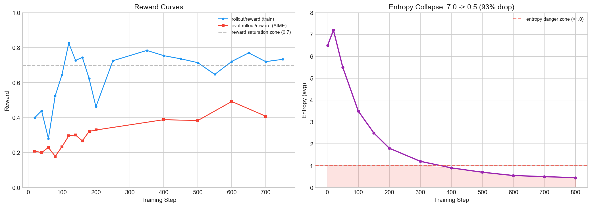
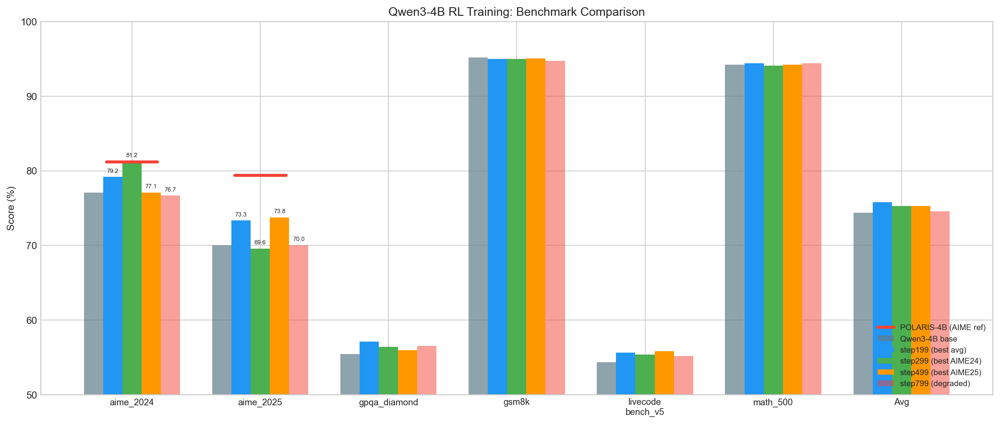

# Qwen3-4B POLARIS-Aligned RL 实验记录
> 版本：v1.0 | 作者：zengbw | 日期：2026-04-20

---

## 1. 实验概述
### 1.1 实验目标
在 Qwen3-4B 上复现 POLARIS（HKU NLP + ByteDance Seed）的 RL 训练方案，验证 AReaL 框架下小模型 RL 后训练的效果天花板。
### 1.2 验证目标
对比 POLARIS-4B 在 AIME 2024/2025 上的效果（81.2 / 79.4），评估 AReaL 单阶段训练方案的差距，定位瓶颈并制定多阶段训练计划。
### 1.3 参考方案
- POLARIS: [HKU NLP Blog](https://hkunlp.github.io/blog/2025/Polaris/) | [GitHub](https://github.com/ChenxinAn-fdu/POLARIS)
- 框架: veRL (Volcano Engine RL)
- 核心思路: 3 阶段渐进 RL（温度递增 + 难度过滤 + 长度递增）

---

## 2. 实验配置
### 2.1 训练任务信息
| 项目 | 值 |
|---|---|
| Job Name | bifrost-2026041721040601-zengbw1 |
| 模型 | Qwen3-4B (`/publicdata/huggingface.co/Qwen/Qwen3-4B`) |
| 训练数据 | dapo_math_17k (17398 samples, type=dapo_math) |
| 评测数据 | AIME 2024 (30 problems) |
| 集群 | 2 nodes x 8 A100-80G |
| 运行时长 | ~2.5 天 |
| 进度 | Epoch 2/2, Step 1844/2174 (84.8%) |
| SwanLab | https://swanlab.cn/@zengbw1/areal_train/runs/e2b7kxj1tlw2v9yxn08ju |

### 2.2 超参配置
| 参数 | 本实验值 | POLARIS Stage-1 | 差异说明 |
|---|---|---|---|
| 训练数据 | dapo_math_17k (17K) | Polaris-Dataset-53K (30K for 4B) | 数据量少 43%，且难度偏低 |
| batch_size | 16 prompts | 128 sequences (16 prompts x 8) | 等效相同 |
| n_samples | 8 | 8 | 相同 |
| lr | 1e-6 | 1e-6 | 相同 |
| temperature | 1.4 | 1.4 | 相同 |
| eps_clip | 0.2 | 0.2 | 相同 |
| eps_clip_higher | 0.28 | 0.28 | 相同 |
| kl_ctl | 0.001 (in advantage) | 0.001 (in advantage) | 相同 |
| kl_loss | N/A (无显式 KL loss) | 0 (显式关闭) | 相同 |
| entropy_coeff | N/A | 0 (显式关闭) | 相同 |
| max_new_tokens | 31744 | 39936 | 本实验少 20% |
| total_epochs | 2 | 30 per stage, 3 stages | POLARIS 多阶段+更多轮 |
| 训练策略 | 单阶段 | 3 阶段渐进 | 核心差异 |
| adv_norm | batch/batch | group/group | 本实验用 batch-level |
| reward_norm | group/group (group_size=8) | [待确认] | - |
| Actor 并行 | megatron d1t4c2p1 | [待确认] | - |
| Rollout 并行 | sglang d2p1t4 | [待确认] | - |

### 2.3 集群资源
| 角色 | 节点 | GPU | 并行度 | 显存峰值 |
|---|---|---|---|---|
| Actor (Megatron) | Node 0 | 8x A100 | DP1 x TP4 x CP2 | 67.3/79.3 GB (84.9%) |
| Ref (Megatron colocated) | Node 0 | 共用 | 同 Actor | 同 Actor |
| Rollout (SGLang) | Node 1 | 8x A100 | DP2 x TP4 | 88.5% |

### 2.4 Checkpoint 保存
保存路径：

```
/dataset_rc_llmrl/zengbw1/areal_experiments/
  bifrost-2026041721040601-zengbw1-qwen3-4b-polaris-rlvr/
    files/checkpoints/root/.../trial0/default/
```

| Checkpoint | Step | 保存时间 | 大小 |
|---|---|---|---|
| epoch0epochstep99globalstep99 | 100 | 04-17 22:51 | ~7.6 GB |
| epoch0epochstep199globalstep199 | 200 | 04-18 01:00 | ~7.6 GB |
| epoch0epochstep299globalstep299 | 300 | 04-18 04:02 | ~7.6 GB |
| epoch0epochstep399globalstep399 | 400 | 04-18 07:23 | ~7.6 GB |
| epoch0epochstep499globalstep499 | 500 | 04-18 11:08 | ~7.6 GB |
| epoch0epochstep599globalstep599 | 600 | 04-18 15:03 | ~7.6 GB |
| epoch0epochstep699globalstep699 | 700 | 04-18 19:11 | ~7.6 GB |

---

## 3. 评测结果
### 3.1 Benchmark 完整对比
| Model | aime_2024 | aime_2025 | gpqa_diamond | gsm8k | livecodebench_v5 | math_500 | Avg |
|---|---|---|---|---|---|---|---|
| Qwen3-4B (base) | 77.08 | 70.00 | 55.43 | 95.22 | 54.37 | 94.20 | 74.38 |
| step99 | 79.17 | 69.58 | 55.81 | 94.92 | 53.09 | 94.50 | 74.51 (+0.13) |
| step199 (best avg) | 79.17 | 73.33 | 57.13 | 95.00 | 55.65 | 94.45 | 75.79 (+1.41) |
| step299 | 81.25 | 69.58 | 56.38 | 95.00 | 55.35 | 94.13 | 75.28 (+0.90) |
| step399 | 77.50 | 72.92 | 55.24 | 94.77 | 56.17 | 94.25 | 75.14 (+0.76) |
| step499 | 77.08 | 73.75 | 55.93 | 95.07 | 55.80 | 94.25 | 75.31 (+0.93) |
| POLARIS-4B (参考) | 81.20 | 79.40 | - | - | - | - | - |

### 3.2 与 POLARIS 对比（AIME 维度）
| Model | aime_2024 | aime_2025 |
|---|---|---|
| Qwen3-4B base | 77.08 | 70.00 |
| 本实验 best (step299) | 81.25 (+4.17) | 69.58 (-0.42) |
| 本实验 step499 | 77.08 (+0.00) | 73.75 (+3.75) |
| POLARIS-4B | 81.20 (+4.12) | 79.40 (+9.40) |

关键发现：
- aime_2024: step299 达到 81.25，与 POLARIS-4B 的 81.2 持平，但随后回落至 77.08（完全退回 base）
- aime_2025: 最高 73.75（step499），距 POLARIS-4B 的 79.4 仍有 5.65 的差距
- 两个 AIME 指标无法同时达到最优 — step299 赢 AIME24 但输 AIME25，step499 反之

### 3.3 训练曲线关键指标
| 指标 | 初始 (step 1-20) | 中期 (step ~400) | 后期 (step ~1800) | 趋势 |
|---|---|---|---|---|
| rollout/reward | 0.20~0.40 | 0.70~0.80 | 0.65~0.85 | 快速上升后饱和 |
| eval-rollout/reward (AIME) | 0.208 | 0.388 | 0.467 | 缓慢上升 |
| entropy/avg | 6.5~7.5 | 1.0~2.0 | 0.42~0.57 | 暴跌 93% |
| kl_div_taylor/avg | ~0.0002 | ~0.0003 | ~0.0003 | 几乎不变 |
| no_eos_ratio | 0.0078 | 0.0078 | 0.0078 | 恒定不变 |
| grad_norm | 0.01~0.04 | 0.005~0.02 | 0.003~0.015 | 逐渐减小 |





---

## 4. 实验分析
### 4.1 核心结论
1. 训练效果一般 — Avg 最高仅 +1.41%（step199），AIME24/25 无法同时提升
2. 训练集 reward 快速饱和（70%+）但评测集提升有限 — 典型的过拟合信号
3. entropy 从 ~7 暴跌至 ~0.5（下降 93%）— 模型多样性严重丧失
4. KL 散度几乎不变（~0.0003） — kl_ctl=0.001 约束太弱，未起到实际作用

### 4.2 与 POLARIS 差距根因分析
#### 问题 1：训练数据太简单（最关键因素）
- 本实验: dapo_math_17k，模型训练集正确率快速达到 70%+
- POLARIS: 使用 Polaris-Dataset-53K（从 DeepScaleR-40K + AReaL-boba-106K 过滤），并且每个阶段间隔会 drop 掉 reward>0.9 的简单题
- 影响: 简单数据导致 rollout reward 快速饱和，advantage 信号稀释，模型学到的是"答题模板"而非推理能力
- POLARIS 的做法: 按模型难度校准数据（mirrored J-shaped 分布，偏向更难的问题）

#### 问题 2：单阶段训练 vs 多阶段渐进
- 本实验: 单阶段，固定温度 1.4，固定数据集，2 个 epoch
- POLARIS: 3 阶段渐进 — 温度 1.4→1.45→1.5，每阶段过滤简单题，max_response 39936→48128→52224
- 影响: 单阶段训练导致 entropy 不可逆地 collapse，而 POLARIS 通过逐阶段提高温度和增加难度来维持多样性
- 验证: POLARIS 用 Distinct 4-gram 指标在阶段间校准温度，确保多样性不下降

#### 问题 3：entropy collapse 无对抗机制
- entropy 从 7 跌到 0.5（93% 下降），但 kl_ctl=0.001 太弱，KL 散度仅 0.0003 基本没变
- POLARIS 也不用 entropy bonus（他们发现会导致训练崩溃），但通过多阶段温度递增来间接维持
- 本实验缺乏任何 entropy 维护机制

#### 问题 4：max_new_tokens 偏短
- 本实验: 31744（31K）
- POLARIS Stage-1: 39936（39K），Stage-3 达到 52224（51K）
- 对于 AIME 级别的难题，更长的推理链有助于复杂问题求解
- POLARIS 明确指出：4B 模型直接用长 response 效果更好，不需要"先短后长"的渐进策略

### 4.3 各 benchmark 表现解读
| Benchmark | 表现 | 解读 |
|---|---|---|
| gsm8k (95%) | 无变化 | 基座已饱和，RL 无提升空间 |
| math_500 (94%) | 无变化 | 同上 |
| aime_2024 | 先升后降（81.25→77.08） | 短暂触及天花板后过拟合回落 |
| aime_2025 | 缓慢上升（70→73.75） | 方向正确但幅度不足 |
| gpqa_diamond | 微升后回落 | 推理泛化不足 |
| livecodebench_v5 | 微升 (+1.8) | 代码能力有轻微迁移 |

---

## 5. 下一步实验计划
### 5.1 实验路线图

```
  实验 A (短期)          实验 B (中期)           实验 C (长期)
+-------------------+  +--------------------+  +--------------------+
| 换 deepmath-20k   |  | 2阶段渐进训练      |  | 3阶段完整复现      |
| 单阶段, 验证数据  |  | Stage1 + Stage2    |  | POLARIS full       |
| 效果差异          |->| 温度递增+难度过滤  |->| + 超长 response    |
| 1-2天             |  | 3-5天              |  | 5-7天              |
+-------------------+  +--------------------+  +--------------------+
```

### 5.2 实验 A: 2 阶段渐进训练（POLARIS 核心策略）
目标: 在 dapo_math_17k 上复现 POLARIS 多阶段训练策略 — 阶段间过滤简单题 + 提高温度

Stage 1 = 当前实验，选取最优 checkpoint（step199 或 step299）作为 Stage 2 起点。

Stage 1→2 间隔操作（数据过滤）：

```bash
# 1. 在 GPU 节点上启动 SGLang server（指向 Stage-1 最优 checkpoint）
python -m sglang.launch_server \
    --model-path /dataset_rc_llmrl/zengbw1/areal_experiments/bifrost-2026041721040601-zengbw1-qwen3-4b-polaris-rlvr/files/checkpoints/root/.../trial0/default/epoch0epochstep199globalstep199 \
    --tp 4 --port 30000

# 2. 运行数据过滤脚本（POLARIS-style: drop avg_reward > 0.9）
python fuyao_examples/tools/filter_easy_data.py \
    --dataset-path /workspace/zhangjh37@xiaopeng.com/data/dapo_math_17k_processed \
    --dataset-type dapo_math \
    --server-url http://localhost:30000 \
    --n-samples 8 \
    --temperature 1.4 \
    --max-tokens 31744 \
    --threshold 0.9 \
    --output /workspace/zengbw1/data/dapo_math_filtered_stage2.parquet

# 3. (可选) 搜索下一阶段最优温度
python fuyao_examples/tools/filter_easy_data.py \
    --dataset-path /workspace/zhangjh37@xiaopeng.com/data/dapo_math_17k_processed \
    --dataset-type dapo_math \
    --server-url http://localhost:30000 \
    --mode search-temperature \
    --temps 1.4,1.45,1.5,1.55,1.6
```

过滤脚本: `fuyao_examples/tools/filter_easy_data.py`
- 对训练集每个 prompt 生成 N=8 个 response
- 用 math_verify 评分，计算 avg_reward
- Drop avg_reward > 0.9 的样本（模型已经学会的简单题）
- 输出过滤后的 parquet + 难度分布统计

Stage 2 配置变更（基于 Stage 1 yaml 修改）：
| 参数 | Stage 1 值 | Stage 2 值 | 说明 |
|---|---|---|---|
| actor.path | Qwen3-4B base | Stage-1 最优 ckpt (step199) | 从 Stage-1 继续训练 |
| train_dataset.path | dapo_math_17k | dapo_math_filtered_stage2 | 过滤后的难题子集 |
| gconfig.temperature | 1.4 | 1.45 (或搜索结果) | POLARIS: 逐阶段提高 |
| gconfig.max_new_tokens | 31744 | 39936 | 更长推理链 |
| total_train_epochs | 2 | 2-3 | 更多轮训练更难的数据 |

预期效果:
- 过滤后数据集大小: 预估保留 60%-70%（当前 reward ~0.7，部分 easy 题 >0.9 约 30%）
- 训练集 reward 应从更低起点开始（~0.5），entropy 下降更慢
- AIME 提升更稳定，避免先升后降

### 5.3 实验 B: deepmath-20k 数据对比
目标: 验证更难数据集的效果
数据路径: `/workspace/lijl42@xiaopeng.com/datasets/hard_prompts/20251203_for_rl/data/deepmath_math_rule_20k.parquet`

配置变更：
| 参数 | 当前值 | 新值 |
|---|---|---|
| train_dataset.path | dapo_math_17k | deepmath_math_rule_20k.parquet |
| train_dataset.type | dapo_math | deepmath |

可在实验 A 完成后作为对照实验。

### 5.4 实验 C: 超参调优（可并行）
| 实验 | 变更 | 目的 |
|---|---|---|
| C1: 增大 kl_ctl | kl_ctl: 0.001→0.01 | 缓解 entropy collapse |
| C2: 增大 max_new_tokens | 31744→39936 | 对齐 POLARIS Stage-1 |
| C3: adv_norm group-level | adv_norm mean_level: group | 对齐 POLARIS 设定 [待确认] |

### 5.5 评测计划
- 每 100 步保存 checkpoint
- 重点评测 aime_2024, aime_2025（与 POLARIS 直接可比）
- 监控 entropy 变化作为训练健康指标 — entropy 跌破 1.0 前应是最佳 checkpoint 区间

---

## 6. 实验结论

1. 单阶段 + dapo_math_17k 的效果天花板约 Avg +1.4%（step199），AIME24 可短暂持平 POLARIS 但不稳定（证据: step299 AIME24=81.25 随后跌回 77.08）
2. 与 POLARIS-4B 的核心差距在 AIME 2025 上: 73.75 vs 79.4，差 5.65 个点
3. 训练效果一般的根因是 entropy collapse（从 7 跌到 0.5） + 训练数据太简单（reward 快速饱和 70%+）
4. 下一步最关键动作: 换 deepmath-20k 数据集，验证数据难度对 entropy 维持和评测效果的影响

---

## 7. 复现指南
### 7.1 启动命令

```bash
fuyao deploy \
    --disable-fault-tolerance \
    --docker-image=infra-registry-vpc.cn-wulanchabu.cr.aliyuncs.com/data-infra/fuyao:zhangjh37-260325-0644 \
    --project=rc-ai-infra \
    --experiment=zengbw1/llm_rl \
    --gpu-type a100 --gpus-per-node 8 --node=2 \
    --label=qwen3-4b-polaris-32k-tp4-cp2 \
    --site=fuyao_b1 --queue=rc-llmrl-a100 \
    SWANLAB_API_KEY=<key> bash fuyao_examples/fuyao_areal_run.sh \
    --run-type math_rlvr \
    --config fuyao_examples/math/qwen3_4b_rlvr.yaml
```

### 7.2 关键监控指标
| 指标 | 健康范围 | 异常信号 |
|---|---|---|
| rollout/reward | 0.3~0.7 | 持续 >0.8 说明数据太简单 |
| entropy/avg | >1.0 | <1.0 说明 entropy collapse，应停止或调参 |
| kl_div_taylor/avg | 0.001~0.1 | <0.001 说明 KL 约束太弱 |
| no_eos_ratio | <5% | >10% 说明截断严重 |
| eval-rollout/reward | 持续上升 | 下降说明过拟合 |

### 7.3 配置文件
- 训练配置: `fuyao_examples/math/qwen3_4b_rlvr.yaml`
- 启动脚本: `fuyao_examples/fuyao_areal_run.sh`
- 训练入口: `fuyao_examples/math/train_math_rlvr.py`
- 数据加载: `fuyao_examples/dataset/dapo_math.py` (当前) / `fuyao_examples/dataset/deepmath.py` (下一步)
