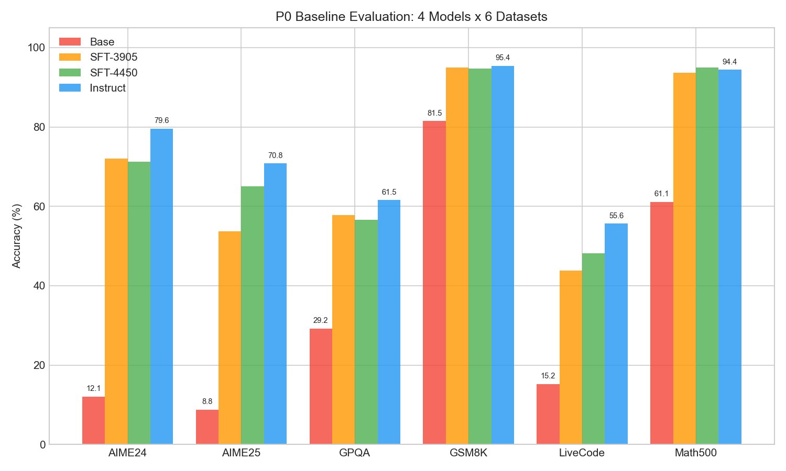
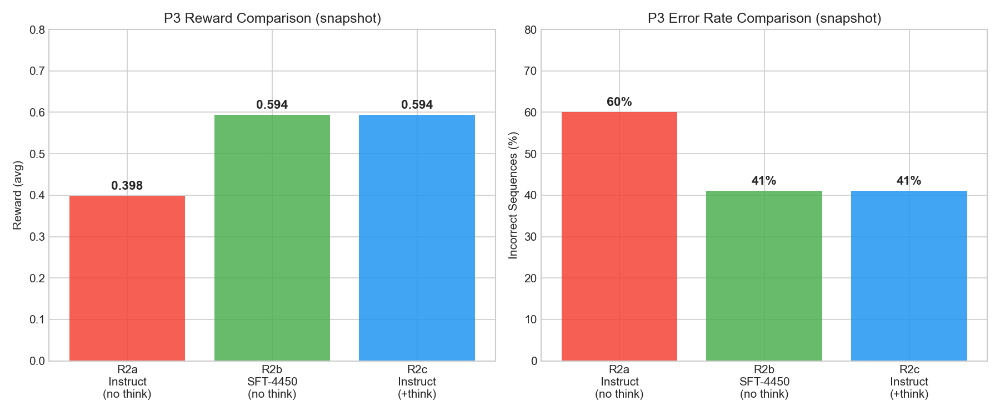
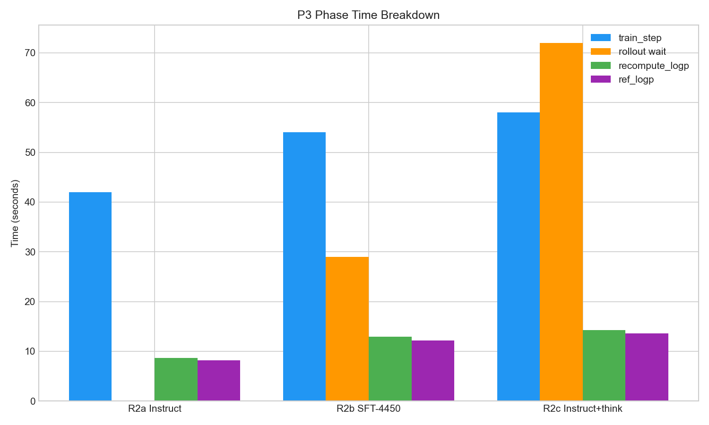
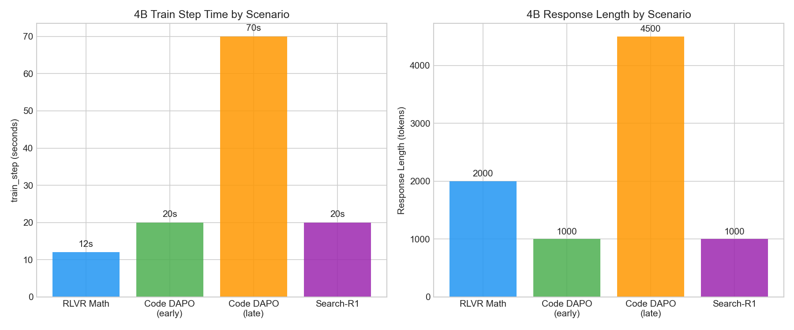

# Qwen3-8B Math RLVR 实验记录
> 创建日期：2026-04-09 | 状态：P0 基线评测中 | 负责人：zengbw

---

## 1. 实验概述
### 1.1 目标
在 Qwen3-8B 上打通 Math SFT → RLVR → 轨迹回灌 完整后训练闭环，验证 RL 能持续提升数学推理能力。详见 [roadmap.md](roadmap.md)。
### 1.2 核心路线
```
Qwen3-8B Instruct → Math SFT → RLVR → 轨迹筛选回灌 → 二轮 RLVR → code 扩展
```

---

## 2. 模型资产

### 2.1 待评测模型
| 编号 | 名称 | 路径 | 说明 |
|---|---|---|---|
| M1 | qwen3-8b-base | `/publicdata/huggingface.co/Qwen/Qwen3-8B-Base` | 预训练基座，无任何后训练 |
| M2 | qwen3-8b-instruct | `/publicdata/huggingface.co/Qwen/Qwen3-8B` | 官方 post-trained 版本，支持 thinking/non-thinking 双模式 |
| M3 | qwen3-8b-sft3905 | [待确认路径] | 内部 SFT checkpoint (global_step_3905) |
| M4 | qwen3-8b-sft4450 | `/dataset_rc_b1/llm_train_sft/lijl42/SFT_Qwen3_8B_Base/qwen3_8b_base_ot3_sft_0105/global_step_4450/huggingface` | 内部 SFT checkpoint (global_step_4450)，当前 RLVR 配置默认模型 |

### 2.2 模型关系
```
Qwen3-8B-Base (M1)
  │
  ├── 官方后训练 ──→ Qwen3-8B Instruct (M2)
  │                  (SFT + RLHF + GRPO，官方完整流水线)
  │
  └── 内部 SFT ────→ sft3905 (M3) ──→ sft4450 (M4)
                     (中间 checkpoint)    (最终 checkpoint)
```

---

## 3. 数据资产

### 3.1 训练数据
| 数据集 | 用途 | 路径 | 规模 | 格式 | 说明 |
|---|---|---|---|---|---|
| OpenThoughts3-1.2M | SFT | `/workspace/chenj81@xiaopeng.com/tyzn/dyymx/training_data/sft/OpenThoughts3-1_2M/train` | 456K (16 parquet files) | `messages` 格式: system + user + assistant (含 `<think>` 推理链) | QwQ-32B 标注的高质量推理轨迹，850K 数学 + 250K 代码 + 100K 科学。SFT 学"怎么写推理链" |
| deepmath_math_rule_20k | RLVR | `/workspace/lijl42@xiaopeng.com/datasets/hard_prompts/20251203_for_rl/data/deepmath_math_rule_20k.parquet` | 19982 | `prompt` (messages 列表) + `reward_model.ground_truth` (答案) | 硬数学题，无 solution 列，只有题目和答案。RLVR 学"怎么做对"：模型自己探索，verifier 判对错 |
| dapo_math_17k | RLVR (备选) | `/workspace/zhangjh37@xiaopeng.com/data/dapo_math_17k_processed` | ~17K | `prompt` + `solution` (含 `\boxed{}`) | 已集成到 AReaL 的训练数据 |

### 3.1.1 数据分工原则 (2026-04-09 确认)
- **SFT 学"怎么写"**：需要高质量的完整推理轨迹作为模仿对象 → OpenThoughts3（有详细推理链）
- **RLVR 学"怎么做对"**：只需要题目 + 答案，模型自己探索解法，对错由 reward 判断 → deepmath_20k（硬题，有区分度）
- **不要混用**：SFT 数据不该给 RLVR（会变成模仿学习而非探索学习），RLVR 数据不该给 SFT（没有推理过程可模仿）

### 3.1.2 数据格式实测 (bifrost-2026040910373400-zengbw1)
**OpenThoughts3 样本结构**：
```json
{
  "data_source": "open-thoughts/OpenThoughts3-1.2M",
  "messages": [
    {"role": "system", "content": "You are a helpful assistant."},
    {"role": "user", "content": "I am in desperate need of some ear defenders..."},
    {"role": "assistant", "content": "<think>\nOkay, I need to solve...\n</think>\n\nHere is the solution..."}
  ],
  "extra_info": {"difficulty": 7, "domain": "code", "source": "stackexchange_codegolf"}
}
```
dataset_sft.py 自动检测 `messages` 列 → 直接使用，无需格式转换。

**deepmath_20k 样本结构**：
```json
{
  "data_source": "math_rule",
  "prompt": [{"role": "user", "content": "Solve the following math problem..."}],
  "ability": "math",
  "reward_model": {"ground_truth": "1", "style": "rule"},
  "extra_info": {"answer": "1", "difficulty": 10, "question": "Determine whether..."}
}
```
注意：`prompt` 是 messages 列表格式（非纯文本），无 `solution` 列。当前 RLVR 配置使用 dapo_math_17k；如需切换到 deepmath_20k，需适配 RL dataset loader。

### 3.2 评测数据
| 数据集 | 路径/来源 | 题数 | 难度 | 角色 |
|---|---|---|---|---|
| aime_2024 | `/workspace/lijl42@xiaopeng.com/data_process/20251205_rl_data/aime_2024_rule.parquet` | 30 | 高 | 训练验证集 + 业界对标指标 |
| aime_2025 | [待确认] | 30 | 高 | 防 2024 过拟合 |
| math_500 | [待确认] | 500 | 中 | 主指标，综合数学能力 |
| gsm8k | [待确认] | ~1319 | 低 | 基础能力不退化的底线 |
| gpqa_diamond | [待确认] | [待确认] | 很高 | 推理泛化到科学领域 |
| livecodebench_v5 | [待确认] | [待确认] | 中高 | code 不退化监控 |

### 3.3 评测数据集用途分配
| 用途 | 数据集 | 频率 |
|---|---|---|
| 训练中 eval（每 N 步） | aime_2024 | 每 20 步 |
| 阶段结束全量评测 | 全部 6 个 | P0 / P1 / P3 / P4 / P5 各跑一次 |
| 核心对标指标 | math_500 + aime_2024 | 所有报告必须包含 |
| 基础能力退化监控 | gsm8k | 如果掉分说明"偏科" |

---

## 4. P0 基线评测

### 4.1 评测矩阵（P0 完成，2026-04-09）
| DataSet \ Model | qwen3-8b-base (M1) | qwen3-8b-sft3905 (M3) | qwen3-8b-sft4450 (M4) | qwen3-8b-instruct (M2) |
|---|---|---|---|---|
| AIME 2024 | 12.08% | 72.08% | 71.25% | 79.58% |
| AIME 2025 | 8.75% | 53.75% | 65.00% | 70.83% |
| GPQA Diamond | 29.23% | 57.83% | 56.57% | 61.55% |
| GSM8K | 81.50% | 95.00% | 94.77% | 95.38% |
| LiveCodeBench v5 | 15.21% | 43.75% | 48.19% | 55.65% |
| Math 500 | 61.08% | 93.60% | 94.98% | 94.43% |
| 平均 Accuracy | 34.64% | 69.33% | 71.79% | 76.24% |

### 4.2 评测分析
**Q1: 哪个模型做 RL 起点最好？**
→ **Instruct (M2)**。平均 76.24%，全面最高。AIME24 79.58% 比 POLARIS 的 baseline (73.8%) 还高。

**Q2: SFT 是否有效？**
→ 非常有效。Base → SFT: 34.64% → 71.79% (+37.15%)，AIME24 从 12% 到 71%（+59%）。

**Q3: Instruct vs SFT-4450？**
→ Instruct 全面领先（+4.45% avg），但 Math 500 上 SFT-4450 反超（94.98% vs 94.43%）。纯数学能力接近持平，Instruct 在推理泛化（GPQA）和代码（LiveCode）上更强。

**Q4: SFT 训练是否饱和？**
→ 接近饱和。3905→4450 在 AIME25 上 +11.25%（大幅提升），但 AIME24 -0.83%（微降）。继续训练预期收益递减。

**Q5: 格式合规率？**
→ 所有后训练模型 GSM8K > 94%，格式基本稳定。[待补充] `\boxed{}` 专项检查。

**Q6: 基础能力如何？**
→ 所有后训练模型 GSM8K > 94%，基础能力无问题。Base 的 81.50% 也在可接受范围。

### 4.3 模型选择决策
**选定：Qwen3-8B Instruct (M2) 作为 P3 RLVR 起点。跳过 P1 SFT。**

理由：
1. pass@1 全面最高（76.24% avg, AIME24 79.58%）
2. POLARIS 用同类起点验证了 Instruct → 直接 RL 有效
3. 格式最稳（原生 thinking 模式 + `\boxed{}`），RL 崩坏风险最低
4. 失败成本低——切到 SFT-4450 只需改 `actor.path`

回退条件：
- RL 100 步后 reward 不升 + entropy collapse → 切 SFT-4450
- SFT-4450 路径: `/dataset_rc_b1/llm_train_sft/lijl42/SFT_Qwen3_8B_Base/qwen3_8b_base_ot3_sft_0105/global_step_4450/huggingface`

---

## 5. RLVR 训练配置

### 5.1 AReaL 配置
| 配置项 | 值 |
|---|---|
| 配置文件 | `fuyao_examples/math/qwen3_8b_rlvr.yaml` |
| 训练入口 | `fuyao_examples/math/train_math_rlvr.py` |
| 启动命令 | `bash fuyao_examples/fuyao_areal_run.sh --run-type math_rlvr --config fuyao_examples/math/qwen3_8b_rlvr.yaml` |
| 模型路径 | 由 P0 评测结果决定（M2 或 M4） |
| 训练数据 | deepmath_math_rule_20k 或 dapo_math_17k |
| 验证集 | aime_2024 (30 题，每 20 步 eval) |

### 5.2 集群资源
| 角色 | GPU | 节点 | 并行策略 |
|---|---|---|---|
| Actor (Megatron) | 8 | node 0 | DP2 × TP2 × PP2 |
| SGLang Rollout | 8 | node 1 | DP4 × TP2 |
| Ref Model | 0 | node 0 | colocation with actor |

### 5.3 核心超参数
| 参数 | 值 |
|---|---|
| `gconfig.n_samples` | 8 |
| `gconfig.max_new_tokens` | 8192 |
| `gconfig.temperature` | 0.99 |
| `actor.optimizer.lr` | 1.0e-6 |
| `actor.optimizer.weight_decay` | 0.1 |
| `actor.eps_clip` | 0.2 |
| `actor.kl_ctl` | 0.001 |
| `actor.behave_imp_weight_cap` | 2.0 |
| `total_train_epochs` | 2 (快速验证) → 10 (完整训练) |

### 5.4 算法选择
AReaL 没有显式 `algorithm` 字段，算法由参数组合隐式决定。当前配置 = **GRPO + KL 正则化**。

**当前配置对应 GRPO 的关键参数：**
| 参数 | 当前值 | 含义 |
|---|---|---|
| `actor.adv_norm.mean_level` | batch | advantage 均值归一化级别 |
| `actor.adv_norm.std_level` | batch | advantage 方差归一化级别 |
| `actor.eps_clip` | 0.2 | PPO 对称裁剪 |
| `actor.kl_ctl` | 0.001 | KL 惩罚系数（>0 则启用 ref model） |
| `actor.use_decoupled_loss` | true | token-level loss |
| `actor.behave_imp_weight_mode` | token_mask | token 级别 importance sampling |

**AReaL 支持的全部算法及切换方式（只改 YAML，不改代码）：**
| 算法 | `adv_norm mean/std` | 特殊参数 | 说明 |
|---|---|---|---|
| GRPO (当前) | batch / batch | — | 默认，最稳定 |
| DAPO | batch / batch | `eps_clip_higher: 0.28`, `dynamic_bs: true`, `kl_ctl: 0.0`, `mask_no_eos_with_zero: true` | 更强探索，AIME24 50分(32B) |
| Dr.GRPO | group / null | — | 组内归一化变体 |
| RLOO | group / null | `mean_leave1out: true` | leave-one-out baseline |
| GSPO | batch / batch | `importance_sampling_level: sequence` | Qwen 团队新算法 |
| SAPO | batch / batch | `use_sapo_loss: true`, `use_decoupled_loss: false` | — |
| PPO | batch / batch | 需额外配置 `critic:` 段 | 需要 value model |

**P3 策略：先用 GRPO 跑通，效果不好时切 DAPO。** 从 GRPO 切 DAPO 只需在 YAML `actor:` 下加：
```yaml
eps_clip_higher: 0.28      # Clip-Higher 上界
kl_ctl: 0.0               # 移除 KL
mask_no_eos_with_zero: true # 截断样本排除出 loss
# 顶层加:
dynamic_bs: true            # Dynamic Sampling
```

### 5.5 fuyao 部署命令模板
```bash
# P1: SFT (单节点 8 GPU)
fuyao deploy --disable-fault-tolerance \
    --docker-image=infra-registry-vpc.cn-wulanchabu.cr.aliyuncs.com/data-infra/fuyao:zhangjh37-260325-0644 \
    --project=rc-ai-infra --experiment=zengbw1/llm_rl \
    --gpu-type a100 --gpus-per-node 8 --node=1 \
    --label=qwen3-8b-math-sft \
    --site=fuyao_b1 --queue=rc-llmrl-a100 \
    SWANLAB_API_KEY=<KEY> \
    bash fuyao_examples/fuyao_areal_run.sh \
        --run-type math_sft \
        --config fuyao_examples/math/qwen3_8b_sft.yaml

# P3: RLVR with dapo_math_17k (双节点 16 GPU)
fuyao deploy --disable-fault-tolerance \
    --docker-image=infra-registry-vpc.cn-wulanchabu.cr.aliyuncs.com/data-infra/fuyao:zhangjh37-260325-0644 \
    --project=rc-ai-infra --experiment=zengbw1/llm_rl \
    --gpu-type a100 --gpus-per-node 8 --node=2 \
    --label=qwen3-8b-math-rlvr \
    --site=fuyao_b1 --queue=rc-llmrl-a100 \
    SWANLAB_API_KEY=<KEY> \
    bash fuyao_examples/fuyao_areal_run.sh \
        --run-type math_rlvr \
        --config fuyao_examples/math/qwen3_8b_rlvr.yaml

# P5: RLVR with deepmath_20k (CLI 覆盖数据集)
# 在上面 P3 命令的 bash 行末追加:
#   train_dataset.type=deepmath \
#   train_dataset.path=/workspace/lijl42@xiaopeng.com/datasets/hard_prompts/20251203_for_rl/data/deepmath_math_rule_20k.parquet
```

---

## 6. 实验日志

### Run 0: P0 基线评测
- **日期**：2026-04-09
- **状态**：完成
- **内容**：4 个模型 × 6 个数据集 = 24 组评测
- **结果**：见 4.1 评测矩阵
- **结论**：选定 Instruct (76.24% avg) 作为 RL 起点，跳过 P1 SFT，直接进 P3

### Run 1: 首次 RLVR (SFT-4450, dapo_math_17k)
- **日期**：2026-04-09
- **Job**: `bifrost-2026040910373400-zengbw1`
- **状态**：完成（手动 cancel，已收集足够数据）
- **配置**：SFT-4450 + dapo_math_17k + `enable_thinking=False` + 2 nodes × 8 A100
- **结果**：59 步，reward 0.28→0.54，response_length ~7.7k（接近 max 8192）
- **问题**：train/valid 用了同一份数据（无法评估泛化）
- **改进**：valid_dataset 改为 aime_2024（30 题独立 eval set）

### Run 2: P3 三实验对比 (2026-04-10)
同时提交三个实验，对比 Instruct vs SFT-4450 × thinking 开关：

| | ① Instruct (no think) | ② SFT-4450 (no think) | ③ Instruct + think |
|---|---|---|---|
| **Job** | `bifrost-2026041013084901-zengbw1` | `bifrost-2026041013085900-zengbw1` | `bifrost-2026041014393901-zengbw1` |
| **模型** | Qwen3-8B Instruct | Qwen3-8B SFT-4450 | Qwen3-8B Instruct |
| **Thinking** | Off | Off | **On** |
| **训练数据** | dapo_math_17k | dapo_math_17k | dapo_math_17k |
| **验证集** | aime_2024 (每 20 步) | aime_2024 (每 20 步) | aime_2024 (每 20 步) |

**截至 2026-04-10 17:00 的对比数据（最新 step）：**

| 指标 | ① Instruct (step 219) | ② SFT-4450 (step 96) | ③ Instruct+think (step 51) |
|---|---|---|---|
| **reward** | **0.398** (↓ 下降中) | **0.594** | **0.594** |
| **incorrect_n_seqs** | 77/128 (60%) | 52/128 (41%) | 52/128 (41%) |
| **response_length** | 4,273 (从 2.4k 涨上来) | 6,474 | 6,975 |
| **train_step** | 42s | 54s | 58s |
| **rollout 等待** | ~0s | 29s | 72s |
| **no_eos_ratio** | 3.9% | 12.5% | 11.7% |
| **KL div** | 4.6e-4 (增大中) | 1.2e-3 | 7.2e-4 |
| **速度** | ~1 min/step | ~2.3 min/step | ~2.8 min/step |

**分析：**
1. **Instruct (no think) reward 在下降**（0.47→0.40），模型变长但没变好，KL 增大
2. **开 thinking 后 Instruct reward 追平 SFT-4450**（0.594 vs 0.594），CoT 推理有效
3. **SFT-4450 自发 CoT**（response 6.5k），不需要额外开 thinking
4. ② 和 ③ 表现完全一致（reward、incorrect 数量都相同），说明两种起点 + CoT 等效
5. ① 速度最快但效果最差——Instruct 不开 thinking 做 RLVR 不可行

### Run 2 结论
- **停掉 ①**（Instruct no think）：reward 持续下降，无继续价值
- **继续 ② 和 ③**：等待 AIME 2024 eval 结果（每 20 步），对比泛化能力
- **SFT-4450 不需要开 thinking**：已经自发 CoT
- **下一步**：观察 ② vs ③ 长期趋势，挑选胜者做完整训练（epoch 改回 10）

---

## 7. 决策记录

| 日期 | 决策 | 理由 | 状态 |
|---|---|---|---|
| 2026-04-09 | 聚焦 Qwen3-8B，math 单任务先行 | 最快打通闭环，math reward 最干净 | 确认 |
| 2026-04-09 | 选定 Instruct 作为 RL 起点，跳过 P1 SFT | P0 数据确认：Instruct 76.24% avg 全面最高；POLARIS 验证同类路线有效；回退方案：切 SFT-4450 | **修正** (见 04-10) |
| 2026-04-09 | aime_2024 作为训练验证集 | 30 题，eval 成本低，业界对标指标 | 确认 |
| 2026-04-09 | 6 数据集评测体系 | gsm8k(底线) + math_500(主指标) + aime(对标) + gpqa(泛化) + livecode(code 监控) | 确认 |
| 2026-04-09 | SFT 用 OpenThoughts3，RLVR 用 deepmath_20k | SFT 学"怎么写"需要推理链；RLVR 学"怎么做对"只需题目+答案 | 确认 |
| 2026-04-09 | 训练 `enable_thinking=False`，评测可开 | thinking 让序列变长、reward 更噪、RL 更难收敛；先跑稳再放大 | **修正** (见 04-10) |
| 2026-04-09 | 统一输出格式为 `\boxed{}` | SFT 数据 + RLVR prompt + reward 提取器三方已对齐；提取器验证 8/10 通过 | 确认 |
| 2026-04-09 | 提交 SFT 任务 | job: bifrost-2026040915445800-zengbw1，Qwen3-8B Instruct + OpenThoughts3，单节点 8×A100 | 完成 |
| 2026-04-10 | Instruct 必须开 thinking 才能做 RLVR | 实验 ① 证明 no-think Instruct reward 持续下降（0.47→0.40），模型变长但不变好；开 thinking 后 reward 追平 SFT-4450 (0.594) | **确认** |
| 2026-04-10 | SFT-4450 不需要开 thinking | SFT-4450 已自发 CoT (response 6.5k)，reward 与 Instruct+think 一致 (0.594)；开 thinking 只会增加序列长度和训练成本 | **确认** |
| 2026-04-10 | 并行实验 ② SFT-4450 和 ③ Instruct+think | 两者当前表现完全一致，需要更多步数 + AIME eval 数据才能区分；winner 做完整 10 epoch 训练 | 进行中 |
| 2026-04-10 | valid_dataset 从 dapo_math 改为 aime_2024 | 原来 train/valid 用同一数据，无法评估泛化；aime_2024 (30 题) 作为独立 eval set | 确认 |
| 2026-04-10 | model_tag 和 enable_thinking 改为环境变量可配 | 一份 yaml 支持多模型 × 多配置，部署命令区分实验；`MODEL_TAG` 控制命名，`ENABLE_THINKING` 控制推理模式 | 确认 |

---

## 8. 下一步计划

### 短期（1-2 天）
1. **观察 ② vs ③ 的 AIME 2024 eval 结果**
   - evaluator 每 20 步触发，预计 ② 已有 4 次 eval，③ 有 2 次
   - 比较泛化表现（AIME 2024 accuracy）
   - 如果差距不大，选训练速度更快的（② SFT-4450, ~2.3 min/step vs ③ ~2.8 min/step）

2. **停掉 ① Instruct (no think)**
   - 已确认不可行，释放 GPU 资源

3. **挑选 winner，改 `total_train_epochs: 10` 做完整训练**
   - 预计 1 epoch ≈ 1087 步 × 2.5 min ≈ 45 小时
   - 10 epoch ≈ 19 天，可先跑 2-3 epoch 看趋势

### 中期（1-2 周）
4. **阶段结束全量评测**（6 数据集）
   - 2 epoch 训练完成后，保存 checkpoint
   - 跑 gsm8k + math_500 + aime_2024 + aime_2025 + gpqa + livecode

5. **尝试切 DAPO 算法**
   - 如果 GRPO reward 平台期（>100 步不涨），切 DAPO
   - 只需改 yaml：`eps_clip_higher: 0.28`, `kl_ctl: 0.0`, `mask_no_eos_with_zero: true`, `dynamic_bs: true`

6. **尝试 deepmath_20k 数据**
   - dapo_math_17k 效果稳定后，切到更难的 deepmath_20k 看是否继续提升

### 长期
7. **轨迹筛选回灌**（P4）
   - 从 RLVR checkpoint 采样正确轨迹 → SFT 回灌 → 二轮 RLVR
8. **扩展到 code 任务**（P6）
   - 验证 math RLVR 的收益是否迁移到 code

---

## 9. 复现指南

### 9.1 环境要求
- Docker: `infra-registry-vpc.cn-wulanchabu.cr.aliyuncs.com/data-infra/fuyao:zhangjh37-260325-0644`
- GPU: 2 nodes × 8 A100 80G = 16 GPU
- 队列: `rc-llmrl-a100` (fuyao_b1)

### 9.2 模型选择逻辑

```
Step 1: P0 基线评测 → 4 模型 × 6 数据集
         结果: Instruct 76.24% > SFT-4450 71.79% > SFT-3905 69.33% > Base 34.64%

Step 2: 选最强模型作为 RL 起点
         选定: Instruct (M2)
         回退: SFT-4450 (M4)

Step 3: 确定 thinking 模式
         实验验证: Instruct 必须开 thinking, SFT-4450 不需要

Step 4: 三实验对比 → 选 winner
         ① Instruct no-think: 失败 (reward 下降)
         ② SFT-4450 no-think: reward 0.594 ✓
         ③ Instruct + think:  reward 0.594 ✓
         待定: 等 AIME eval 数据区分 ② vs ③
```

### 9.3 数据集选择逻辑

```
训练数据: dapo_math_17k
  理由: 已集成到 AReaL，格式验证通过，17k 题目规模适中
  备选: deepmath_20k (更难，待 dapo 效果稳定后尝试)

验证数据: aime_2024 (30 题)
  理由: 独立于训练集，业界标准对标指标，eval 成本低 (30 题 × 每 20 步)
  注意: 早期配置 train/valid 用同一数据（已修复）

全量评测: gsm8k + math_500 + aime_2024 + aime_2025 + gpqa + livecode
  角色: gsm8k=底线, math_500=主指标, aime=对标, gpqa=泛化, livecode=code 不退化
```

### 9.4 部署命令

```bash
# ── 实验 ②: SFT-4450 (推荐，无需开 thinking) ──
fuyao deploy --disable-fault-tolerance \
    --docker-image=infra-registry-vpc.cn-wulanchabu.cr.aliyuncs.com/data-infra/fuyao:zhangjh37-260325-0644 \
    --project=rc-ai-infra --experiment=zengbw1/llm_rl \
    --gpu-type a100 --gpus-per-node 8 --node=2 \
    --label=qwen3-8b-sft4450-rlvr \
    --site=fuyao_b1 --queue=rc-llmrl-a100 \
    SWANLAB_API_KEY=<KEY> \
    MODEL_TAG=sft4450 \
    bash fuyao_examples/fuyao_areal_run.sh \
        --run-type math_rlvr \
        --config fuyao_examples/math/qwen3_8b_rlvr.yaml \
        actor.path=/dataset_rc_b1/llm_train_sft/lijl42/SFT_Qwen3_8B_Base/qwen3_8b_base_ot3_sft_0105/global_step_4450/huggingface

# ── 实验 ③: Instruct + thinking ──
fuyao deploy --disable-fault-tolerance \
    --docker-image=infra-registry-vpc.cn-wulanchabu.cr.aliyuncs.com/data-infra/fuyao:zhangjh37-260325-0644 \
    --project=rc-ai-infra --experiment=zengbw1/llm_rl \
    --gpu-type a100 --gpus-per-node 8 --node=2 \
    --label=qwen3-8b-instruct-think-rlvr \
    --site=fuyao_b1 --queue=rc-llmrl-a100 \
    SWANLAB_API_KEY=<KEY> \
    MODEL_TAG=instruct-think ENABLE_THINKING=true \
    bash fuyao_examples/fuyao_areal_run.sh \
        --run-type math_rlvr \
        --config fuyao_examples/math/qwen3_8b_rlvr.yaml

# ── Instruct 默认 (不推荐，已验证 reward 下降) ──
# 仅供参考，不建议使用
fuyao deploy --disable-fault-tolerance \
    --docker-image=infra-registry-vpc.cn-wulanchabu.cr.aliyuncs.com/data-infra/fuyao:zhangjh37-260325-0644 \
    --project=rc-ai-infra --experiment=zengbw1/llm_rl \
    --gpu-type a100 --gpus-per-node 8 --node=2 \
    --label=qwen3-8b-instruct-rlvr \
    --site=fuyao_b1 --queue=rc-llmrl-a100 \
    SWANLAB_API_KEY=<KEY> \
    bash fuyao_examples/fuyao_areal_run.sh \
        --run-type math_rlvr \
        --config fuyao_examples/math/qwen3_8b_rlvr.yaml
```

### 9.5 监控要点

| 指标 | 健康范围 | 异常处理 |
|---|---|---|
| reward | 应逐步上升 | 100 步不涨 → 切 DAPO 或调 lr |
| response_length | <max_new_tokens 的 90% | 持续涨 → 加 length penalty |
| no_eos_ratio | <15% | >20% → 模型截断严重，检查 max_new_tokens |
| KL div | <0.01 | >0.05 → 训练不稳定，降 lr 或加大 kl_ctl |
| train_step | 应稳定 | 持续增长 → response_length 膨胀 |
| entropy | 缓慢下降 | 骤降 → entropy collapse，降 lr |

---

## 10. 实验索引

所有 RLVR 相关实验的完整记录，方便检索和对比。

### 10.1 Qwen3-4B 实验（Infra 基线验证）

| ID | Fuyao Job | 模型 | 任务 | GPU | 状态 | Steps | SwanLab |
|---|---|---|---|---|---|---|---|
| 4B-RLVR | `bifrost-2026040717094300-zengbw1` | Qwen3-4B | Math RLVR | 1×8 A100 | Cancelled | 200 | [link](https://swanlab.cn/@canghongjian/areal_train/runs/bifrost-2026040717094300-zengbw1-qwen3-4b-math-rlvr-trial0/chart) |
| 4B-Code | [待确认] | Qwen3-4B | Code DAPO | 1×8 A100 | 完成 | 656 | [link](https://swanlab.cn/@canghongjian/areal_train/runs/5v0iddgqa2r2tfqgqh5si/chart) |
| 4B-Search | [待确认] | Qwen3-4B | Search-R1 | 1×8 A100 | 完成 | 656 | [link](https://swanlab.cn/@canghongjian/areal_train/runs/azronpdxd97s9nna8lxnm/chart) |

**4B 配置：**
- Config: `fuyao_examples/math/qwen3_4b_rlvr.yaml` / `code_dapo/code_dapo_qwen3_4b.yaml` / `search_r1/search_r1_qwen3_4b.yaml`
- Backend: Actor `megatron:d4t1p1`, Rollout `sglang:d4t1`
- Batch: 128 × 1 sample (agentic) 或 128 × 8 samples (RLVR)

### 10.2 Qwen3-8B 实验（P3 RLVR 主线）

| ID | Fuyao Job | 模型 | Thinking | 状态 | Steps | 启动时间 | SwanLab |
|---|---|---|---|---|---|---|---|
| 8B-R0 | `bifrost-2026040910373400-zengbw1` | SFT-4450 | Off | Cancelled | 59 | 2026-04-09 10:38 | [待补充] |
| 8B-R2a | `bifrost-2026041013084901-zengbw1` | Instruct | Off | Running | 259+ | 2026-04-10 13:21 | [待补充] |
| 8B-R2b | `bifrost-2026041013085900-zengbw1` | SFT-4450 | Off | Running | 116+ | 2026-04-10 13:16 | [待补充] |
| 8B-R2c | `bifrost-2026041014393901-zengbw1` | Instruct | On | Running | 70+ | 2026-04-10 15:00 | [待补充] |

**8B 共享配置：**
- Config: `fuyao_examples/math/qwen3_8b_rlvr.yaml`
- Backend: Actor `megatron:d2t2p2`, Rollout `sglang:d4p1t2`
- Cluster: 2 nodes × 8 A100 = 16 GPU
- Data: train=dapo_math_17k, valid=aime_2024
- Algorithm: GRPO, lr=1e-6, kl_ctl=0.001, n_samples=8, max_new_tokens=8192

**各实验差异：**
| ID | MODEL_TAG | ENABLE_THINKING | actor.path |
|---|---|---|---|
| 8B-R0 | (无) | false | SFT-4450: `/.../global_step_4450/huggingface` |
| 8B-R2a | instruct (默认) | false (默认) | Instruct: `/dataset_rc_b1/models/Qwen3-8B` |
| 8B-R2b | sft4450 | false (默认) | SFT-4450: `/.../global_step_4450/huggingface` |
| 8B-R2c | instruct-think | true | Instruct: `/dataset_rc_b1/models/Qwen3-8B` |

### 10.3 启动命令速查

```bash
# 8B-R2a: Instruct (no think) — 不推荐，reward 下降
fuyao deploy --disable-fault-tolerance \
    --docker-image=infra-registry-vpc.cn-wulanchabu.cr.aliyuncs.com/data-infra/fuyao:zhangjh37-260325-0644 \
    --project=rc-ai-infra --experiment=zengbw1/llm_rl \
    --gpu-type a100 --gpus-per-node 8 --node=2 \
    --label=qwen3-8b-instruct-rlvr \
    --site=fuyao_b1 --queue=rc-llmrl-a100 \
    SWANLAB_API_KEY=sQOWAKdHZlG94Q8BSTnCM \
    bash fuyao_examples/fuyao_areal_run.sh \
        --run-type math_rlvr \
        --config fuyao_examples/math/qwen3_8b_rlvr.yaml

# 8B-R2b: SFT-4450 (no think) — 推荐
fuyao deploy --disable-fault-tolerance \
    --docker-image=infra-registry-vpc.cn-wulanchabu.cr.aliyuncs.com/data-infra/fuyao:zhangjh37-260325-0644 \
    --project=rc-ai-infra --experiment=zengbw1/llm_rl \
    --gpu-type a100 --gpus-per-node 8 --node=2 \
    --label=qwen3-8b-sft4450-rlvr \
    --site=fuyao_b1 --queue=rc-llmrl-a100 \
    SWANLAB_API_KEY=sQOWAKdHZlG94Q8BSTnCM \
    MODEL_TAG=sft4450 \
    bash fuyao_examples/fuyao_areal_run.sh \
        --run-type math_rlvr \
        --config fuyao_examples/math/qwen3_8b_rlvr.yaml \
        actor.path=/dataset_rc_b1/llm_train_sft/lijl42/SFT_Qwen3_8B_Base/qwen3_8b_base_ot3_sft_0105/global_step_4450/huggingface

# 8B-R2c: Instruct + thinking — 对比实验
fuyao deploy --disable-fault-tolerance \
    --docker-image=infra-registry-vpc.cn-wulanchabu.cr.aliyuncs.com/data-infra/fuyao:zhangjh37-260325-0644 \
    --project=rc-ai-infra --experiment=zengbw1/llm_rl \
    --gpu-type a100 --gpus-per-node 8 --node=2 \
    --label=qwen3-8b-instruct-think-rlvr \
    --site=fuyao_b1 --queue=rc-llmrl-a100 \
    SWANLAB_API_KEY=sQOWAKdHZlG94Q8BSTnCM \
    MODEL_TAG=instruct-think ENABLE_THINKING=true \
    bash fuyao_examples/fuyao_areal_run.sh \
        --run-type math_rlvr \
        --config fuyao_examples/math/qwen3_8b_rlvr.yaml
```

### 10.4 阶段性结果汇总

#### P0 基线评测 (2026-04-09)

| DataSet | Base (M1) | SFT-3905 (M3) | SFT-4450 (M4) | Instruct (M2) |
|---|---|---|---|---|
| AIME 2024 | 12.08% | 72.08% | 71.25% | 79.58% |
| AIME 2025 | 8.75% | 53.75% | 65.00% | 70.83% |
| GPQA Diamond | 29.23% | 57.83% | 56.57% | 61.55% |
| GSM8K | 81.50% | 95.00% | 94.77% | 95.38% |
| LiveCodeBench v5 | 15.21% | 43.75% | 48.19% | 55.65% |
| Math 500 | 61.08% | 93.60% | 94.98% | 94.43% |
| 平均 | 34.64% | 69.33% | 71.79% | 76.24% |



决策：选 Instruct (M2) 作为 RL 起点 (76.24% avg)，回退 SFT-4450 (M4)。

#### P3 三实验对比 (2026-04-10, 截至 17:50)

| 指标 | 8B-R2a Instruct (step 259) | 8B-R2b SFT-4450 (step 116) | 8B-R2c Instruct+think (step 70) |
|---|---|---|---|
| reward | 0.398 (下降中) | 0.594 | 0.594 |
| incorrect_n_seqs | 77/128 (60%) | 52/128 (41%) | 52/128 (41%) |
| response_length | 4,273 | 6,474 | 6,975 |
| train_step | 42s | 54s | 58s |
| rollout 等待 | ~0s | 29s | 72s |
| no_eos_ratio | 3.9% | 12.5% | 11.7% |
| KL div | 4.6e-4 | 1.2e-3 | 7.2e-4 |
| 速度 | ~1 min/step | ~2.3 min/step | ~2.8 min/step |





决策：
- 8B-R2a (Instruct no-think) 确认失败，建议停止
- 8B-R2b vs 8B-R2c 当前持平 (reward 0.594)，继续跑到 200 步看 AIME eval 数据

#### 4B 三场景 Infra 对比

| 指标 | RLVR Math (4B-RLVR) | Code DAPO (4B-Code) | Search-R1 (4B-Search) |
|---|---|---|---|
| train_step | 12→25s (上升) | 20→70s (上升) | 20s (稳定) |
| rollout 等待 | 20s (未完全隐藏) | ~0s | ~0s |
| response_length | 2k→4k (上升) | 1k→4.5k (上升) | 1k (稳定) |
| reward | 0.3→0.7 | 0.3→0.7 | 0.2→0.45 |



---

## 11. 文件索引

| 文件 | 说明 |
|---|---|
| [roadmap.md](roadmap.md) | P0-P6 分阶段训练路线图 |
| [experiment-record.md](experiment-record.md) | 本文件：实验记录与数据汇总 |
| [01_training_roadmap.png](01_training_roadmap.png) | 训练路线全景图 |
| [02_rlvr_architecture.png](02_rlvr_architecture.png) | AReaL RLVR 训练架构图 |
| [03_dapo_vs_grpo.png](03_dapo_vs_grpo.png) | DAPO vs GRPO 算法对比图 |
| [04_decision_tree.png](04_decision_tree.png) | SFT 必要性决策树 |
| [05_monitoring.png](05_monitoring.png) | 训练监控指标看板 |
| [06_hyperparam_priority.png](06_hyperparam_priority.png) | 超参调优优先级图 |
| [07_p0_baseline.png](07_p0_baseline.png) | P0 基线评测 4 模型对比柱状图 |
| [08_p3_reward_comparison.png](08_p3_reward_comparison.png) | P3 三实验 reward/error rate 对比 |
| [09_p3_infra_comparison.png](09_p3_infra_comparison.png) | P3 三实验 infra 耗时分解 |
| [10_4b_infra_comparison.png](10_4b_infra_comparison.png) | 4B 三场景 train_step / response_length 对比 |
| [generate_roadmap_diagrams.py](generate_roadmap_diagrams.py) | roadmap 图表生成脚本 |
| [generate_experiment_charts.py](generate_experiment_charts.py) | 实验结果图表生成脚本 |
