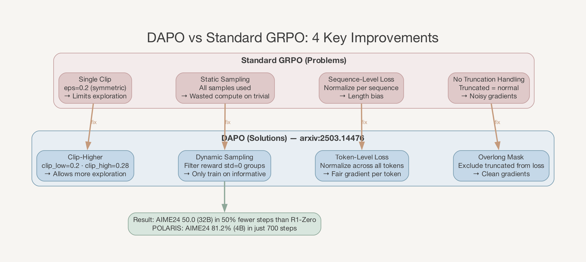

# Qwen3-8B Math-First Post-Training Roadmap
> 版本：v2.0 | 作者：zengbw | 日期：2026-04-09
> 实验模型：Qwen3-8B | 集群：2 节点 × 8 GPU (A100 80G) | 聚焦：math 单任务先行

---

## 0. 文档目标
用 Qwen3-8B 在 math 单任务上先打通完整后训练闭环：
```
Qwen3-8B Instruct
  → Math SFT (P1)
  → 轻量偏好对齐 DPO (P2, 可选)
  → Math RLVR (P3)
  → 轨迹筛选回灌 (P4)
  → 二轮 RLVR / 稳定化 (P5)
  → 再扩展到 code / tool / agent (P6)
```
目标不是理论创新，而是**最快得到一条能复现、能迭代、能扩展的训练路线**。

---

## 1. 模型选择
### 1.1 推荐起点：Qwen3-8B Instruct（post-trained 版本）
| 维度 | Instruct | Base + SFT |
|---|---|---|
| 格式稳定性 | 原生支持 `<think>` 双模式，格式开箱可用 | 需要 SFT 训练格式，依赖 checkpoint 质量 |
| 启动速度 | 直接进 P0/P1，不需额外 SFT checkpoint | 需先确认 SFT checkpoint 质量 |
| 数学基线 | MATH-500 95.16% (thinking), GSM8K 强 | GSM8K 89.84, MATH 60.80 (base 裸跑) |
| 探索多样性 | 中：RLHF 有一定 entropy 压缩 | 高：未经 RLHF 压缩 |
| RL 训练复杂度 | 需要保留轻量 KL 约束 | 理论上可完全去掉 KL |
| 社区验证 | POLARIS (4B instruct → AIME24 81.2%) | 社区 Base+SFT+GRPO (GSM8K 61.9→83.6) |

**选择 Instruct 的理由**：当前目标是尽快打通全流程闭环，不是追求理论最优。Instruct 的优势是：
1. 已有格式服从能力和推理基础，P0/P1 阶段更快
2. POLARIS 验证了从 instruct 直接 RL 的有效性
3. 如果 RL 不稳定，排查范围更小（不需要怀疑 SFT 质量）

**备选方案**：如果后续发现 instruct 的 entropy 压缩确实限制了 RL 增益（pass@k 上限低），可以切换到 Base + SFT 路线。已有内部 SFT checkpoint（`qwen3_8b_base_ot3_sft_0105/global_step_4450`）可直接使用。

### 1.2 math-only 不会走偏
先在 math 上验证训练链路，不追求第一阶段的"全能"。math 的优势：
- reward 最干净（答案可验证，不怕 reward hacking）
- 数据最容易组织（问题 + 标准答案 + 难度分层）
- 训练反馈最快（能快速暴露 SFT/RLVR/KL/回灌的问题）
- 推理能力可泛化（POLARIS 证明逻辑谜题训练可迁移到数学；DeepSeek-R1 数学 RL 也提升了代码和 STEM）

等 math 闭环稳定后，再逐步扩展到 code → tool → agent。

---

## 2. 阶段总览

| 阶段 | 名称 | 输入 | 输出 | 目标 |
|---|---|---|---|---|
| P0 | 环境与基线准备 | Qwen3-8B Instruct + math 数据 | baseline 指标 + extractor | 跑通最小系统 |
| P1 | Math SFT | 结构化 math 数据 | policy-v1 | 得到可用于 RL 的初始策略 |
| P2 | 轻量偏好对齐 (可选) | chosen/rejected 样本对 | policy-v2 | 降低 RL 方差、提升格式稳定性 |
| P3 | 第一轮 RLVR | policy-v1/v2 + verifier + 题池 | policy-v3 + 轨迹库 | 提升可验证推理能力 |
| P4 | 轨迹筛选与回灌 | RL rollout 轨迹 | policy-v4 + 新 SFT 集 | 固化 RL 收益 |
| P5 | 第二轮 RLVR / 稳定化 | policy-v4 + 更新题池 | policy-v5 | 进一步强化并去噪 |
| P6 | 扩展准备 | policy-v5 + 迁移模板 | code/tool 迁移计划 | 为下阶段扩展做接口对齐 |

### 里程碑定义
| 里程碑 | 包含阶段 | 成功标准 |
|---|---|---|
| M1: 打通 | P0 → P3 | RL 后 dev accuracy 有提升 |
| M2: 闭环 | P4 | 回灌后不做 RL 也比 v1 强 |
| M3: 稳定 | P5 | 第二轮 RL 仍然有效 |
| M4: 可迁移 | P6 | 同样流程能迁移到 code |

---

## 3. P0：环境与基线准备
### 3.1 目标
建立一条最小但完整的训练与评测通路。
### 3.2 要做的事
1. **跑 baseline 推理**：用原始 Qwen3-8B Instruct 在 GSM8K/MATH dev 上跑一遍，不做任何训练
2. **实现答案提取器**：从输出里稳定提取最终答案（`\boxed{}`、`<final>` 或正则匹配）
3. **统一输出格式**：从这一阶段开始固定，后续所有阶段沿用
4. **建立评测看板**（SwanLab 或本地）：exact match accuracy、可解析率、平均输出长度、推理失败类型分布

### 3.3 输出格式规范
为了后面 RLVR 简单，先用统一格式：
```
<analysis>
[推理过程]
</analysis>
<final>
[最终答案]
</final>
```
或沿用 AReaL 现有的 `\boxed{}` 格式（已有 extractor 和 reward function）。

**注意**：当前 AReaL 的 `math_reward_fn`（`fuyao_examples/reward.py`）已经实现了 `\boxed{}` 提取 + math_verify 校验。如果沿用 `\boxed{}` 格式，P0 的 extractor 工作量为零。

### 3.4 AReaL 基础设施现状
| 组件 | 路径 | 状态 |
|---|---|---|
| 训练入口 | `fuyao_examples/math/train_math_rlvr.py` | 已完成 |
| 启动脚本 | `fuyao_examples/fuyao_areal_run.sh --run-type math_rlvr` | 已完成 |
| 数据集加载 | `fuyao_examples/dataset/dapo_math.py` | 已完成 |
| 奖励函数 | `fuyao_examples/reward.py` (math_reward_fn, `\boxed{}` 提取) | 已完成 |
| Workflow | `areal/workflow/rlvr/RLVRWorkflow` | 框架内置 |
| 8B RLVR 配置 | `fuyao_examples/math/qwen3_8b_rlvr.yaml` | 已完成 |

### 3.5 验收标准
- 原始模型能稳定跑完整个评测集
- extractor 成功率 > 95%
- 有明确的 baseline 指标记录

---

## 4. P1：Math SFT
### 4.1 目标
得到一个**适合做 RLVR 的初始 policy**，不是追求最强。SFT 只要做到三件事：
1. **格式稳**：final answer 能被 extractor 稳定提取
2. **基础题能做对不少**：准确率明显高于原始模型
3. **能生成"有区分度"的轨迹**：不是几乎全错，也不是简单题几乎全对

### 4.2 数据设计（三层难度）
| 层级 | 占比 | 来源 | 说明 |
|---|---|---|---|
| A. 基础题 | 50% | GSM8K 风格 | 短链推理，保证格式稳定 |
| B. 中等题 | 35% | MATH 中较干净的子集 | 多步算术、代数、组合 |
| C. 长链高质量 | 15% | 筛选/合成 | 少量但人审过，给模型长推理示范 |

**推荐数据来源**：
| 数据集 | 规模 | 特点 |
|---|---|---|
| dapo_math_17k (已集成) | 17K | 多难度，parquet 格式，已有加载器 |
| OpenR1-Math-220k | 220K | 从 DeepSeek-R1 蒸馏的推理轨迹 |
| Skywork-OR1-RL-Data | 105K + 14K code | 高质量，含代码推理 |

### 4.3 单条样本格式
```json
{
  "messages": [
    {"role": "system", "content": "Solve the problem step by step. Put the final answer in \\boxed{}."},
    {"role": "user", "content": "Find all x such that x^2 + 3x - 4 = 0"},
    {"role": "assistant", "content": "We factor: (x+4)(x-1) = 0, so x = -4 or x = 1.\n\n\\boxed{x = -4, 1}"}
  ]
}
```

### 4.4 训练建议
| 参数 | 建议值 | 说明 |
|---|---|---|
| epochs | 1-2 | 不宜太高，SFT 不是最终目标 |
| learning_rate | 1e-5 | cosine decay |
| max_seq_len | 8192 | 给 reasoning 留空间 |
| 方式 | 先 LoRA 打通，再考虑全参 | 降低资源开销和迭代速度 |

### 4.5 验收标准（满足三条即可进 P3）
- final 可解析率 >= 95%
- math 准确率明显高于原始模型
- 输出格式稳定，不大量跑偏

---

## 5. P2：轻量偏好对齐（可选，但推荐）
### 5.1 目标
在 RL 之前把策略"拉直"一点，降低 rollout 噪声。**不是必须**，如果想最快打通可跳过。但如果之前 VERL 效果一直不好，这一步通常值得做。
### 5.2 偏好数据构造
从 SFT 模型采样多条答案后构造 pair：
- **chosen**：正确、简洁、格式合法
- **rejected**：错误、冗长、格式错、绕圈子

### 5.3 对齐维度（只做这几个，不贪多）
- 正确优先
- final 格式严格
- 少废话
- 不乱猜

### 5.4 验收标准
- 格式错误率进一步下降
- 输出更短、更稳定
- 同样长度预算下，dev 表现不退化

---

## 6. P3：第一轮 Math RLVR（核心阶段）
### 6.1 目标
在**强可验证 reward** 下提升推理能力。
### 6.2 Reward 设计（渐进式）
**第一版 reward（先跑通，不加花哨项）：**
```python
reward = 1.0 if extracted_answer == ground_truth else 0.0
```
使用现有 `fuyao_examples/reward.py` 的 `math_reward_fn`（math_verify + `\boxed{}` 提取）。

**第二版 reward（跑稳后可选加一项，不要同时加多项）：**
| 辅助项 | 权重 | 说明 |
|---|---|---|
| 格式合法奖励 | +0.1 | 鼓励 `\boxed{}` 出现 |
| 过长惩罚 | -0.1 × (len/max_len) | 防止输出无限增长 |

### 6.3 数据池设计
训练题池按难度分桶采样：
| 难度 | 占比 | 理由 |
|---|---|---|
| easy | 40% | 稳定信号，保证 reward 不过于稀疏 |
| medium | 40% | 主要学习区间 |
| hard | 20% | 拉高上限，但不要太多避免 reward 过于稀疏 |

**关键检查**：训练前评估模型在题池上的正确率，确保在 20%-80% 区间。太低无学习信号，太高无挑战。

### 6.4 AReaL 训练配置（qwen3_8b_rlvr.yaml）


**集群资源（2 节点 × 8 GPU）：**
| 角色 | GPU 数 | 节点 | 并行策略 |
|---|---|---|---|
| Actor (Megatron) | 8 | node 0 | DP2 × TP2 × PP2 |
| SGLang Rollout | 8 | node 1 | DP4 × TP2 |
| Ref Model | 0 | node 0 | colocation with actor |

**核心超参数：**
| 参数 (YAML path) | 值 | 说明 |
|---|---|---|
| `actor.path` | Qwen3-8B Instruct 或 P1 checkpoint | 起始模型 |
| `gconfig.n_samples` | 8 | 每个 prompt 生成 8 条回复 |
| `gconfig.max_new_tokens` | 8192 | 最大生成长度 |
| `gconfig.temperature` | 0.99 | 高温采样促进多样性 |
| `actor.optimizer.lr` | 1.0e-6 | 学习率 |
| `actor.optimizer.weight_decay` | 0.1 | 防止参数极端值 |
| `actor.optimizer.lr_scheduler_type` | cosine | 余弦退火 |
| `actor.optimizer.gradient_clipping` | 1.0 | 梯度裁剪 |
| `actor.eps_clip` | 0.2 | PPO clip ratio |
| `actor.kl_ctl` | 0.001 | 轻量 KL 约束 |
| `actor.behave_imp_weight_cap` | 2.0 | importance weight 裁剪 |
| `actor.behave_imp_weight_mode` | token_mask | token 级别 IS 修正 |
| `actor.use_decoupled_loss` | true | token-level loss |
| `actor.reward_norm` | group-level (group_size=8) | 组内 reward 归一化 |
| `sglang.disable_custom_all_reduce` | true | 避免 TP2 崩溃 |

### 6.5 训练中要盯的 6 个指标
| 指标 | 健康范围 | 异常信号 |
|---|---|---|
| dev accuracy | 持续上升 | 停滞或下降 |
| train reward | 上升（但不是最重要的） | 上升但 dev 不升 = reward hacking |
| entropy | 缓慢下降，> 0.5 | 急降到 ~0 = entropy collapse |
| KL divergence | 稳定，不崩 | 暴涨 = policy 跑飞 |
| average length | 稳定或缓慢增长 | 无限增长 = reward hacking |
| parser success rate | > 95% | 急降 = 格式崩坏 |

### 6.6 成功标准
不是 reward 上升（可能是 hacking），而是：
- **dev accuracy 持续上升**
- KL 稳定没崩
- 格式没坏
- 输出长度增长但不失控

### 6.7 常见故障与应对

**故障 A：reward 上升，但 dev 不升**
说明在 reward hacking 或题池过拟合。做法：换独立验证集；检查 extractor 漏洞；检查是否学会了模板作弊。

**故障 B：模型开始胡言乱语**
通常是 KL 太松或初始 policy 不够稳。做法：回调 KL（0.001 → 0.01）；降低 rollout temperature；必要时退回 P2 做轻量偏好对齐。

**故障 C：几乎不学习**
通常是 SFT 不够、题太难、或 reward 太 sparse。做法：回补更容易的题；增强 SFT 初始能力；先在 easy/medium 上跑通。

**故障 D：entropy collapse**
做法：降低 lr（1e-6 → 5e-7）；增大 gradient_clipping（1.0 → 0.1）；如仍崩溃，考虑切换到 DAPO。

### 6.8 DAPO 进阶调整（效果不好时再考虑）



当前配置使用 GRPO（kl_ctl=0.001），更保守稳定。如果想进一步提升，可尝试 DAPO：
| DAPO 技术 | 调整 | 说明 |
|---|---|---|
| Clip-Higher | 新增 `eps_clip_high` = 0.28 | [待确认] AReaL 是否支持 |
| Dynamic Sampling | 过滤 reward std=0 样本组 | [待确认] AReaL 是否支持 |
| Token-Level Loss | `use_decoupled_loss: true` (已开启) | 已符合 DAPO |
| 移除 KL | `kl_ctl: 0.0` | 从 0.001 降到 0.0 |

### 6.9 超参调优优先级


**第一优先级：**
| 参数 | 当前值 | 调整方向 |
|---|---|---|
| `gconfig.n_samples` | 8 | 8 → 16 |
| `actor.optimizer.gradient_clipping` | 1.0 | 1.0 → 0.1 |
| `actor.optimizer.lr` | 1e-6 | 1e-6 → 5e-7 |

**第二优先级：**
| 参数 | 当前值 | 调整方向 |
|---|---|---|
| `actor.optimizer.beta2` | 0.999 | 0.999 → 0.99 |
| `actor.kl_ctl` | 0.001 | 0.001 → 0.0 (DAPO 风格) |

**第三优先级：**
| 参数 | 当前值 | 调整方向 |
|---|---|---|
| `gconfig.max_new_tokens` | 8192 | 8192 → 16384 |
| `rollout.max_head_offpolicyness` | 2 | 2 → 1 |

### 6.10 验收标准（达到任意两条即可继续）
- dev accuracy 明显高于 policy-v1/v2
- 输出质量未崩
- 同一预算下解题成功率稳定增长

### 6.11 阶段输出
- `policy-v3`
- 完整 rollout 轨迹库
- 第一轮 RL 分析报告

---

## 7. P4：轨迹筛选与回灌
### 7.1 目标
把 RL 中真正有价值的行为"固化"成监督数据。**这是训练闭环的关键一步**——DeepSeek-R1 验证了 R1-Zero → 收集数据做 SFT → 再 RLVR 效果好于单纯延长 RL。
### 7.2 筛选规则
只保留满足以下全部条件的样本：
- reward = 1（答案正确）
- reasoning 可读（不是乱码）
- 格式合法（extractor 能解析）
- 无明显作弊模式（如直接输出答案没有推理）

### 7.3 分类存储
| 类别 | 用途 |
|---|---|
| A. 直接高质量样本 | 回灌 SFT |
| B. 正确但冗长 | 构造偏好数据（长=rejected，精简=chosen） |
| C. 失败但有价值 | 构造 error-correction 样本 |

### 7.4 回灌方式
```
筛选后数据 → math_sft_round2.jsonl
           → math_pref_round2.jsonl (可选)
  → 再做一次 SFT (或轻量 DPO)
  → 得到 policy-v4
```

### 7.5 验收标准
- **不做 RL 时**，policy-v4 也比 policy-v1 更强（验证"固化"成功）
- 格式稳定性进一步提升
- 相比 policy-v3，更适合做下一轮 RL（更稳的起点）

---

## 8. P5：第二轮 RLVR / 稳定化
### 8.1 目标
在更稳的基础上继续推高能力。
### 8.2 这一轮可以加入什么
只建议加**一项**辅助信号（不要同时加多项）：
- final 正确主奖励（不变）
- 格式正确小奖励（+0.1）

### 8.3 验收标准
- 第二轮后还有提升，而不是原地震荡
- 模型没有朝"只会做一种模板题"的方向坍缩

---

## 9. P6：为 code / tool 扩展做接口准备
### 9.1 目标
让后续能平滑扩展，不推翻前面的流程。
### 9.2 在 math 阶段末统一的三个接口
**A. 统一输出抽取器接口**
今天抽 `\boxed{}` 答案，明天能抽 code block、patch、tool args。

**B. 统一 verifier 接口**
今天校验 math final，明天能接 unit tests、execution success、API result matching。

**C. 统一数据 schema**
让 SFT / DPO / RLVR 数据格式长得像一个家族，便于混合训练。

### 9.3 扩展路线
```
policy-v5 (math-stabilized)
  → code SFT + code RLVR (unit test / compile 作为 verifier)
  → 混合 math + code 训练
  → tool-use SFT → short-horizon tool RL
  → 最后进 agentic RL (multi-turn, long horizon)
```

已有 AReaL 配置可复用：
| 场景 | 配置模板 | 需要适配 |
|---|---|---|
| Code DAPO | `fuyao_examples/code_dapo/code_dapo_qwen3_4b.yaml` | 改为 8B 并行策略 |
| Search R1 | `fuyao_examples/search_r1/search_r1_qwen3_4b.yaml` | 改为 8B 并行策略 |

---

## 10. 复现指南
### 10.1 启动 P3 RLVR（Qwen3-8B）
```bash
# 确认模型和数据路径
ls /publicdata/huggingface.co/Qwen/Qwen3-8B  # instruct 版本
ls /workspace/zhangjh37@xiaopeng.com/data/dapo_math_17k_processed

# 修改 qwen3_8b_rlvr.yaml 中 actor.path 指向正确的模型路径
# 如果用 instruct: actor.path = /publicdata/huggingface.co/Qwen/Qwen3-8B
# 如果用 P1 SFT checkpoint: actor.path = /path/to/policy-v1

# 先跑 2 epochs 快速验证
bash fuyao_examples/fuyao_areal_run.sh \
    --run-type math_rlvr \
    --config fuyao_examples/math/qwen3_8b_rlvr.yaml \
    --swanlab-api-key $SWANLAB_API_KEY
```

### 10.2 前 100 步观察清单
```
必须看的 4 个指标:
1. reward_mean      — 100 步内是否开始上升？
2. entropy          — 是否急降到 ~0？
3. response_length  — 是否无限增长？
4. dev accuracy     — 独立验证集准确率是否提升？

训练 reward 在升 ≠ 模型真的变强，一定要看验证集！
```

### 10.3 根据观察决定下一步
| 情况 | 现象 | 下一步 |
|---|---|---|
| A: 成功 | reward ↑ + entropy 稳 + dev acc ↑ | total_train_epochs=10，完整训练 → P4 回灌 |
| B: reward 停滞 | reward 不动 | 检查 reward fn；确认正确率在 20-80%；n_samples 8→16 |
| C: entropy collapse | entropy 急降到 ~0 | lr 1e-6→5e-7；gradient_clipping 1.0→0.1；考虑 DAPO |
| D: 格式崩坏 | parser rate 急降 | 退回 P2 做偏好对齐；或增加格式 reward |
| E: reward ↑ 但 dev 不升 | reward hacking | 换独立验证集；检查 extractor 漏洞 |

### 10.4 最容易踩的三个坑
1. **题目太简单**：正确率 > 80%，reward 没梯度。需要补充更难的题，确保模型在"会一部分但做不稳"的区间。
2. **只看训练 reward**：训练 reward 升不代表模型变强，可能是模板化输出。**一定要看独立验证集。**
3. **过度追求长 CoT**：不是越长越好。需要的是有效推理 + 可验证结果 + 稳定格式。

### 10.5 监控指标速查表


| 指标 | 健康范围 | 异常信号 | 应对措施 |
|---|---|---|---|
| reward_mean | 持续上升 | 100 步内无上升 | 检查 reward fn；增加 n_samples |
| entropy | 缓慢下降，> 0.5 | 急降到 ~0 | 降低 lr；考虑 DAPO |
| response_length | < max_new_tokens 80% | 持续增长接近上限 | 增加 max_new_tokens；检查 reward hacking |
| clip_fraction | 0.1-0.3 | > 0.5 | 降低 lr |
| sample_staleness | < max_head_offpolicyness | 持续接近上限 | 增加 rollout 并发 |
| dev accuracy | 逐步提升 | 上升后大幅回落 | 降低 lr；提前停止 |

---

## 11. 工程原则
### 11.1 最小可行原则
第一版不要追这些：多任务混训、复杂 process reward、长时域 agent 环境、一堆 reward 组合。先把四件事做扎实：SFT 数据格式、extractor 稳定性、RLVR 训练稳定性、回灌闭环。

### 11.2 日志必须留
每轮至少保留：模型 checkpoint、dev 评测分数、rollout 样本、错题集、长度分布、KL 曲线。

### 11.3 阶段切换原则
只在"当前阶段真的稳定"时再进入下一阶段。不要因为"框架能跑"就往后跳。

---

## 附录 A: 业界参考路线
| 路线 | 起始模型 | 阶段 | 成果 |
|---|---|---|---|
| POLARIS | Qwen3-4B instruct | 直接 DAPO RL (700 步) | AIME24: 81.2% |
| Skywork-OR1 | Qwen2.5-32B base | SFT (10 epoch) + GRPO+MAGIC | 72.8% avg |
| DeepSeek-R1 | DeepSeek-V3 base | R1-Zero(GRPO) + SFT + RLVR + RLHF | AIME24: 79.8% |
| Open-R1 | Qwen2.5-32B | SFT(OpenR1-Math) + GRPO | 匹配 R1 蒸馏模型 |

---

## 附录 B: 核心参考资源
### 论文
| 论文 | 关键内容 | 链接 |
|---|---|---|
| DAPO | Clip-Higher, Dynamic Sampling, Token-Level Loss, Overlong Mask | [arXiv:2503.14476](https://arxiv.org/abs/2503.14476) |
| DeepSeek-R1 | 纯 RL 涌现推理，GRPO 算法详解 | [arXiv:2501.12948](https://arxiv.org/abs/2501.12948) |
| VAPO | Value-augmented PPO，AIME24 SOTA | [arXiv:2504.05118](https://arxiv.org/abs/2504.05118) |
| Kimi K1.5 | 128K 上下文 RL，Partial Rollouts | [arXiv:2501.12599](https://arxiv.org/abs/2501.12599) |
| Entropy Mechanism | RL 训练中 entropy 与 reward 的数学关系 | [arXiv:2505.22617](https://arxiv.org/abs/2505.22617) |
| Search-R1 | 推理中自主搜索的 RL 训练 | [arXiv:2503.09516](https://arxiv.org/abs/2503.09516) |
| Alignment Tax | RLHF 导致 instruct 模型多样性压缩 | [arXiv:2603.24124](https://arxiv.org/abs/2603.24124) |

### 开源项目
| 项目 | 特点 | 链接 |
|---|---|---|
| POLARIS | 4B instruct 700 步达 AIME24 81.2% | [GitHub](https://github.com/ChenxinAn-fdu/POLARIS) |
| Skywork-OR1 | MAGIC entropy 调度 + 开源数据集 | [GitHub](https://github.com/SkyworkAI/Skywork-OR1) |
| Open-R1 | DeepSeek-R1 系统性复现 | [GitHub](https://github.com/huggingface/open-r1) |
| DAPO 代码 | 基于 veRL 的 DAPO 实现 | [GitHub](https://github.com/BytedTsinghua-SIA/DAPO) |
| veRL | 最成熟的开源 RL 训练框架 | [GitHub](https://github.com/volcengine/verl) |

### 调优指南
| 指南 | 内容 | 链接 |
|---|---|---|
| PPO → GRPO → DAPO 全参数解读 | 每个超参数的作用和推荐值 | [Blog](https://blog.softmaxdata.com/from-ppo-to-grpo-to-dapo-understanding-rl-for-llms-and-every-training-parameter-explained/) |
| 16 个框架深度对比 | 异步 RL 框架选型 | [HuggingFace](https://huggingface.co/blog/async-rl-training-landscape) |
| veRL GRPO+LoRA 工程手册 | 工程实践经验 | [HuggingFace](https://huggingface.co/blog/Weyaxi/engineering-handbook-grpo-lora-with-verl) |
| Awesome-RLVR | RLVR 论文合集 | [GitHub](https://github.com/opendilab/awesome-RLVR) |
| Awesome-RL-for-LRMs | RL for LLM 论文合集 | [GitHub](https://github.com/TsinghuaC3I/Awesome-RL-for-LRMs) |
