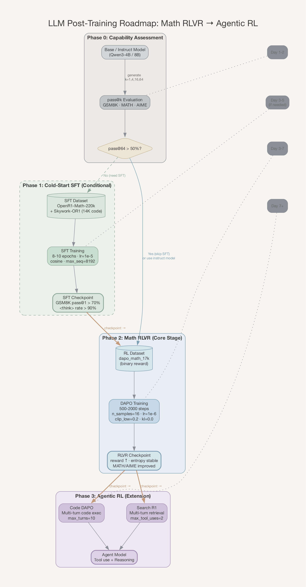
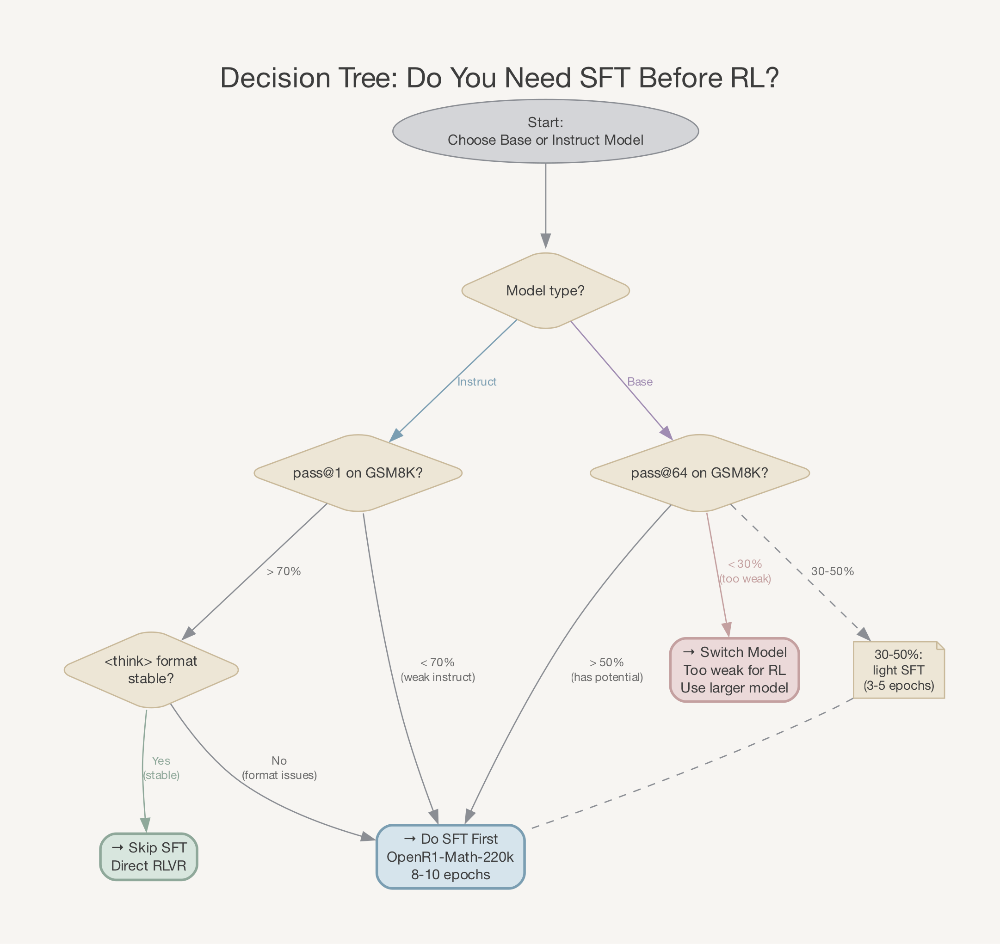
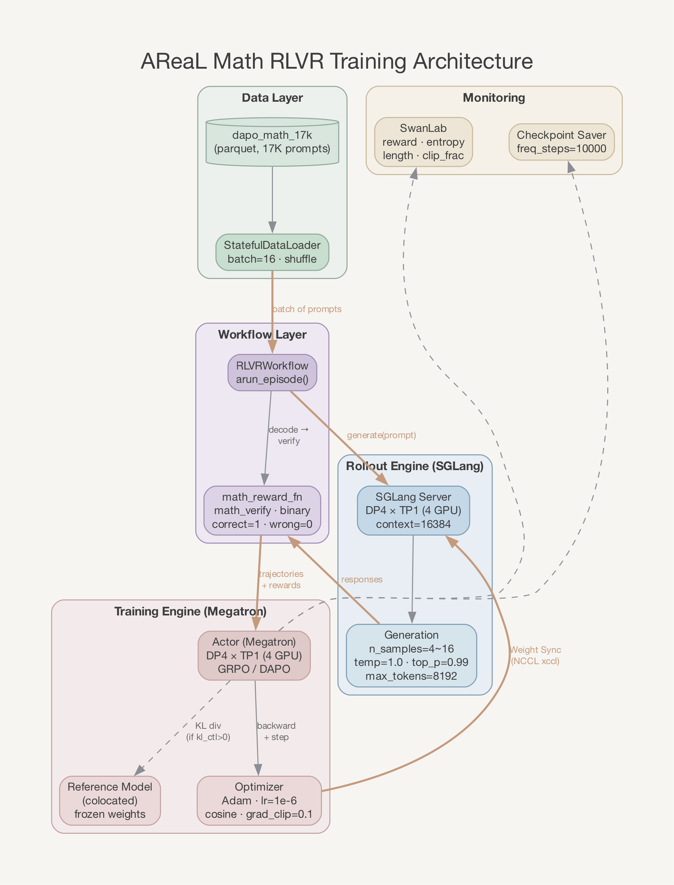
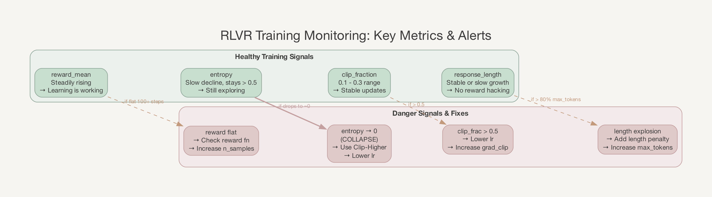
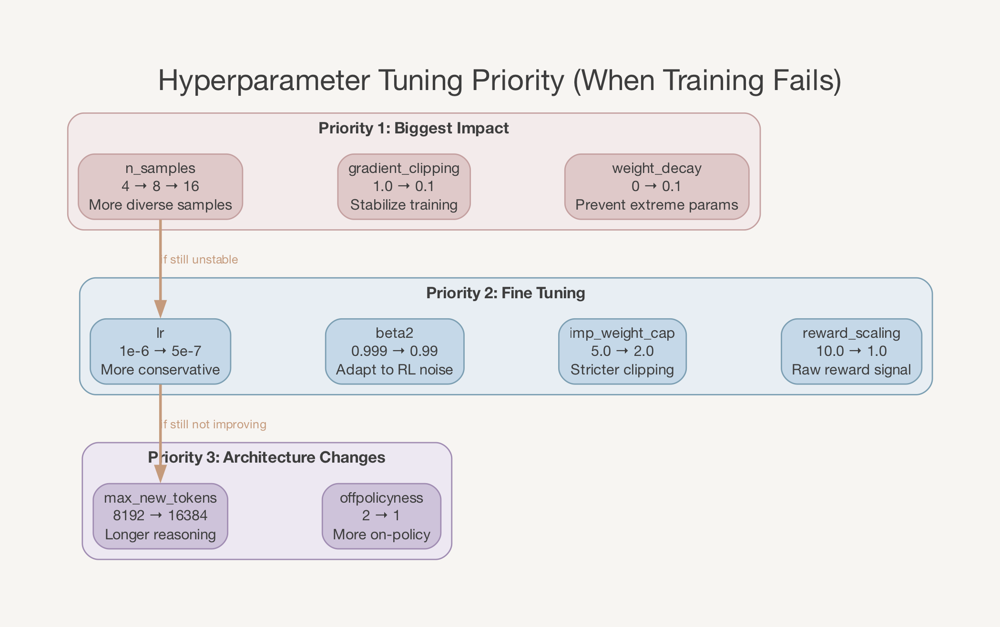

# LLM 后训练路线图：从 Math RLVR 到 Agentic RL
> 版本：v1.0 | 作者：zengbw | 日期：2026-04-09

---

## 1. 需求内容
### 1.1 需求目标
基于开源 base/instruct 模型（Qwen3 系列），通过 SFT → RLVR → Agentic RL 多阶段后训练，复现业界已验证的训练路线，实现模型通用推理、代码生成和工具使用能力的提升。
### 1.2 验证目标
- Phase 1（快速验证）：在 math 单一任务上跑通 RLVR 全流程，reward 曲线稳步上升，AIME/MATH 等 benchmark 有可观测提升
- Phase 2（能力扩展）：在 Phase 1 checkpoint 基础上扩展到代码执行（Code DAPO）和搜索增强（Search R1）agentic 场景
- Phase 3（通用对齐）：可选，通过 DPO/RLHF 对齐通用偏好，提升安全性和有用性
### 1.3 参考方案
| 方案 | 来源 | 核心贡献 | 链接 |
|---|---|---|---|
| DAPO | ByteDance Seed + 清华 | Clip-Higher / Dynamic Sampling / Token-Level Loss / Overlong Mask | [arXiv:2503.14476](https://arxiv.org/abs/2503.14476) |
| POLARIS | ByteDance Seed | 700 步 RL 让 4B 模型逼近 235B 数学推理 | [GitHub](https://github.com/ChenxinAn-fdu/POLARIS) |
| Skywork-OR1 | 昆仑万维 | MAGIC entropy 调度解决 entropy collapse | [GitHub](https://github.com/SkyworkAI/Skywork-OR1) |
| DeepSeek-R1 | DeepSeek | 纯 RL 涌现推理 + 四阶段训练流水线 | [arXiv:2501.12948](https://arxiv.org/abs/2501.12948) |
| Search-R1 | 密歇根大学 | 推理中自主搜索的 RL 训练 | [GitHub](https://github.com/PeterGriffinJin/Search-R1) |
| VAPO | ByteDance Seed | Value-augmented PPO，AIME24 达 60.4 | [arXiv:2504.05118](https://arxiv.org/abs/2504.05118) |

---

## 2. 需求分析
### 2.1 技术背景
**RLVR（Reinforcement Learning with Verifiable Rewards）** 是当前 LLM 推理能力提升的主流方案。核心思路是：用可自动验证的信号（数学答案正确性、代码执行结果）作为奖励，通过 RL 训练将模型的 pass@k 能力压缩到 pass@1。

DeepSeek-R1 证明了纯 RL 可以从 base model 涌现推理能力（R1-Zero），但也指出先做 SFT 再做 RL 效果更好——SFT 提供格式和基础推理链，RL 负责优化策略。DAPO 进一步在 GRPO 基础上解决了四个核心问题（entropy collapse、长度偏差、截断噪声、采样低效），用 50% 步数超越 R1-Zero。

**关于 math-only 是否影响全局训练**：业界证据表明，在数学上训练的推理能力可以泛化到其他领域。POLARIS 发现逻辑谜题上训练可以迁移到数学；DeepSeek-R1 的数学 RL 训练也提升了代码和 STEM 能力。因此，先在 math 上验证再扩展到多领域，是一条被广泛验证的正确路径——不会"浪费"训练，反而是效率最高的验证方式。
### 2.2 技术挑战
| 挑战 | 说明 |
|---|---|
| Entropy Collapse | GRPO/DAPO 训练中策略 entropy 急剧下降到 ~0，模型失去探索能力，reward 停滞。这是 RL 训练失败的最常见原因 |
| SFT 充分性判断 | SFT 不充分会导致 RL 初期格式混乱、reward 极低；SFT 过度会导致模型过拟合、RL 难以跳出局部最优。需要明确的停止标准 |
| 奖励函数正确率区间 | 奖励函数在训练集上的正确率需要在 20%-80% 范围：太低无学习信号，太高无挑战。需要在训练前评估 |
| 从 math 到 agentic 的迁移 | 单轮 math RLVR 到多轮 agentic RL，workflow 架构不同（RLVRWorkflow vs OpenAIProxyWorkflow），reward 归因方式不同，需要验证 checkpoint 兼容性 |
| Base model 能力上限 | 最新研究表明 RLVR 并非凭空创造推理能力，而是压缩 pass@k → pass@1。如果 base model 的 pass@64 本身很低，RL 增益有限 |
### 2.3 约束条件
- 部署环境：fuyao 集群，A100/H800 80G GPU
- 基础框架：AReaL（当前仓库），训练后端 Megatron + SGLang
- 实验跟踪：SwanLab
- 提交入口：`fuyao_examples/fuyao_areal_run.sh`
- 模型：Qwen3-4B（快速验证）→ Qwen3-8B（中等规模）→ Qwen3-30B-A3B（MoE，目标规模）

---

## 3. 方案设计
### 3.1 整体训练路线



### 3.2 "先 math 后扩展" 策略的合理性
| 维度 | math-only 先行 | 多任务同时训练 |
|---|---|---|
| 验证速度 | 快：1 节点 8GPU，无外部服务依赖 | 慢：需要搜索服务、代码沙箱 |
| 调试难度 | 低：单轮生成，reward 可解释 | 高：多轮交互，reward 归因复杂 |
| 能力迁移 | 有：数学推理可泛化到代码/逻辑 | — |
| 资源开销 | 低：dapo_math_17k 仅 17K 样本 | 高：多数据集、多服务 |
| 风险 | 低：可在 1-2 天内验证完整流程 | 高：任何环节出错都阻塞全局 |

结论：**math-only 是正确的第一步**。POLARIS 证明 4B 模型仅 700 步 RL 就能在 AIME24 达到 81.2%，说明 math 任务足以验证 RL pipeline 的有效性。后续扩展到 agentic 场景时，math RLVR checkpoint 是更好的起点（比 base model 有更强的推理基础）。
### 3.3 关键设计决策
| 决策 | 选择 | 理由 |
|---|---|---|
| 起始模型 | Qwen3-4B base（快速验证）或 instruct（跳过 SFT） | POLARIS 验证了从 instruct 直接 RL 的可行性；base 需要额外 SFT 阶段 |
| RL 算法 | DAPO（GRPO 变体） | 50% 步数超越 R1-Zero；解决 entropy collapse；AReaL 已有 GRPO 实现可复用 |
| 数据集 | dapo_math_17k | 已在仓库中集成，数据量适中，覆盖多难度等级 |
| KL 惩罚 | kl_ctl=0.0 | DAPO 论文明确移除 KL 惩罚，效果更好 |
| 采样数 | n_samples=4~16 | 4 为快速验证起点，16 为效果最优配置 |

---

## 4. 需求实现
### 4.1 已有基础设施
当前仓库已有完整的 math RLVR 训练基础设施，可直接复用：

**训练 pipeline：**
| 组件 | 路径 | 状态 |
|---|---|---|
| 训练入口 | `fuyao_examples/math/train_math_rlvr.py` | 已完成 |
| 启动脚本 | `fuyao_examples/fuyao_areal_run.sh --run-type math_rlvr` | 已完成 |
| 数据集加载 | `fuyao_examples/dataset/dapo_math.py` | 已完成 |
| 奖励函数 | `fuyao_examples/reward.py` (math_reward_fn) | 已完成 |
| Workflow | `areal/workflow/rlvr/RLVRWorkflow` | 框架内置 |
| Trainer | `areal/trainer/rl_trainer.py` (PPOTrainer) | 框架内置 |

**已有配置（三个模型规模）：**
| 配置 | 路径 | GPU | 节点 |
|---|---|---|---|
| Qwen3-4B | `fuyao_examples/math/qwen3_4b_rlvr.yaml` | 8 | 1 |
| Qwen3-8B | `fuyao_examples/math/qwen3_8b_rlvr.yaml` | 16 | 2 |
| Qwen3-30B-A3B | `fuyao_examples/math/qwen3_30b_a3b_rlvr.yaml` | 32 | 4 |

**Agentic 扩展（已实现，Phase 3 使用）：**
| 组件 | 路径 | 状态 |
|---|---|---|
| Code DAPO Agent | `fuyao_examples/code_dapo/code_exec_agent.py` | 已完成 |
| Search R1 Agent | `fuyao_examples/search_r1/search_r1_agent.py` | 已完成 |
| Code DAPO 配置 | `fuyao_examples/code_dapo/code_dapo_qwen3_4b.yaml` | 已完成 |
| Search R1 配置 | `fuyao_examples/search_r1/search_r1_qwen3_4b.yaml` | 已完成 |
### 4.2 需要新增/调整的工作
| 工作项 | 说明 | 优先级 |
|---|---|---|
| Phase 0 评估脚本 | 编写 pass@k 评估脚本，在 MATH/AIME/GSM8K 上评估 base model 能力上限 | P0 |
| DAPO 超参调优 | 当前配置使用 REINFORCE 算法（kl_ctl=0.0, reward_norm=group），需要按 DAPO 论文调整 clip_higher 等参数 | P0 |
| SFT 训练配置 | 如果 base model pass@64 不足，需要配置 SFT 训练（可使用现有 `SFTTrainer`） | P1 |
| Entropy 监控 | 在 SwanLab 中增加 entropy 指标追踪，及时发现 entropy collapse | P0 |
| Checkpoint 兼容性 | 验证 math RLVR checkpoint 能否直接加载到 Code DAPO / Search R1 配置中继续训练 | P2 |

---

## 5. 实验配置
### 5.1 Phase 0: 能力评估（训练前必做）
**目标**：确定 base model 的 pass@k 能力上限，决定是否需要 SFT 阶段。



**评估方案**：
| 评估项 | 数据集 | 指标 | 判断标准 |
|---|---|---|---|
| 数学推理 | GSM8K (1319 题) | pass@1, pass@4, pass@16, pass@64 | pass@64 > 50% 则 RL 有空间 |
| 数学推理 | MATH-500 | pass@1, pass@4 | pass@1 作为 baseline |
| 竞赛数学 | AIME 2024 (30 题) | pass@1 | 作为对标 DAPO/R1 的参考 |
| 格式合规 | 随机 100 题 | `<think>` 标签出现率 | > 80% 可跳过 SFT |

**决策树**：参见上方 Decision Tree 图表。

### 5.2 Phase 1: Cold-Start SFT（按需执行）
**输入**: Base model (Qwen3-4B)
**输出**: 格式稳定、具备基础推理链的 checkpoint
**训练框架**: AReaL `SFTTrainer`（`areal/trainer/sft_trainer.py`）

**数据来源（任选其一或混合）**：
| 数据集 | 规模 | 来源 | 特点 |
|---|---|---|---|
| OpenR1-Math-220k | 220K | HuggingFace open-r1 | 从 DeepSeek-R1 蒸馏的数学推理轨迹 |
| Skywork-OR1-RL-Data | 105K 数学 + 14K 代码 | GitHub Skywork-OR1 | 高质量，含代码推理 |
| NuminaMath-CoT | 860K | HuggingFace | 数学 CoT，规模最大 |

推荐组合: OpenR1-Math-220k（主体）+ Skywork-OR1 代码部分（14K，增加多样性）

**数据格式要求**：
```json
{
  "messages": [
    {"role": "user", "content": "Solve: x^2 + 3x - 4 = 0"},
    {"role": "assistant", "content": "<think>\nI need to factor x^2 + 3x - 4.\n...\n</think>\n\nThe solutions are x = -4 and x = 1."}
  ]
}
```

**SFT 超参数**：
| 参数 | 值 | 说明 |
|---|---|---|
| epochs | 8-10 | Skywork-OR1 发现 AIME 精度在 epoch 10 才饱和，短 SFT (1-3 epoch) 会导致 RL 不稳定 |
| learning_rate | 1e-5 | cosine decay |
| warmup_ratio | 0.03 | |
| max_seq_len | 8192 | 推理链需要较长上下文 |
| global_batch_size | 128-256 | |
| weight_decay | 0.01 | |
| dtype | bfloat16 | |

**停止标准**：
- 验证集 loss 不再下降（连续 2 个 epoch）
- GSM8K pass@1 > 70%（4B 模型）
- 随机采样 100 条输出，`<think>` 标签出现率 > 90%

### 5.3 Phase 2: Math RLVR（核心阶段）
**输入**: Phase 1 checkpoint 或 instruct model
**输出**: 数学推理能力显著提升的 checkpoint
**训练框架**: AReaL `PPOTrainer` + `RLVRWorkflow`

#### 5.3.1 基础配置（基于现有 qwen3_4b_rlvr.yaml）
| 参数 (YAML path) | 当前值 | 建议调整 | 理由 |
|---|---|---|---|
| `gconfig.n_samples` | 4 | 8-16 | 增加采样多样性，DAPO 论文推荐 16 |
| `actor.optimizer.lr` | 1.0e-6 | 5.0e-7 ~ 1.0e-6 | 保守起步，观察稳定性后调整 |
| `actor.optimizer.weight_decay` | 0 | 0.1 | DAPO 推荐，防止参数极端值 |
| `actor.optimizer.beta2` | 0.999 | 0.99 | DeepSeek 推荐，适合 RL 噪声梯度 |
| `actor.optimizer.gradient_clipping` | 1.0 | 0.1 | DAPO 使用激进梯度裁剪 |
| `actor.eps_clip` | 0.2 | 0.2 (保持) | DAPO clip_low，不变 |
| `actor.kl_ctl` | 0.0 | 0.0 (保持) | DAPO 移除 KL 惩罚 |
| `actor.reward_scaling` | 10.0 | 1.0 | 默认不缩放，观察原始 reward 信号 |
| `actor.reward_bias` | -0.5 | 0.0 | 默认不偏置 |
| `actor.behave_imp_weight_cap` | 5.0 | 2.0 | 更严格的 importance weight 裁剪 |
| `total_train_epochs` | 10 | 2-3 | 快速验证，观察 reward 趋势后决定 |
| `gconfig.temperature` | 0.99 | 1.0 | DAPO 标准设置 |



#### 5.3.2 DAPO 特有调整（需要代码层面支持）


| DAPO 技术 | 对应 AReaL 配置 | 说明 |
|---|---|---|
| Clip-Higher | `actor.eps_clip` = 0.2（低），需新增 `eps_clip_high` = 0.28 | 解耦上下 clip 阈值，允许更大探索空间。**[待确认]** AReaL 是否支持双 clip 参数 |
| Dynamic Sampling | rollout 层过滤 reward std=0 的样本组 | **[待确认]** AReaL 是否支持 dynamic sampling |
| Token-Level Loss | `actor.use_decoupled_loss: true` (已开启) | 当前已使用 token-level loss，符合 DAPO 要求 |
| Overlong Mask | 需确认截断响应是否从 loss 中排除 | **[待确认]** `max_new_tokens: 8192` 截断时的 loss 处理 |

#### 5.3.3 集群资源配置
**Qwen3-4B（快速验证，1 节点）：**
| 角色 | GPU 数 | 并行策略 | 显存特征 |
|---|---|---|---|
| Actor (Megatron) | 4 | DP4, TP1, PP1 | 峰值 ~79 GB，稳态 ~69% |
| SGLang Rollout | 4 | DP4, TP1 | 静态 70%，context_length=16384 |
| Ref Model | 0 (与 Actor 共置) | colocation | 复用 Actor 显存 |

**Qwen3-8B（标准实验，2 节点）：**
| 角色 | GPU 数 | 并行策略 | 显存特征 |
|---|---|---|---|
| Actor (Megatron) | 8 (node 0) | DP2, TP2, PP2 | PP2 减半单卡显存 |
| SGLang Rollout | 8 (node 1) | DP4, TP2 | 静态 85% |
| Ref Model | 0 (与 Actor 共置) | colocation | 需要 PP2 为 Ref 腾出空间 |

### 5.4 Phase 3: Agentic RL（扩展阶段）
**输入**: Phase 2 的 RLVR checkpoint
**输出**: 具备工具调用能力的 agent 模型

**Code DAPO 配置要点**（基于 `fuyao_examples/code_dapo/code_dapo_qwen3_4b.yaml`）：
| 参数 | 值 | 说明 |
|---|---|---|
| `actor.path` | Phase 2 checkpoint 路径 | 从 RLVR checkpoint 继续训练 |
| `agentic.max_turns` | 10 | 最大对话轮数 |
| `agentic.max_tool_uses` | 1 | 每轮最多 1 次工具调用 |
| `agentic.code_timeout` | 5 | 代码执行超时秒数 |
| `gconfig.n_samples` | 1 | agentic 场景每次 1 条（多轮交互成本高） |
| `train_dataset.batch_size` | 128 | 更大 batch 补偿单样本 |

**Search R1 配置要点**（基于 `fuyao_examples/search_r1/search_r1_qwen3_4b.yaml`）：
| 参数 | 值 | 说明 |
|---|---|---|
| `actor.path` | Phase 2 checkpoint 路径 | 从 RLVR checkpoint 继续训练 |
| `agentic.retrieval_endpoint` | 搜索服务地址 | 需要预先部署检索服务 |
| `agentic.max_turns` | 10 | 最大搜索轮数 |
| `agentic.max_tool_uses` | 2 | 每轮最多 2 次搜索 |
| `gconfig.n_samples` | 1 | 同上 |

---



---

## 6. 实验结果
### 6.1 已有基线数据
**Qwen3-4B Math RLVR 基础设施测试**（来自 infra-reports/20260407）：
| 指标 | 值 | 说明 |
|---|---|---|
| 任务完成 | 通过 | 跑完 46 步，无崩溃 |
| GPU 利用率 | 44.52% | RL 训练正常水平 |
| GPU 显存 | 68.69% (78.63/79.25 GB) | 有余量 |
| 单步耗时 | ~19s | rollout 34% + train 51% + update 14% |
| sample_staleness | 1.8-2.0 | 在 max_head_offpolicyness=2 范围内，正常 |
| 预估全量时长 | ~75h (10 epochs, 10870 步) | 建议先用 2 epochs 快速验证 |

### 6.2 业界对标基线
| 模型 | 算法 | AIME24 | MATH-500 | GSM8K | 训练步数 | 来源 |
|---|---|---|---|---|---|---|
| Qwen2.5-32B + DAPO | DAPO | 50.0 | — | — | ~5000 | DAPO 论文 |
| Qwen2.5-32B + VAPO | VAPO | 60.4 | — | — | ~5000 | VAPO 论文 |
| Qwen3-4B + POLARIS | DAPO 变体 | 81.2 | — | — | 700 | POLARIS |
| Qwen2.5-32B + Skywork-OR1 | GRPO+MAGIC | — | 72.8 (avg) | — | — | Skywork-OR1 |
| DeepSeek-R1-Zero-Qwen-32B | GRPO | 47.0 | — | — | — | R1 论文 |

### 6.3 效果验证计划
**[待补充]** 以下指标将在实验执行后填入：

**Phase 2 (Math RLVR) 预期追踪指标：**
| 指标 | 健康范围 | 异常信号 |
|---|---|---|
| reward_mean | 持续上升，最终 > 0.3 | 停滞或下降 |
| entropy | 缓慢下降，始终 > 0.5 | 急剧降到 ~0 = entropy collapse |
| response_length_mean | 稳定或缓慢增长 | 无限增长 = reward hacking |
| clip_fraction | 0.1-0.3 | > 0.5 = 学习率过大 |
| pass@1 (eval) | 逐步提升 | 上升后大幅回落 = 过拟合 |

---

## 7. 实验结论
**[待补充]** 实验执行后填入具体结论。

### 7.1 预期验证项
| 验证项 | 成功标准 | 状态 |
|---|---|---|
| Math RLVR pipeline 跑通 | reward 曲线在 100 步内开始上升 | 待验证 |
| Entropy 不崩溃 | 训练全程 entropy > 0.5 | 待验证 |
| Benchmark 提升 | GSM8K pass@1 提升 > 5% | 待验证 |
| Checkpoint 兼容 | RLVR checkpoint 能加载到 Code DAPO 配置 | 待验证 |
| Agentic RL 跑通 | Code DAPO 多轮交互正常，reward 有信号 | 待验证 |

---

## 8. 复现指南
### 8.1 实验执行步骤

#### Step 0: 能力评估
```bash
# 1. 评估 base model 的 pass@k
# [待补充] 评估脚本路径和命令

# 2. 根据结果决定是否需要 SFT
# 判断标准: GSM8K pass@64 > 50% 可跳过 SFT
```

#### Step 1: Cold-Start SFT（如需要）
```bash
# 1. 准备 SFT 数据 (OpenR1-Math-220k)
# [待补充] 数据下载和预处理命令

# 2. 配置 SFT YAML (基于 examples/math/gsm8k_sft.py 格式)
# [待补充] SFT 配置文件路径

# 3. 启动 SFT 训练
# [待补充] 启动命令
```

#### Step 2: Math RLVR（核心步骤）
```bash
# 1. 确认模型路径
#    - 如果做了 SFT: 指向 SFT checkpoint
#    - 如果用 instruct: 指向 /publicdata/huggingface.co/Qwen/Qwen3-4B
#    修改 YAML 中 actor.path 和 ref.path

# 2. 快速验证 (2 epochs, ~3h)
bash fuyao_examples/fuyao_areal_run.sh \
    --run-type math_rlvr \
    --config fuyao_examples/math/qwen3_4b_rlvr.yaml \
    --swanlab-api-key $SWANLAB_API_KEY

# 3. 观察 SwanLab 指标:
#    - reward_mean: 是否上升
#    - entropy: 是否崩溃
#    - response_length_mean: 是否爆炸

# 4. 如果 reward 持续上升且 entropy 稳定:
#    调整 total_train_epochs=10, 完整训练
```

#### Step 3: Agentic RL（扩展步骤）
```bash
# 1. 修改 Code DAPO 配置中的 actor.path 指向 Phase 2 checkpoint
# 编辑 fuyao_examples/code_dapo/code_dapo_qwen3_4b.yaml:
#   actor.path: /path/to/phase2/checkpoint

# 2. 启动 Code DAPO 训练
bash fuyao_examples/fuyao_areal_run.sh \
    --run-type code_dapo \
    --config fuyao_examples/code_dapo/code_dapo_qwen3_4b.yaml \
    --swanlab-api-key $SWANLAB_API_KEY

# 3. 启动 Search R1 训练 (需要先部署检索服务)
bash fuyao_examples/fuyao_areal_run.sh \
    --run-type search_r1 \
    --config fuyao_examples/search_r1/search_r1_qwen3_4b.yaml \
    --swanlab-api-key $SWANLAB_API_KEY
```

### 8.2 超参调优优先级


当训练效果不好时，按以下优先级调整：

**第一优先级（影响最大）：**
| 参数 | 调整方向 | 预期效果 |
|---|---|---|
| `gconfig.n_samples` | 4 → 8 → 16 | 增加采样多样性，reward 方差更小 |
| `actor.optimizer.gradient_clipping` | 1.0 → 0.1 | 稳定训练，防止梯度爆炸 |
| `actor.optimizer.weight_decay` | 0 → 0.1 | 防止参数极端值 |

**第二优先级（精细调整）：**
| 参数 | 调整方向 | 预期效果 |
|---|---|---|
| `actor.optimizer.lr` | 1e-6 → 5e-7 | 更保守的更新，稳定性更好 |
| `actor.optimizer.beta2` | 0.999 → 0.99 | 适合 RL 噪声梯度 |
| `actor.behave_imp_weight_cap` | 5.0 → 2.0 | 更严格的 importance weight 裁剪 |
| `actor.reward_scaling` | 10.0 → 1.0 | 使用原始 reward 信号 |

**第三优先级（架构调整）：**
| 参数 | 调整方向 | 预期效果 |
|---|---|---|
| `gconfig.max_new_tokens` | 8192 → 16384 | 允许更长推理链 |
| `rollout.max_head_offpolicyness` | 2 → 1 | 牺牲吞吐换取更 on-policy 的训练 |

### 8.3 关键监控指标
| 指标 | 健康范围 | 异常信号 | 应对措施 |
|---|---|---|---|
| reward_mean | 持续上升 | 100 步内无上升 | 检查奖励函数；增加 n_samples |
| entropy | 缓慢下降，> 0.5 | 急降到 ~0 | 增大 eps_clip_high（如支持）；降低 lr |
| response_length_mean | < max_new_tokens 的 80% | 持续增长接近上限 | 增加 max_new_tokens；检查是否 reward hacking |
| clip_fraction | 0.1-0.3 | > 0.5 | 降低 lr；增加 gradient_clipping |
| sample_staleness | < max_head_offpolicyness | 持续接近上限 | 增加 rollout 并发；减少 train batch |
| pass@1 (eval) | 逐步提升 | 上升后大幅回落 | 降低 lr；提前停止 |

---

## 附录 A: 业界训练路线对比

### A.1 已验证的成功路线
| 路线 | 起始模型 | 阶段 | 成果 | 资源 |
|---|---|---|---|---|
| POLARIS | Qwen3-4B instruct | 直接 DAPO RL (700 步) | AIME24: 81.2% | 8 GPU |
| Skywork-OR1 | Qwen2.5-32B base | SFT (10 epoch) + GRPO+MAGIC | 72.8% avg | 多节点 |
| DeepSeek-R1 | DeepSeek-V3 base | R1-Zero(GRPO) + SFT + RLVR + RLHF | AIME24: 79.8% | 大规模 |
| Open-R1 | Qwen2.5-32B | SFT(OpenR1-Math) + GRPO | 匹配 R1 蒸馏模型 | 多节点 |

### A.2 推荐路线（适用于当前项目）
**路线 A（最快出结果，推荐）：**
```
Qwen3-4B instruct --> DAPO RL (dapo_math_17k, 500-2000 步)
                      --> 评估 GSM8K/MATH/AIME
                      --> Code DAPO / Search R1
```

**路线 B（更完整，base model 起步）：**
```
Qwen3-4B base --> SFT (OpenR1-Math-220k, 8-10 epoch)
              --> DAPO RL (dapo_math_17k, 500-2000 步)
              --> 评估
              --> Code DAPO / Search R1
```

---

## 附录 B: 核心参考资源

### 论文
| 论文 | 关键内容 | 链接 |
|---|---|---|
| DAPO | Clip-Higher, Dynamic Sampling, Token-Level Loss, Overlong Mask | [arXiv:2503.14476](https://arxiv.org/abs/2503.14476) |
| DeepSeek-R1 | 纯 RL 涌现推理，GRPO 算法详解 | [arXiv:2501.12948](https://arxiv.org/abs/2501.12948) |
| VAPO | Value-augmented PPO，AIME24 SOTA | [arXiv:2504.05118](https://arxiv.org/abs/2504.05118) |
| Kimi K1.5 | 128K 上下文 RL，Partial Rollouts | [arXiv:2501.12599](https://arxiv.org/abs/2501.12599) |
| Entropy Mechanism | RL 训练中 entropy 与 reward 的数学关系 | [arXiv:2505.22617](https://arxiv.org/abs/2505.22617) |
| Search-R1 | 推理中自主搜索的 RL 训练 | [arXiv:2503.09516](https://arxiv.org/abs/2503.09516) |

### 开源项目
| 项目 | 特点 | 链接 |
|---|---|---|
| POLARIS | 4B 模型 700 步达 AIME24 81.2% | [GitHub](https://github.com/ChenxinAn-fdu/POLARIS) |
| Skywork-OR1 | MAGIC entropy 调度 + 开源数据集 | [GitHub](https://github.com/SkyworkAI/Skywork-OR1) |
| Open-R1 | DeepSeek-R1 系统性复现 | [GitHub](https://github.com/huggingface/open-r1) |
| DAPO 代码 | 基于 veRL 的 DAPO 实现 | [GitHub](https://github.com/BytedTsinghua-SIA/DAPO) |
| veRL | 最成熟的开源 RL 训练框架 | [GitHub](https://github.com/volcengine/verl) |

### 调优指南
| 指南 | 内容 | 链接 |
|---|---|---|
| PPO → GRPO → DAPO 全参数解读 | 每个超参数的作用和推荐值 | [Blog](https://blog.softmaxdata.com/from-ppo-to-grpo-to-dapo-understanding-rl-for-llms-and-every-training-parameter-explained/) |
| 16 个框架深度对比 | 异步 RL 框架选型 | [HuggingFace](https://huggingface.co/blog/async-rl-training-landscape) |
| veRL GRPO+LoRA 工程手册 | 工程实践经验 | [HuggingFace](https://huggingface.co/blog/Weyaxi/engineering-handbook-grpo-lora-with-verl) |
| Awesome-RLVR | RLVR 论文合集 | [GitHub](https://github.com/opendilab/awesome-RLVR) |
| Awesome-RL-for-LRMs | RL for LLM 论文合集 | [GitHub](https://github.com/TsinghuaC3I/Awesome-RL-for-LRMs) |
