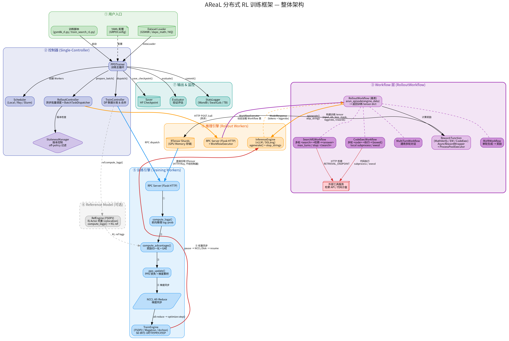

# AReaL 整体架构

## 架构概览

AReaL 是一个基于 **Single-Controller** 架构的分布式 RL 训练框架，通过异步 Rollout + 同步训练实现高吞吐的 LLM 对齐。

## 六层架构

### 1. 用户入口

- **训练脚本** (`gsm8k_rl.py`, `train_search_r1.py` 等): 定义用哪个 Workflow、怎么加载数据
- **YAML 配置** (`GRPOConfig`): 资源分配、超参、数据路径
- **Dataset Loader**: 数据集加载与格式转换

### 2. 控制器 (PPOTrainer)

中心调度节点，不持有模型权重，只持有元数据：

- **Scheduler** (Local/Ray/Slurm): 创建和管理 Worker 进程
- **RolloutController**: 异步调度推理请求，维护 `BatchTaskDispatcher`
- **TrainController**: 数据并行分发(FFD 负载均衡) 与结果合并
- **StalenessManager**: 跟踪模型版本，过滤过期样本 (`max_head_offpolicyness`)

### 3. Workflow 层

核心扩展点，定义单次 episode 的交互逻辑：

| Workflow | 类型 | 交互协议 |
|----------|------|---------|
| **RLVRWorkflow** | 单轮 | 生成 -> 奖励 |
| **SearchR1Workflow** | 多轮搜索 | `<search>` -> 检索 -> `<answer>` |
| **CodeExecWorkflow** | 多轮代码 | `<code>` -> 执行 -> `\boxed{}` |
| **MultiTurnWorkflow** | 多轮重试 | 错误 -> 重试 prompt -> 再生成 |

所有 Workflow 返回统一的 tensor dict:
- `input_ids`: 完整序列 (prompt + 所有轮次)
- `loss_mask`: 0=prompt/工具输出, 1=模型生成 (只对模型生成的 token 计算梯度)
- `logprobs`: 每 token log-prob
- `versions`: 每 token 的模型版本
- `rewards`: 标量奖励

### 4. 推理引擎 (Rollout Workers)

- **RPC Server**: Flask HTTP 多线程，接收控制器请求
- **WorkflowExecutor**: 动态加载 Workflow 类，异步执行 `arun_episode()`
- **InferenceEngine** (SGLang/vLLM): 底层推理，支持 `stop_strings` 中断
- **RTensor Shards**: 生成结果存在 Worker GPU 上，控制器只持有元数据

### 5. 训练引擎 (Training Workers)

- **TrainEngine** (FSDP2/Megatron/Archon): 模型训练
- 直接从 Rollout Workers 拉取 RTensor (不经控制器，零拷贝)
- 计算流: `compute_logp()` -> `compute_advantages()` -> `ppo_update()` -> `NCCL All-Reduce`
- 支持 5D 并行: DP/TP/PP/CP/EP

### 6. 输出与监控

- **StatsLogger**: WandB / SwanLab / TensorBoard
- **Saver**: HuggingFace 格式 Checkpoint
- **Evaluator**: 周期性验证评估

## 关键设计

- **RTensor 零拷贝**: 控制器只持有元数据，训练 Worker 直接从 Rollout Worker 拉数据
- **三级并发**: Controller 线程 -> RPC Server 多线程 -> GPU 推理进程
- **版本追踪**: 每个 token 标记生成时的模型版本，支持 off-policy 过滤
- **异步流水线**: 训练和推理在不同 GPU 上并行 (`scheduling_strategy: separation`)
