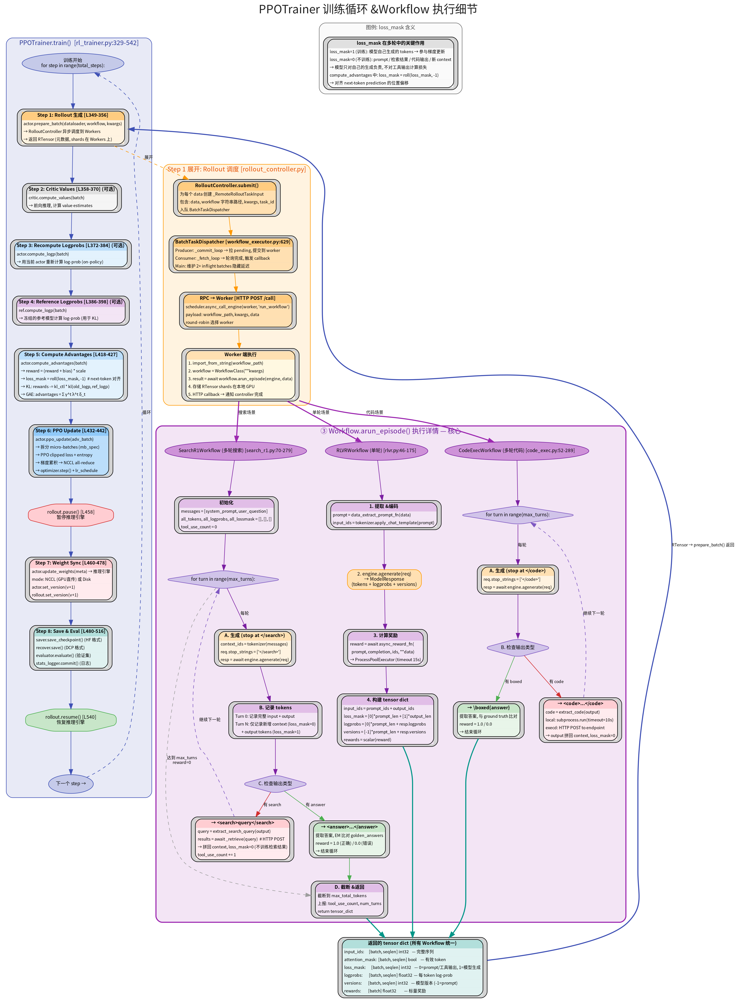

# PPOTrainer 训练循环与 Workflow 执行



## 训练主循环

`PPOTrainer.train()` (`rl_trainer.py:329-542`) 每个 step 执行以下阶段:

### Step 1: Rollout 生成 [L349-356]

```
PPOTrainer
  -> RolloutController.prepare_batch(dataloader, workflow_path, kwargs)
    -> BatchTaskDispatcher.submit() 异步入队
      -> RPC HTTP POST /call -> Worker
        -> import_from_string(workflow_path)(**kwargs)  # 动态加载 Workflow
        -> workflow.arun_episode(engine, data)           # 核心执行
        -> 存储 RTensor shards 在 Worker GPU
        -> HTTP callback 通知 Controller
```

Rollout 是**异步**的: Worker 在后台持续生成，`prepare_batch()` 收割已完成的结果。收到的样本可能是旧版本模型生成的 (由 `max_head_offpolicyness` 控制容忍度)。

### Step 2: Critic Values [L358-370] (可选)

如有 Critic 模型，计算 value estimates。GRPO 不需要。

### Step 3: Recompute Logprobs [L372-384] (可选)

用**当前 actor 权重**重新对 rollout 序列做前向，得到 on-policy 的 `prox_logp`。

因为 rollout 是异步的，生成时用的可能是 v(N-2) 的旧权重，而 actor 已经是 v(N)。`recompute_logprob=true` 时额外做一次前向保证严格 on-policy。

| 来源 | 字段 | 谁算的 | 用途 |
|------|------|--------|------|
| Rollout | `logprobs` | 推理引擎 (旧版本) | 采样基础 |
| Step 3 | `prox_logp` | 训练引擎 (当前版本) | PPO ratio 分母 |
| Step 4 | `ref_logp` | 冻结 ref 模型 | KL 散度惩罚 |

### Step 4: Reference Logprobs [L386-398] (可选)

冻结的参考模型计算 log-prob，用于 KL 散度惩罚。`kl_ctl=0` 时无效果。

### Step 5: Compute Advantages [L418-427]

```python
reward = (reward + bias) * scale           # 奖励缩放
reward = clip(reward, -clip_value, clip_value)
loss_mask = roll(loss_mask, -1)            # next-token prediction 对齐
kl_penalty = -kl_ctl * kl(old_logp, ref_logp)  # KL 惩罚
advantages = GAE(rewards + kl_penalty, gamma, lambda)
```

关键: `loss_mask` 向左移 1 位，因为训练预测的是下一个 token。

### Step 6: PPO Update [L432-442]

```
actor.ppo_update(adv_batch)
  -> 按 max_tokens_per_mb 拆分 micro-batches
  -> 每个 micro-batch: forward -> PPO clipped loss -> backward
  -> 梯度累积 -> NCCL all-reduce
  -> optimizer.step() + lr_schedule
```

**注意**: PPO update 期间推理引擎还在继续生成 (为下一个 step 攒样本)。

### Pause -> Weight Sync -> Resume [L457-540]

```python
self.rollout.pause()                    # 暂停推理引擎
self.actor.update_weights(meta)         # NCCL/Disk 同步权重到推理引擎
self.actor.set_version(new_version)     # 更新版本号
self.rollout.set_version(new_version)
# ... save checkpoint, evaluate ...
self.rollout.resume()                   # 恢复推理
```

Pause 在 PPO update **之后**，不是之前。这样训练和推理的流水线重叠最大化。Pause 的原因是权重同步不是原子操作，需要保证推理引擎拿到完整的新权重。

## Workflow 执行详情

### RLVRWorkflow (单轮) `rlvr.py`

```
1. prompt -> tokenizer.apply_chat_template()
2. engine.agenerate(req) -> ModelResponse (tokens + logprobs)
3. async_reward_fn(prompt, completion, **data) -> float
4. 构建 tensor:
   loss_mask = [0]*prompt_len + [1]*output_len
   logprobs  = [0]*prompt_len + resp.logprobs
```

### SearchR1Workflow (多轮搜索) `search_r1_workflow.py`

```
for turn in range(max_turns):
  1. context_ids = tokenizer(messages)
  2. engine.agenerate(req, stop_strings=["</search>"])
  3. 记录 tokens:
     - Turn 0: 完整 input + output
     - Turn N: 仅新增 context (loss_mask=0) + output (loss_mask=1)
  4. 检查输出:
     - <answer>...</answer> -> EM 比对 -> reward -> 结束
     - <search>query</search> -> HTTP 检索 -> 结果拼回 context
       检索结果 loss_mask=0 (不参与训练)
  5. 截断到 max_total_tokens
```

### CodeExecWorkflow (多轮代码) `code_exec_workflow.py`

```
for turn in range(max_turns):
  1. engine.agenerate(req, stop_strings=["</code>"])
  2. 检查输出:
     - \boxed{answer} -> 与 ground truth 比对 -> 结束
     - <code>...</code> -> subprocess.run(timeout=10s) -> 输出拼回
       代码执行结果 loss_mask=0
```

## loss_mask 的核心作用

多轮 Workflow 的关键设计: **模型只对自己生成的 tokens 负责**。

| 内容 | loss_mask | 参与梯度 |
|------|-----------|---------|
| 原始 prompt | 0 | 否 |
| 模型生成的回复 | 1 | 是 |
| 检索返回的文档 | 0 | 否 |
| 代码执行的输出 | 0 | 否 |
| 新一轮的 context (重编码) | 0 | 否 |

## 关键指标

### 训练效果

| 指标 | 含义 | 期望趋势 |
|------|------|---------|
| `ppo_actor/task_reward/avg` | 平均正确率 | 上升 |
| `ppo_actor/update/actor_loss/avg` | PPO loss | 下降/稳定 |
| `ppo_actor/update/entropy/avg` | 策略熵 | 不能塌到 0 |
| `ppo_actor/update/grad_norm` | 梯度范数 | 不爆炸 (<100) |
| `ppo_actor/update/clip_ratio/avg` | PPO clip 比例 | 不太高 |

### Off-policy 健康度

| 指标 | 含义 |
|------|------|
| `version_stats/sample_staleness_*` | 样本版本滞后 |
| `ppo_actor/update/behave_imp_weight/max` | 接近 cap 说明严重 off-policy |

### 性能

| 指标 | 含义 |
|------|------|
| `timeperf/rollout` | rollout 耗时 (通常最大) |
| `timeperf/train_step` | PPO update 耗时 |
| `timeperf/update_weights` | 权重同步耗时 |
