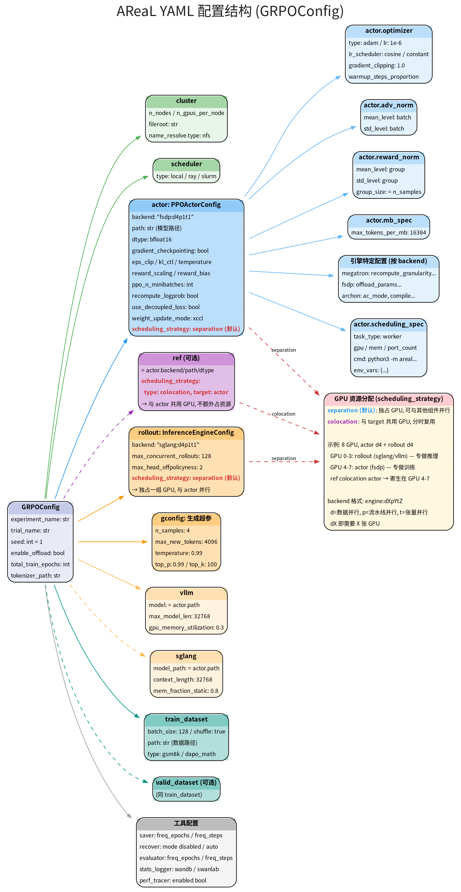

# AReaL YAML 配置说明



## 配置层级

AReaL 使用 Hydra + OmegaConf 管理配置，根配置类为 `GRPOConfig`。

### 根级字段

```yaml
experiment_name: my-experiment        # 实验标识，用于日志/checkpoint 路径
trial_name: trial0                     # 同一实验的不同运行
seed: 42
enable_offload: false                  # CPU offload (小模型不需要)
total_train_epochs: 10
tokenizer_path: ${actor.path}          # 支持 ${...} 插值引用
```

### 资源分配 (cluster + scheduler)

```yaml
cluster:
  n_nodes: 1
  n_gpus_per_node: 8
  fileroot: /tmp/areal/experiments     # 日志/checkpoint/轨迹 dump 根目录
  name_resolve:
    type: nfs                          # 服务发现: nfs / etcd3 / ray
    nfs_record_root: /tmp/areal/name_resolve  # Worker 地址注册目录

scheduler:
  type: local                          # local / ray / slurm
```

- `fileroot`: 所有持久化输出的根目录 (checkpoint, 日志, 轨迹)
- `nfs_record_root`: Worker 间服务发现的 KV 存储目录 (分布式时需共享文件系统)

### 训练引擎 (actor)

```yaml
actor:
  backend: "fsdp:d4p1t1"              # 引擎:d{DP}p{PP}t{TP}
  path: /path/to/model                 # HuggingFace 模型路径
  dtype: bfloat16
  gradient_checkpointing: true
  # PPO 超参
  eps_clip: 0.2                        # PPO clip 范围
  kl_ctl: 0.0                          # KL 惩罚系数 (0=不用 KL)
  reward_scaling: 10.0                 # 奖励缩放
  reward_bias: -0.5                    # 奖励偏移
  recompute_logprob: true              # 用当前权重重算 log-prob (on-policy)
  use_decoupled_loss: true             # 解耦 PPO loss
  weight_update_mode: xccl             # 权重同步: xccl (NCCL) / disk
  # 子配置
  optimizer: {type: adam, lr: 1e-6, ...}
  mb_spec: {max_tokens_per_mb: 16384}  # micro-batch token 上限
  adv_norm: {mean_level: batch, std_level: batch}
  reward_norm: {mean_level: group, std_level: group, group_size: 4}
  scheduling_spec:                     # Worker 资源声明
    - task_type: worker
      gpu: 1
      mem: 32
      cmd: python3 -m areal.infra.rpc.rpc_server
```

#### backend 格式

`engine:dXpYtZ` 其中:
- `d` = 数据并行 (DP), 决定需要几张 GPU
- `p` = 流水线并行 (PP)
- `t` = 张量并行 (TP)

示例: `fsdp:d4p1t1` = FSDP 引擎, 4 卡数据并行, 无流水线/张量并行

#### scheduling_strategy

```yaml
# 默认: separation (独占 GPU)
actor:
  backend: "fsdp:d4p1t1"    # 占 4 GPU

# colocation: 与 target 共用 GPU
ref:
  scheduling_strategy:
    type: colocation
    target: actor             # 与 actor 共用, 不额外占 GPU
```

GPU 分配示例 (8 GPU):
```
GPU 0-3: rollout (sglang, d4) -- 推理
GPU 4-7: actor (fsdp, d4)     -- 训练
          ref colocation actor -- 寄生在 GPU 4-7
```

### 推理引擎 (rollout + sglang/vllm)

```yaml
rollout:
  backend: "sglang:d4p1t1"
  max_concurrent_rollouts: 128         # 最大并发生成数
  max_head_offpolicyness: 2            # 允许的最大版本差 (异步容忍度)
  dump_to_file: true                   # 保存轨迹到 jsonl

sglang:
  model_path: ${actor.path}
  context_length: 16384                # KV cache 最大长度 (prompt + response)
  mem_fraction_static: 0.8             # GPU 显存占比
```

- `max_head_offpolicyness`: 允许 rollout 样本比当前 actor 版本落后几步
- `context_length`: 预分配的 KV cache 上限，设太大浪费显存

### 生成超参 (gconfig)

```yaml
gconfig:
  n_samples: 4                         # 每个 prompt 生成几条回复
  max_new_tokens: 8192                 # 每次生成最大 token 数
  temperature: 0.99
  top_p: 0.99
  top_k: 100
  stop:                                # 多轮场景的 stop 字符串
    - "</search>"
```

### 数据集

```yaml
train_dataset:
  batch_size: 128
  shuffle: true
  path: /path/to/data
  type: rl                             # 数据类型 (rl / sft)
```

`type` 字段用于 `areal/dataset/__init__.py` 的注册表查找。fuyao 场景中 train 脚本直接加载数据，不走注册表。

### 工具配置

```yaml
saver:
  freq_epochs: 1                       # 每 N epoch 保存 checkpoint
  freq_steps: 10000                    # 每 N step 保存

evaluator:
  freq_steps: 10                       # 每 N step 跑 validation

stats_logger:
  wandb: {mode: disabled}
  swanlab:
    mode: online
    project: areal_train
    api_key: ${oc.env:SWANLAB_API_KEY,}  # 环境变量, 缺失时为空
```

### 命令行覆盖

所有 YAML 字段都可通过 Hydra overrides 在命令行覆盖:

```bash
python train.py --config config.yaml \
    gconfig.max_new_tokens=4096 \
    train_dataset.batch_size=32 \
    actor.optimizer.lr=5e-7 \
    actor.backend="fsdp:d4p1t1"
```
